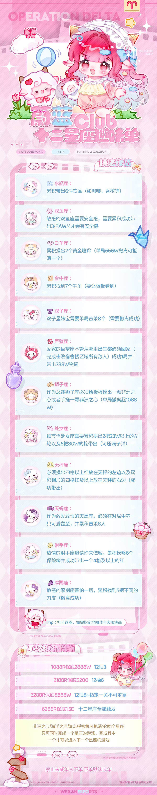
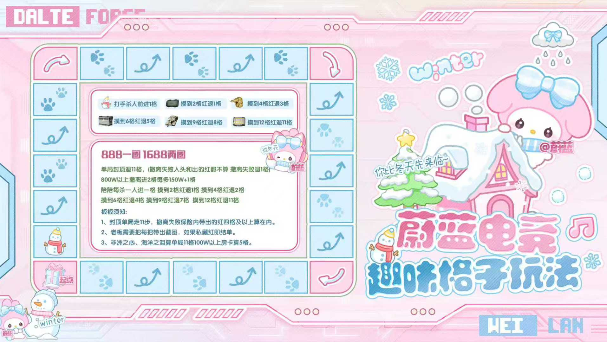
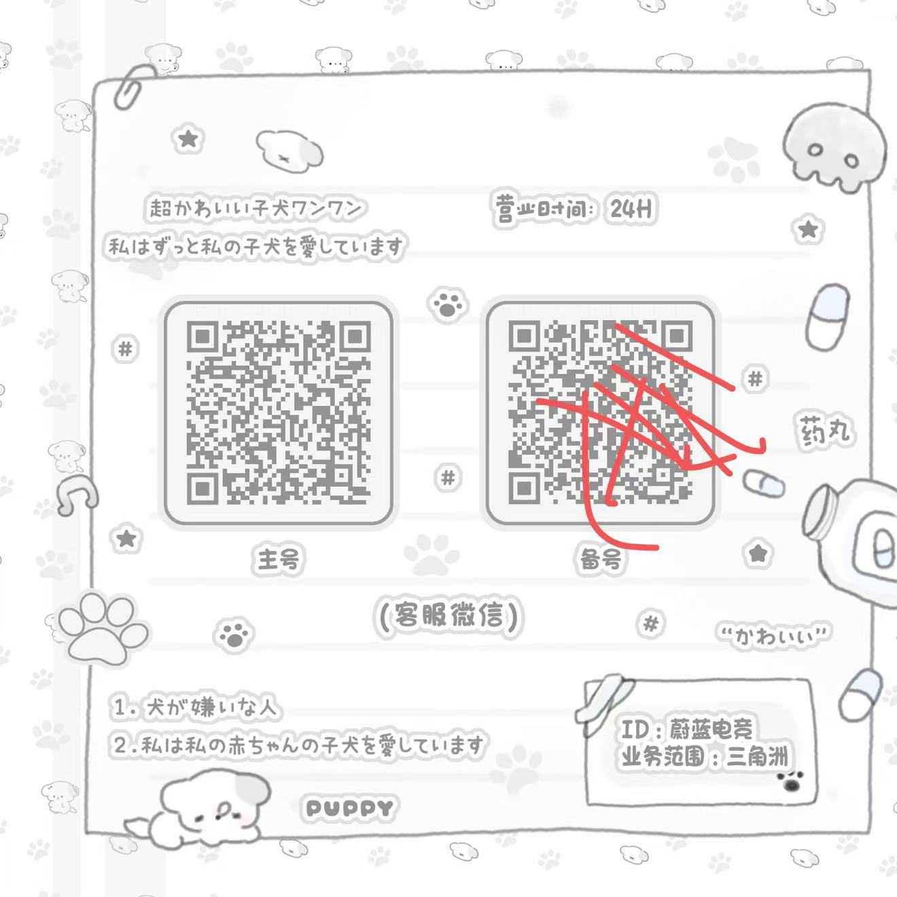

<!DOCTYPE html>
<!-- saved from url=(0051)https://xaiohaozi.github.io/xiaohoaziwo-.github.io/ -->
<html lang="en-US"><head><meta http-equiv="Content-Type" content="text/html; charset=UTF-8">
    
    <meta http-equiv="X-UA-Compatible" content="IE=edge">
    <meta name="viewport" content="width=device-width, initial-scale=1">

<!-- Begin Jekyll SEO tag v2.8.0 -->
<title>xiaohoaziwo-.github.io | 共用</title>
<meta name="generator" content="Jekyll v3.10.0">
<meta property="og:title" content="xiaohoaziwo-.github.io">
<meta property="og:locale" content="en_US">
<meta name="description" content="共用">
<meta property="og:description" content="共用">
<link rel="canonical" href="https://xaiohaozi.github.io/xiaohoaziwo-.github.io/">
<meta property="og:url" content="https://xaiohaozi.github.io/xiaohoaziwo-.github.io/">
<meta property="og:site_name" content="xiaohoaziwo-.github.io">
<meta property="og:type" content="website">
<meta name="twitter:card" content="summary">
<meta property="twitter:title" content="xiaohoaziwo-.github.io">

<!-- End Jekyll SEO tag -->

    <link rel="stylesheet" href="./测试终版1_files/style.css">
    <!-- start custom head snippets, customize with your own _includes/head-custom.html file -->

<!-- Setup Google Analytics -->

<!-- You can set your favicon here -->
<!-- link rel="shortcut icon" type="image/x-icon" href="/xiaohoaziwo-.github.io/favicon.ico" -->

<!-- end custom head snippets -->

  

</head>
  <body id="mainBody" class="user-mode">
    

      
      <h1><a href="https://xaiohaozi.github.io/xiaohoaziwo-.github.io/">xiaohoaziwo-.github.io</a></h1>
      

      
&lt;!DOCTYPE html&gt;

    
    <meta name="viewport" content="width=device-width, initial-scale=1.0">
    <title>蔚蓝电竞 · 治愈系价目卡</title>
    

✨ 已保存

<nav class="top-nav">
    

<a href="https://xaiohaozi.github.io/xiaohoaziwo-.github.io/#pubg" class="nav-link">体验单区</a>
<button class="nav-edit-btn">✎</button><button class="nav-delete-btn">🗑️</button>

<a href="https://xaiohaozi.github.io/xiaohoaziwo-.github.io/#rent" class="nav-link">趣味单区</a>
<button class="nav-edit-btn">✎</button><button class="nav-delete-btn">🗑️</button>

<a href="https://xaiohaozi.github.io/xiaohoaziwo-.github.io/#section1771937998169" class="nav-link">三角洲陪玩</a>
<button class="nav-edit-btn">✎</button><button class="nav-delete-btn">🗑️</button>

<a href="https://xaiohaozi.github.io/xiaohoaziwo-.github.io/#section1771938318849" class="nav-link">收款码</a>
<button class="nav-edit-btn">✎</button><button class="nav-delete-btn">🗑️</button>

<a href="https://xaiohaozi.github.io/xiaohoaziwo-.github.io/#section1771940221731" class="nav-link">客服联系</a>
<button class="nav-edit-btn">✎</button><button class="nav-delete-btn">🗑️</button>

    

        <button class="add-nav-btn" id="addNavBtn">➕ 添加导航</button>
        <button class="auth-btn" id="authBtn">🔐 管理员</button>
    

</nav>

    

        <h1 class="editable" data-type="hero" data-field="title" id="heroTitle">蔚蓝电竞 · 三角洲区</h1>
        

    

    

                <h2 class="section-title" id="steam">
                    
                    
                </h2>
                

            
                <h2 class="section-title" id="pubg">
                    体验单区
                    
                </h2>
                

                        

                            
                            

                                
体验单每天限1单

                                

                                

                                

                            

                            

                                
                            

                            
                        

                    

            
                <h2 class="section-title" id="rent">
                    趣味单区
                    
                </h2>
                

                        

                            
                            

                                
📌趣味1

                                

                                

                                

                            

                            

                                
                            

                            
                        

                    
                        

                            
                            

                                
📌2区大红赌约单

                                

                                

                                

                            

                            

                                
                            

                            
                        

                    
                        

                            
                            

                                
📌十二星座

                                

                                

                                

                            

                            

                                
                            

                            
                        

                    
                        

                            
                            

                                
📌0元购

                                

                                

                                

                            

                            

                                
                            

                            
                        

                    
                        

                            
                            

                                
📌趣味2

                                

                                

                                

                            

                            

                                
                            

                            
                        

                    
                        

                            
                            

                                
📌趣味3

                                

                                

                                

                            

                            

                                
                            

                            
                        

                    
                        

                            
                            

                                
📌格子单

                                

                                

                                

                            

                            

                                
                            

                            
                        

                    
                        

                            
                            

                                
📌情感剧本

                                

                                

                                

                            

                            

                                
                            

                            
                        

                    
                        

                            
                            

                                
📌趣味4

                                

                                

                                

                            

                            

                                
                            

                            
                        

                    

            
                <h2 class="section-title" id="video">
                    
                    
                </h2>
                

            
                <h2 class="section-title" id="display">
                    
                    
                </h2>
                

            
                <h2 class="section-title" id="section1771937998169">
                    三角洲陪玩
                    
                </h2>
                

                        

                            
                            

                                
📌女陪

                                

                                

                                
女陪等级小时单

                            

                            

                                
                            

                            
                        

                    
                        

                            
                            

                                
📌男陪

                                

                                

                                

                            

                            

                                
                                    
🖼️

                                    
暂无图片

                                
                            

                            
                        

                    

            
                <h2 class="section-title" id="section1771938318849">
                    收款码
                    
                </h2>
                

                        

                            
                            

                                
蔚蓝收款区

                                

                                

                                

                            

                            

                                
                            

                            
                        

                    

            
                <h2 class="section-title" id="section1771940221731">
                    客服联系
                    
                </h2>
                

            

    

        <h3 class="editable" data-type="contact" data-field="title" id="contactTitle">📞 客服联系处</h3>
        

            

                
店长v _Zoe88

                
售后v wyt0299xy

                
ip 暂无

                
营业时间：周一至周日24h

            

            

                
 
点击预览大图

                

                    <button class="image-action-btn" onclick="uploadContactImage()">📤 上传</button>
                    <button class="image-action-btn" onclick="setContactImageUrl()">🔗 URL</button>
                    <button class="image-action-btn danger" onclick="clearContactImage()">🗑️ 清除</button>
                

            

        

    

    🔧 管理工具
    

    <button class="toolbar-btn" id="quickAddCardBtn">➕ 快速添加卡片</button>
    <button class="toolbar-btn" id="ocrToolbarBtn">📸 OCR导入</button>
    <button class="toolbar-btn" id="exportToolbarBtn">📤 导出数据</button>
    <button class="toolbar-btn danger" id="resetToolbarBtn">🔄 重置</button>

    

        
        <button class="close-image-modal" onclick="closeImageModal()">✕</button>
    

🔑

    

        
编辑内容

        

        

            
🗑️ 请选择删除方式：

            

                <button class="btn btn-danger" id="deleteFieldOnlyBtn" style="flex:1;">只删除这段文字</button>
                <button class="btn btn-danger" id="deleteWholeCardBtn" style="flex:1;">删除整个卡片</button>
            

        

        

            <button class="btn btn-success" id="saveEditBtn" style="flex:2;">保存修改</button>
            <button class="btn" id="cancelEditBtn" style="flex:1;">取消</button>
        

    

<input type="file" id="fileInput" accept="image/*" style="display: none;">
<input type="file" id="importFile" accept=".json" style="display: none;">

      
    

    
    
  

<textcortex-shadow-host id="shadow-host"><template shadowrootmode="open">
       <style>
         /* Shared base typography for all apps */

@tailwind base;

/* Conversation typography normalization - Replicate .chat-response-container exactly */

.border-spacing-80{
  --tw-border-spacing-x: 0;
  --tw-border-spacing-y: 0;
}

.-translate-x-1, .-translate-x-1\/2, .-translate-y-1\/2, .translate-x-1, .translate-x-\[-50\%\], .translate-y-0, .translate-y-1, .translate-y-\[-50\%\], .translate-y-\[2px\], .-rotate-90, .rotate-0, .rotate-180, .rotate-45, .rotate-90, .rotate-\[-90deg\], .scale-100, .scale-95, .scale-\[70\%\], .transform, .group-hover\:rotate-180, .group-hover\:scale-110, [data-side="bottom"], [data-side="left"], [data-side="right"], [data-side="top"], [data-state="checked"], [data-state="unchecked"], [data-swipe="cancel"], [data-swipe="end"], [data-swipe="move"], [data-panel-group-direction="vertical"]::after, .group-data-\[state\=open\]\:rotate-180, .hover\:translate-x-0, .hover\:scale-105, .hover\:scale-110, .hover\:scale-\[1\.007\], .hover\:scale-\[1\.02\], .hover\:scale-\[1\.04\], .hover\:scale-\[1\.08px\], .hover\:transform, .active\:scale-\[0\.99\], div, svg{
  --tw-translate-x: 0;
  --tw-translate-y: 0;
  --tw-rotate: 0;
  --tw-skew-x: 0;
  --tw-skew-y: 0;
  --tw-scale-x: 1;
  --tw-scale-y: 1;
}

.after\:-translate-x-1\/2::after{
  --tw-translate-x: 0;
  --tw-translate-y: 0;
  --tw-rotate: 0;
  --tw-skew-x: 0;
  --tw-skew-y: 0;
  --tw-scale-x: 1;
  --tw-scale-y: 1;
}

.hover\:-translate-y-1{
  --tw-translate-x: 0;
  --tw-translate-y: 0;
  --tw-rotate: 0;
  --tw-skew-x: 0;
  --tw-skew-y: 0;
  --tw-scale-x: 1;
  --tw-scale-y: 1;
}

.hover\:-translate-y-\[1px\]{
  --tw-translate-x: 0;
  --tw-translate-y: 0;
  --tw-rotate: 0;
  --tw-skew-x: 0;
  --tw-skew-y: 0;
  --tw-scale-x: 1;
  --tw-scale-y: 1;
}

.touch-pinch-zoom{
  --tw-pan-x:  ;
  --tw-pan-y:  ;
  --tw-pinch-zoom:  ;
}

.from-primary-500, .to-primary-600{
  --tw-gradient-from-position:  ;
  --tw-gradient-via-position:  ;
  --tw-gradient-to-position:  ;
}

.ordinal, .slashed-zero, .lining-nums, .oldstyle-nums, .proportional-nums, .tabular-nums, .diagonal-fractions, .stacked-fractions{
  --tw-ordinal:  ;
  --tw-slashed-zero:  ;
  --tw-numeric-figure:  ;
  --tw-numeric-spacing:  ;
  --tw-numeric-fraction:  ;
}

.\!shadow, .shadow, .shadow-2xl, .shadow-3, .shadow-3xl, .shadow-4, .shadow-7, .shadow-\[2px_100px_1px_rgba\(255\2c 255\2c 255\)_inset\], .shadow-card-1, .shadow-lg, .shadow-md, .shadow-none, .shadow-sm, .shadow-xl, .group-\[\.toaster\]\:shadow-lg, [data-state="active"], .hover\:shadow-md, .hover\:shadow-none, .hover\:shadow-sm, .dark\:shadow-md:is(.dark *){
  --tw-ring-offset-shadow: 0 0 #0000;
  --tw-ring-shadow: 0 0 #0000;
  --tw-shadow: 0 0 #0000;
  --tw-shadow-colored: 0 0 #0000;
}

.ring, .ring-0, .ring-1, .ring-2, .ring-inset, .focus-within\:ring-1, .focus\:\!ring-\[1px\], .focus\:ring-0, .focus\:ring-1, .focus\:ring-2, .focus-visible\:ring-0, .focus-visible\:ring-1, .focus-visible\:ring-2{
  --tw-ring-inset:  ;
  --tw-ring-offset-width: 0px;
  --tw-ring-offset-color: hsl(var(--background));
  --tw-ring-color: hsl(var(--ring) / 0.5);
  --tw-ring-offset-shadow: 0 0 #0000;
  --tw-ring-shadow: 0 0 #0000;
  --tw-shadow: 0 0 #0000;
  --tw-shadow-colored: 0 0 #0000;
}

.blur, .drop-shadow, .drop-shadow-lg, .drop-shadow-md, .drop-shadow-sm, .grayscale, .hue-rotate-180, .invert, .invert-\[90\%\], .sepia, .filter, .hover\:drop-shadow-lg{
  --tw-blur:  ;
  --tw-brightness:  ;
  --tw-contrast:  ;
  --tw-grayscale:  ;
  --tw-hue-rotate:  ;
  --tw-invert:  ;
  --tw-saturate:  ;
  --tw-sepia:  ;
  --tw-drop-shadow:  ;
}

.\!backdrop-blur-md, .backdrop-blur, .backdrop-blur-3xl, .backdrop-blur-md, .backdrop-blur-sm, .backdrop-grayscale, .backdrop-invert, .backdrop-sepia, .backdrop-filter{
  --tw-backdrop-blur:  ;
  --tw-backdrop-brightness:  ;
  --tw-backdrop-contrast:  ;
  --tw-backdrop-grayscale:  ;
  --tw-backdrop-hue-rotate:  ;
  --tw-backdrop-invert:  ;
  --tw-backdrop-opacity:  ;
  --tw-backdrop-saturate:  ;
  --tw-backdrop-sepia:  ;
}

/* ! tailwindcss v3.4.17 | MIT License | https://tailwindcss.com */

/*
1. Prevent padding and border from affecting element width. (https://github.com/mozdevs/cssremedy/issues/4)
2. Allow adding a border to an element by just adding a border-width. (https://github.com/tailwindcss/tailwindcss/pull/116)
*/

*,
::before,
::after {
  box-sizing: border-box;
  /* 1 */
  border-width: 0;
  /* 2 */
  border-style: solid;
  /* 2 */
  border-color: #EAECF0;
  /* 2 */
}

::before,
::after {
  --tw-content: '';
}

/*
1. Use a consistent sensible line-height in all browsers.
2. Prevent adjustments of font size after orientation changes in iOS.
3. Use a more readable tab size.
4. Use the user's configured `sans` font-family by default.
5. Use the user's configured `sans` font-feature-settings by default.
6. Use the user's configured `sans` font-variation-settings by default.
7. Disable tap highlights on iOS
*/

html,
:host {
  line-height: 1.5;
  /* 1 */
  -webkit-text-size-adjust: 100%;
  /* 2 */
  -moz-tab-size: 4;
  /* 3 */
  -o-tab-size: 4;
     tab-size: 4;
  /* 3 */
  font-family: Inter, ui-sans-serif, system-ui, sans-serif, "Apple Color Emoji", "Segoe UI Emoji", "Segoe UI Symbol", "Noto Color Emoji";
  /* 4 */
  font-feature-settings: normal;
  /* 5 */
  font-variation-settings: normal;
  /* 6 */
  -webkit-tap-highlight-color: transparent;
  /* 7 */
}

/*
1. Remove the margin in all browsers.
2. Inherit line-height from `html` so users can set them as a class directly on the `html` element.
*/

body {
  margin: 0;
  /* 1 */
  line-height: inherit;
  /* 2 */
}

/*
1. Add the correct height in Firefox.
2. Correct the inheritance of border color in Firefox. (https://bugzilla.mozilla.org/show_bug.cgi?id=190655)
3. Ensure horizontal rules are visible by default.
*/

hr {
  height: 0;
  /* 1 */
  color: inherit;
  /* 2 */
  border-top-width: 1px;
  /* 3 */
}

/*
Add the correct text decoration in Chrome, Edge, and Safari.
*/

abbr:where([title]) {
  -webkit-text-decoration: underline dotted;
          text-decoration: underline dotted;
}

/*
Remove the default font size and weight for headings.
*/

h1,
h2,
h3,
h4,
h5,
h6 {
  font-size: inherit;
  font-weight: inherit;
}

/*
Reset links to optimize for opt-in styling instead of opt-out.
*/

a {
  color: inherit;
  text-decoration: inherit;
}

/*
Add the correct font weight in Edge and Safari.
*/

b,
strong {
  font-weight: bolder;
}

/*
1. Use the user's configured `mono` font-family by default.
2. Use the user's configured `mono` font-feature-settings by default.
3. Use the user's configured `mono` font-variation-settings by default.
4. Correct the odd `em` font sizing in all browsers.
*/

code,
kbd,
samp,
pre {
  font-family: ui-monospace, SFMono-Regular, Menlo, Monaco, Consolas, "Liberation Mono", "Courier New", monospace;
  /* 1 */
  font-feature-settings: normal;
  /* 2 */
  font-variation-settings: normal;
  /* 3 */
  font-size: 1em;
  /* 4 */
}

/*
Add the correct font size in all browsers.
*/

small {
  font-size: 80%;
}

/*
Prevent `sub` and `sup` elements from affecting the line height in all browsers.
*/

sub,
sup {
  font-size: 75%;
  line-height: 0;
  position: relative;
  vertical-align: baseline;
}

sub {
  bottom: -0.25em;
}

sup {
  top: -0.5em;
}

/*
1. Remove text indentation from table contents in Chrome and Safari. (https://bugs.chromium.org/p/chromium/issues/detail?id=999088, https://bugs.webkit.org/show_bug.cgi?id=201297)
2. Correct table border color inheritance in all Chrome and Safari. (https://bugs.chromium.org/p/chromium/issues/detail?id=935729, https://bugs.webkit.org/show_bug.cgi?id=195016)
3. Remove gaps between table borders by default.
*/

table {
  text-indent: 0;
  /* 1 */
  border-color: inherit;
  /* 2 */
  border-collapse: collapse;
  /* 3 */
}

/*
1. Change the font styles in all browsers.
2. Remove the margin in Firefox and Safari.
3. Remove default padding in all browsers.
*/

button,
input,
optgroup,
select,
textarea {
  font-family: inherit;
  /* 1 */
  font-feature-settings: inherit;
  /* 1 */
  font-variation-settings: inherit;
  /* 1 */
  font-size: 100%;
  /* 1 */
  font-weight: inherit;
  /* 1 */
  line-height: inherit;
  /* 1 */
  letter-spacing: inherit;
  /* 1 */
  color: inherit;
  /* 1 */
  margin: 0;
  /* 2 */
  padding: 0;
  /* 3 */
}

/*
Remove the inheritance of text transform in Edge and Firefox.
*/

button,
select {
  text-transform: none;
}

/*
1. Correct the inability to style clickable types in iOS and Safari.
2. Remove default button styles.
*/

button,
input:where([type='button']),
input:where([type='reset']),
input:where([type='submit']) {
  -webkit-appearance: button;
  /* 1 */
  background-color: transparent;
  /* 2 */
  background-image: none;
  /* 2 */
}

/*
Use the modern Firefox focus style for all focusable elements.
*/

:-moz-focusring {
  outline: auto;
}

/*
Remove the additional `:invalid` styles in Firefox. (https://github.com/mozilla/gecko-dev/blob/2f9eacd9d3d995c937b4251a5557d95d494c9be1/layout/style/res/forms.css#L728-L737)
*/

:-moz-ui-invalid {
  box-shadow: none;
}

/*
Add the correct vertical alignment in Chrome and Firefox.
*/

progress {
  vertical-align: baseline;
}

/*
Correct the cursor style of increment and decrement buttons in Safari.
*/

::-webkit-inner-spin-button,
::-webkit-outer-spin-button {
  height: auto;
}

/*
1. Correct the odd appearance in Chrome and Safari.
2. Correct the outline style in Safari.
*/

[type='search'] {
  -webkit-appearance: textfield;
  /* 1 */
  outline-offset: -2px;
  /* 2 */
}

/*
Remove the inner padding in Chrome and Safari on macOS.
*/

::-webkit-search-decoration {
  -webkit-appearance: none;
}

/*
1. Correct the inability to style clickable types in iOS and Safari.
2. Change font properties to `inherit` in Safari.
*/

::-webkit-file-upload-button {
  -webkit-appearance: button;
  /* 1 */
  font: inherit;
  /* 2 */
}

/*
Add the correct display in Chrome and Safari.
*/

summary {
  display: list-item;
}

/*
Removes the default spacing and border for appropriate elements.
*/

blockquote,
dl,
dd,
h1,
h2,
h3,
h4,
h5,
h6,
hr,
figure,
p,
pre {
  margin: 0;
}

fieldset {
  margin: 0;
  padding: 0;
}

legend {
  padding: 0;
}

ol,
ul,
menu {
  list-style: none;
  margin: 0;
  padding: 0;
}

/*
Reset default styling for dialogs.
*/

dialog {
  padding: 0;
}

/*
Prevent resizing textareas horizontally by default.
*/

textarea {
  resize: vertical;
}

/*
1. Reset the default placeholder opacity in Firefox. (https://github.com/tailwindlabs/tailwindcss/issues/3300)
2. Set the default placeholder color to the user's configured gray 400 color.
*/

input::-moz-placeholder, textarea::-moz-placeholder {
  opacity: 1;
  /* 1 */
  color: #98A2B3;
  /* 2 */
}

input::placeholder,
textarea::placeholder {
  opacity: 1;
  /* 1 */
  color: #98A2B3;
  /* 2 */
}

/*
Set the default cursor for buttons.
*/

button,
[role="button"] {
  cursor: pointer;
}

/*
Make sure disabled buttons don't get the pointer cursor.
*/

:disabled {
  cursor: default;
}

/*
1. Make replaced elements `display: block` by default. (https://github.com/mozdevs/cssremedy/issues/14)
2. Add `vertical-align: middle` to align replaced elements more sensibly by default. (https://github.com/jensimmons/cssremedy/issues/14#issuecomment-634934210)
   This can trigger a poorly considered lint error in some tools but is included by design.
*/

img,
svg,
video,
canvas,
audio,
iframe,
embed,
object {
  display: block;
  /* 1 */
  vertical-align: middle;
  /* 2 */
}

/*
Constrain images and videos to the parent width and preserve their intrinsic aspect ratio. (https://github.com/mozdevs/cssremedy/issues/14)
*/

img,
video {
  max-width: 100%;
  height: auto;
}

/* Make elements with the HTML hidden attribute stay hidden by default */

[hidden]:where(:not([hidden="until-found"])) {
  display: none;
}

*{
  scrollbar-color: initial;
  scrollbar-width: initial;
}

h1,
  h2,
  h3,
  h4 {
  color: #0e1227;
}

h1 {
  font-family: 'Inter';
  font-weight: 400;
  font-size: 24px;
  line-height: 38px;
}

h2 {
  font-family: 'Inter';
  font-weight: 600;
  font-size: 20px;
  line-height: 30px;
}

h3 {
  font-family: 'Inter';
  font-weight: 500;
  font-size: 16px;
  line-height: 28px;
}

h4 {
  font-family: 'Inter';
  font-weight: 500;
  font-size: 12px;
}

p {
  font-weight: 400;
  font-family: 'Inter';
  font-size: 14px;
  line-height: 24px;
}

.h1 {
  font-family: 'Inter';
  font-weight: 600;
  font-size: 24px;
  line-height: 48px;
}

.h2 {
  font-family: 'Inter';
  font-weight: 500;
  font-size: 14px;
  line-height: 24px;
}

.h3 {
  font-family: 'Inter';
  font-weight: 500;
  font-size: 18px;
  line-height: 48px;
}

.h4 {
  font-family: 'Inter';
  font-weight: 500;
  font-size: 16px;
  line-height: 48px;
}

.text-xs-Medium {
  font-family: 'Inter';
  font-size: 12px;
  line-height: 18px;
  font-weight: 500;
}

.text-xs-Regular {
  font-family: 'Inter';
  font-size: 12px;
  line-height: 18px;
  font-weight: 400;
}

.text-xs-SemiBold {
  font-family: 'Inter';
  font-size: 12px;
  line-height: 18px;
  font-weight: 600;
}

.text-xl {
  font-size: 20px;
  font-family: 'Inter';
  line-height: 30px;
  font-style: normal;
}

.text-xl-Bold {
  font-size: 20px;
  font-family: 'Inter';
  font-weight: 700;
  line-height: 30px;
  font-style: normal;
}

.h5BoldRegular {
  font-family: 'Inter';
  font-size: 14px;
  line-height: 24px;
  font-weight: 500;
}

.h6 {
  font-family: 'Inter';
  font-weight: 600;
  font-size: 10px;
  line-height: 24px;
}

.text2 {
  font-family: 'Inter';
  font-size: 14px;
  line-height: 24px;
}

.text3 {
  font-family: 'Inter';
  font-size: 12px;
  line-height: 16px;
}

.text5 {
  font-family: 'Inter';
  font-size: 12px;
  line-height: 24px;
}

.text-sm-SemiBold {
  font-family: 'Inter';
  font-size: 14px;
  line-height: 20px;
  font-weight: 600;
}

.text-xs-SemiBold {
  font-family: 'Inter';
  font-size: 12px;
  line-height: 18px;
  font-weight: 600;
}

.text-sm-Regular {
  font-family: 'Inter';
  font-size: 14px;
  line-height: 20px;
  font-weight: 400;
}

.text-lg-Regular {
  font-family: 'Inter';
  font-size: 18px;
  line-height: 28px;
  font-weight: 400;
}

.text-sm-Medium {
  font-family: 'Inter';
  font-weight: 500;
  font-size: 14px;
  line-height: 20px;
}

.text-lg-SemiBold {
  font-family: 'Inter', 'Roboto', 'Segoe UI', Tahoma, Verdana, sans-serif;
  font-size: 18px;
  line-height: 28px;
  font-weight: 600;
}

.text-xl-Regular {
  font-family: 'Inter';
  font-size: 20px;
  line-height: 28px;
  font-weight: 400;
}

.text-xl-SemiBold {
  font-family: 'Inter';
  font-size: 20px;
  line-height: 28px;
  font-weight: 600;
}

.text-5xl-SemiBold {
  font-family: 'Inter';
  font-size: 48px;
  line-height: 60px;
  font-weight: 600;
}

.text-2xl-Bold {
  font-family: 'Inter';
  font-size: 24px;
  line-height: 32px;
  font-weight: 700;
}

.text-2xl-SemiBold {
  font-family: 'Inter';
  font-weight: 600;
  font-size: 24px;
  line-height: 32px;
}

.text-base-Regular {
  font-family: 'Inter';
  font-size: 16px;
  line-height: 24px;
  font-weight: 400;
}

.text-base-SemiBold {
  font-family: 'Inter';
  font-size: 16px;
  line-height: 24px;
  font-weight: 600;
}

.text-md-SemiBold {
  font-family: 'Inter';
  font-size: 14px;
  line-height: 24px;
  font-weight: 600;
}

.text-base-Medium {
  font-family: 'Inter';
  font-size: 16px;
  line-height: 24px;
  font-weight: 500;
}

.caption1 {
  font-family: 'Inter';
  font-weight: 400;
  font-size: 10px;
  line-height: 24px;
}

:root {
  --background: 0 0% 100%;
  --foreground: 0 0% 3.9%;
  --card: 0 0% 100%;
  --card-foreground: 0 0% 3.9%;
  --popover: 0 0% 100%;
  --popover-foreground: 0 0% 3.9%;
  --primary: 0 0% 9%;
  --primary-01: #8043f9;
  --primary-50: #f0e9fe;
  --primary-100: #e6d9fe;
  --primary-200: #d5c0fd;
  --primary-300: '#BFA1FC';
  --primary-400: #aa82fb;
  --primary-500: #9562fa;
  --primary-600: #8043f9;
  --primary-700: #6133bd;
  --primary-800: #47258a;
  --primary-900: #28164f;
  --primary-foreground: 0 0% 98%;
  --primary-25: #f7f4fe;
  --secondary: 0 0% 96.1%;
  --secondary-foreground: 0 0% 9%;
  --muted: 0 0% 96.1%;
  --muted-foreground: 0 0% 45.1%;
  --accent: 0 0% 96.1%;
  --accent-foreground: 0 0% 9%;
  --destructive: 0 84.2% 60.2%;
  --destructive-foreground: 0 0% 98%;
  --border: 220, 13%, 91%;
  --input: 0 0% 89.8%;
  --ring: 0 0% 3.9%;
  --radius: 8px;
}

.\!dark {
  --background: 210 4% 11% !important;
  --foreground: 0 0% 98% !important;
  --card: 210, 3%, 13% !important;
  --card-foreground: 210, 3%, 13%, 1 !important;
  --popover: 0 0% 3.9% !important;
  --popover-foreground: 0 0% 98% !important;
  --primary: 0 0% 98% !important;
  --primary-foreground: 0 0% 9% !important;
  --primary-25: #17151e !important;
  --secondary: 0 0% 14.9% !important;
  --secondary-foreground: 0 0% 98% !important;
  --muted: 0 0% 14.9% !important;
  --muted-foreground: 0 0% 63.9% !important;
  --accent: 0 0% 14.9% !important;
  --accent-foreground: 0 0% 98% !important;
  --destructive: 0 62.8% 30.6% !important;
  --destructive-foreground: 0 0% 98% !important;
  --border: 210, 2%, 19%, 1 !important;
  --input: 0 0% 14.9% !important;
  --ring: 0 0% 30% !important;
}

.dark {
  --background: 210 4% 11%;
  --foreground: 0 0% 98%;
  --card: 210, 3%, 13%;
  --card-foreground: 210, 3%, 13%, 1;
  --popover: 0 0% 3.9%;
  --popover-foreground: 0 0% 98%;
  --primary: 0 0% 98%;
  --primary-foreground: 0 0% 9%;
  --primary-25: #17151e;
  --secondary: 0 0% 14.9%;
  --secondary-foreground: 0 0% 98%;
  --muted: 0 0% 14.9%;
  --muted-foreground: 0 0% 63.9%;
  --accent: 0 0% 14.9%;
  --accent-foreground: 0 0% 98%;
  --destructive: 0 62.8% 30.6%;
  --destructive-foreground: 0 0% 98%;
  --border: 210, 2%, 19%, 1;
  --input: 0 0% 14.9%;
  --ring: 0 0% 30%;
}

body{
  background-color: hsl(var(--background));
  color: hsl(var(--foreground));
}

*{
  border-color: hsl(var(--border));
}

.tc-prose{
  --tw-text-opacity: 1;
  color: rgb(14 18 39 / var(--tw-text-opacity, 1));
}

.tc-prose:is(.dark *){
  --tw-text-opacity: 1;
  color: rgb(255 255 255 / var(--tw-text-opacity, 1));
}

.tc-prose {
  width: 100%;
}

/* Muted tone variant (used for thinking content) */

.tc-prose.tc-prose-muted{
  --tw-text-opacity: 1;
  color: rgb(102 112 133 / var(--tw-text-opacity, 1));
}

.tc-prose.tc-prose-muted:is(.dark *){
  --tw-text-opacity: 1;
  color: rgb(152 162 179 / var(--tw-text-opacity, 1));
}

/* Override overly-broad web dark-mode globals (e.g. `.dark p { color: #fff; }`) */

.tc-prose.tc-prose-muted
    :where(h1, h2, h3, h4, div, p, label):not(
      :where([class~='not-prose'], [class~='not-prose'] *)
    ) {
  color: inherit;
}

/* Paragraph styling - exact legacy match */

.tc-prose
    :where(p):not(:where([class~='not-prose'], [class~='not-prose'] *)) {
  font-size: 16px;
  line-height: 29.6px;
  margin: 0;
}

.tc-prose
    :where(p:not(:last-child)):not(
      :where([class~='not-prose'], [class~='not-prose'] *)
    ) {
  margin-bottom: 20px;
}

/* Unordered List (ul) */

.tc-prose
    :where(ul):not(:where([class~='not-prose'], [class~='not-prose'] *)) {
  padding-left: 40px;
  margin: 14px 0;
  list-style: disc;
}

/* Ordered List (ol) */

.tc-prose
    :where(ol):not(:where([class~='not-prose'], [class~='not-prose'] *)) {
  list-style-type: decimal;
  padding-left: 40px;
  margin: 14px 0;
}

/* List Item (li) */

.tc-prose
    :where(li):not(:where([class~='not-prose'], [class~='not-prose'] *)) {
  margin: 0 0 10px 0;
}

/* Mobile responsive - paragraphs */

@media (max-width: 900px) {
  .tc-prose
      :where(p):not(:where([class~='not-prose'], [class~='not-prose'] *)) {
    font-size: 14px;
    line-height: 24px;
  }
}

/* Table styling */

.tc-prose
    :where(table tr, table td, table th):not(
      :where([class~='not-prose'], [class~='not-prose'] *)
    ) {
  border-bottom: 1px solid #dee2e6;
  border-left: 1px solid #dee2e6;
  font-size: 13px;
  padding: 5px 5px;
}

.tc-prose
    :where(table):not(:where([class~='not-prose'], [class~='not-prose'] *)) {
  width: 100% !important;
  margin-left: auto;
  margin-right: auto;
  margin-bottom: 30px;
  border-collapse: separate;
  padding: 0;
  border-spacing: 0;
}

.tc-prose
    :where(thead th):not(:where([class~='not-prose'], [class~='not-prose'] *)) {
  border-top: 1px solid #dee2e6;
}

.tc-prose
    :where(td:last-child):not(
      :where([class~='not-prose'], [class~='not-prose'] *)
    ) {
  border-right: 1px solid #dee2e6;
}

.tc-prose
    :where(thead th:first-child):not(
      :where([class~='not-prose'], [class~='not-prose'] *)
    ) {
  border-top-left-radius: 5px;
}

.tc-prose
    :where(thead th:last-child):not(
      :where([class~='not-prose'], [class~='not-prose'] *)
    ) {
  border-top-right-radius: 5px;
  border-right: 1px solid #dee2e6;
}

.tc-prose
    :where(tr:last-of-type td:first-child):not(
      :where([class~='not-prose'], [class~='not-prose'] *)
    ) {
  border-bottom-left-radius: 5px;
}

.tc-prose
    :where(tr:last-of-type td:last-child):not(
      :where([class~='not-prose'], [class~='not-prose'] *)
    ) {
  border-bottom-right-radius: 5px;
}

.tc-prose
    :where(thead):not(:where([class~='not-prose'], [class~='not-prose'] *)) {
  background-color: #f2f2f2;
}

.\!dark
    .tc-prose
    :where(thead):not(:where([class~='not-prose'], [class~='not-prose'] *)) {
  background-color: #141414 !important;
}

.dark
    .tc-prose
    :where(thead):not(:where([class~='not-prose'], [class~='not-prose'] *)) {
  background-color: #141414;
}

/* Link styling - v2 variant */

.tc-prose
    :where(a):not(:where([class~='not-prose'], [class~='not-prose'] *)) {
  position: relative;
  bottom: 1px;
}

.\!dark
    .tc-prose
    :where(a):not(:where([class~='not-prose'], [class~='not-prose'] *)){
  --tw-bg-opacity: 1;
  background-color: rgb(71 37 138 / var(--tw-bg-opacity, 1));
  --tw-text-opacity: 1;
  color: rgb(225 223 218 / var(--tw-text-opacity, 1));
}

.dark
    .tc-prose
    :where(a):not(:where([class~='not-prose'], [class~='not-prose'] *)){
  --tw-bg-opacity: 1;
  background-color: rgb(71 37 138 / var(--tw-bg-opacity, 1));
  --tw-text-opacity: 1;
  color: rgb(225 223 218 / var(--tw-text-opacity, 1));
}

/* Override all prose-invert colors - ensure consistency */

.tc-prose
    :where(h1, h2, h3, h4, h5, h6, strong, em):not(
      :where([class~='not-prose'], [class~='not-prose'] *)
    ) {
  color: inherit;
  margin: 0;
}

:root {
  --background: 0 0% 100%;
  --foreground: 0 0% 3.9%;
  --shadcn-shadow:
      var(--tw-ring-offset-shadow, 0 0 #0000), var(--tw-ring-shadow, 0 0 #0000),
      0 1px 3px 0 rgba(0, 0, 0, 0.1), 0 1px 2px -1px rgba(0, 0, 0, 0.1);
  --card: 0 0% 100%;
  --card-foreground: 0 0% 3.9%;
  --popover: 0 0% 100%;
  --popover-foreground: 0 0% 3.9%;
  --primary: 0 0% 9%;
  --primary-01: #8043f9;
  --primary-50: #f0e9fe;
  --primary-100: #e6d9fe;
  --primary-300: '#BFA1FC';
  --primary-400: #aa82fb;
  --primary-500: #9562fa;
  --primary-600: #8043f9;
  --primary-700: #6133bd;
  --primary-800: #47258a;
  --primary-foreground: 0 0% 98%;
  --primary-25: #f7f4fe;
  --secondary: 0 0% 96.1%;
  --secondary-foreground: 0 0% 9%;
  --muted: 0 0% 96.1%;
  --muted-foreground: 0 0% 45.1%;
  --accent: 0 0% 96.1%;
  --accent-foreground: 0 0% 9%;
  --destructive: 0 84.2% 60.2%;
  --destructive-foreground: 0 0% 98%;
  --border: 220, 13%, 91%;
  --input: 0 0% 89.8%;
  --ring: 0 0% 3.9%;
  --radius: 8px;
  --tw-ring-offset-shadow: 0 0 #0000;
  --tw-ring-shadow: 0 0 #0000;
  --tw-shadow: 0 0 #0000;
  --tw-shadow-colored: 0 0 #0000;
  --tw-shadow: ;
  --tw-shadow-colored:
      0 1px 3px 0 var(--tw-shadow-color), 0 1px 2px -1px var(--tw-shadow-color);
  /* ring is driven by hsl(var(--ring)) via Tailwind tokens */
  --bg-primary-gradient: linear-gradient(
      171.05deg,
      #eeedfb 6.8%,
      #ffe7eb 98.81%
    );
  --bg-secondary-gradient: linear-gradient(
      135deg,
      #ff805f 0%,
      #b74bdd 50%,
      #0379ff 100%
    );
}

.metafinanz {
  --primary-01: #1d4340;
  --primary-500: #f8e64d;
  --primary-600: #89e445;
  --primary-700: #f8e64d;
  --secondary: #89e445;
}

.aicx {
  --primary-50: #fef2f2;
  --primary-01: #fd6262;
  --primary-100: #fc8988;
  --primary-200: #fca3a2;
  --primary-300: #fc9695;
  --primary-400: #fc8988;
  --primary-500: #fc8988;
  --primary-600: #415d77;
  --primary-700: #374f65;
  --primary-800: #2d4153;
  --primary-900: #233341;
  --secondary: #415d77;
  --bg-secondary-gradient: linear-gradient(
      135deg,
      #fd6262 0%,
      #fc8988 50%,
      #415d77 100%
    );
  --circle-fill: #fc8988;
  --circle-stroke: #fd6262;
}

.kbc {
  --primary-01: #000a32;
  --primary-500: #00b464;
  --primary-600: #8264ff;
  --primary-700: #787882;
  --secondary: #aaaab4;
}

.smp {
  --primary-01: #001b96;
  --primary-400: #334db8;
  --primary-500: #001b96;
  --primary-600: #001b96;
  --primary-700: #001b96;
  --secondary: #f7f2d4;
}

.\!dark {
  --background: 210 4% 11% !important;
  --foreground: 0 0% 98% !important;
  --shadcn-shadow:
      var(--tw-ring-offset-shadow, 0 0 #0000), var(--tw-ring-shadow, 0 0 #0000),
      0 1px 3px 0 rgba(255, 255, 255, 0.1),
      0 1px 2px -1px rgba(255, 255, 255, 0.1) !important;
  --card: 210 3% 13% !important;
  --card-foreground: 210 3% 98% !important;
  --popover: 0 0% 3.9% !important;
  --popover-foreground: 0 0% 98% !important;
  --primary: 0 0% 98% !important;
  --primary-foreground: 0 0% 9% !important;
  --primary-25: #17151e !important;
  --secondary: 0 0% 14.9% !important;
  --secondary-foreground: 0 0% 98% !important;
  --muted: 0 0% 14.9% !important;
  --muted-foreground: 0 0% 63.9% !important;
  --accent: 0 0% 14.9% !important;
  --accent-foreground: 0 0% 98% !important;
  --destructive: 0 62.8% 30.6% !important;
  --destructive-foreground: 0 0% 98% !important;
  --border: 0, 0%, 25%, 0.5 !important;
  --input: 210 3% 13% !important;
  --ring: 0 0% 83.1% !important;
  --sidebar-background: 180 5% 7% !important;
  --bg-primary-gradient: linear-gradient(
      to bottom right,
      rgba(255, 127, 95, 0.16),
      rgba(182, 75, 221, 0.16) 50%,
      rgba(3, 121, 255, 0.16)
    ) !important;
  --bg-secondary-gradient: linear-gradient(
      to bottom right,
      rgba(255, 127, 95, 0.16),
      rgba(182, 75, 221, 0.16) 50%,
      rgba(3, 121, 255, 0.16)
    ) !important;
}

.dark {
  --background: 210 4% 11%;
  --foreground: 0 0% 98%;
  --shadcn-shadow:
      var(--tw-ring-offset-shadow, 0 0 #0000), var(--tw-ring-shadow, 0 0 #0000),
      0 1px 3px 0 rgba(255, 255, 255, 0.1),
      0 1px 2px -1px rgba(255, 255, 255, 0.1);
  --card: 210 3% 13%;
  --card-foreground: 210 3% 98%;
  --popover: 0 0% 3.9%;
  --popover-foreground: 0 0% 98%;
  --primary: 0 0% 98%;
  --primary-foreground: 0 0% 9%;
  --primary-25: #17151e;
  --secondary: 0 0% 14.9%;
  --secondary-foreground: 0 0% 98%;
  --muted: 0 0% 14.9%;
  --muted-foreground: 0 0% 63.9%;
  --accent: 0 0% 14.9%;
  --accent-foreground: 0 0% 98%;
  --destructive: 0 62.8% 30.6%;
  --destructive-foreground: 0 0% 98%;
  --border: 0, 0%, 25%, 0.5;
  --input: 210 3% 13%;
  --ring: 0 0% 83.1%;
  --sidebar-background: 180 5% 7%;
  --bg-primary-gradient: linear-gradient(
      to bottom right,
      rgba(255, 127, 95, 0.16),
      rgba(182, 75, 221, 0.16) 50%,
      rgba(3, 121, 255, 0.16)
    );
  --bg-secondary-gradient: linear-gradient(
      to bottom right,
      rgba(255, 127, 95, 0.16),
      rgba(182, 75, 221, 0.16) 50%,
      rgba(3, 121, 255, 0.16)
    );
}

h1,
  h2,
  h3,
  h4,
  h5,
  h6,
  p{
  --tw-text-opacity: 1;
  color: rgb(16 24 40 / var(--tw-text-opacity, 1));
}

h1:is(.dark *),
  h2:is(.dark *),
  h3:is(.dark *),
  h4:is(.dark *),
  h5:is(.dark *),
  h6:is(.dark *),
  p:is(.dark *){
  --tw-text-opacity: 1;
  color: rgb(225 223 218 / var(--tw-text-opacity, 1));
}

h1,
  h2,
  h3,
  h4,
  h5,
  h6,
  p {
  font-family: 'Inter', 'Roboto', 'Segoe UI', Tahoma, Verdana, sans-serif;
}

body{
  --tw-text-opacity: 1;
  color: rgb(16 24 40 / var(--tw-text-opacity, 1));
}

body:is(.dark *){
  --tw-text-opacity: 1;
  color: rgb(225 223 218 / var(--tw-text-opacity, 1));
}

body {
  font-family: 'Inter', 'Roboto', 'Segoe UI', Tahoma, Verdana, sans-serif;
}

/* Global font + colors, except zenochat, tooltips, and elements with text-* classes */

*:not(.zenochat-border *):not(.legacy-zenochat *):not(
      [data-tc-tooltip-content]
    ):not([data-tc-tooltip-content] *):not([class*='text-']) {
  font-family: 'Inter', 'Roboto', 'Segoe UI', Tahoma, Verdana, sans-serif;
  --tw-text-opacity: 1;
  color: rgb(52 64 84 / var(--tw-text-opacity, 1));
}

*:not(.zenochat-border *):not(.legacy-zenochat *):not(
      [data-tc-tooltip-content]
    ):not([data-tc-tooltip-content] *):not([class*='text-']):is(.dark *){
  --tw-text-opacity: 1;
  color: rgb(225 223 218 / var(--tw-text-opacity, 1));
}

/* ZenoChat containers: only font, package handles colors */

.zenochat-border,
  .zenochat-border *,
  .legacy-zenochat,
  .legacy-zenochat * {
  font-family: 'Inter', 'Roboto', 'Segoe UI', Tahoma, Verdana, sans-serif;
}

select{
  --tw-text-opacity: 1;
  color: rgb(16 24 40 / var(--tw-text-opacity, 1));
}

select:is(.dark *){
  --tw-text-opacity: 1;
  color: rgb(225 223 218 / var(--tw-text-opacity, 1));
}

/* Reset tooltip colors - let package styles work (no !important so tooltip's own !important wins) */

[data-tc-tooltip-content],
  [data-tc-tooltip-content] * {
  color: inherit;
}

a{
  --tw-text-opacity: 1;
  color: rgb(128 67 249 / var(--tw-text-opacity, 1));
}

.tool-response-text svga {
  stroke: #8043f9;
}

.dark .tool-response-text svga {
  stroke: #aa82fb;
}

a:is(.dark *){
  --tw-text-opacity: 1;
  color: rgb(170 130 251 / var(--tw-text-opacity, 1));
}

a{
  cursor: pointer;
}

a:hover {
  text-decoration: underline;
}

textarea{
  --tw-text-opacity: 1;
  color: rgb(16 24 40 / var(--tw-text-opacity, 1));
}

textarea:is(.dark *){
  --tw-text-opacity: 1;
  color: rgb(225 223 218 / var(--tw-text-opacity, 1));
}

textarea{
  --tw-bg-opacity: 1;
  background-color: rgb(255 255 255 / var(--tw-bg-opacity, 1));
}

textarea:is(.dark *){
  --tw-bg-opacity: 1;
  background-color: rgb(26 27 28 / var(--tw-bg-opacity, 1));
}

textarea {
  font-family: 'Inter', 'Roboto', 'Segoe UI', Tahoma, Verdana, sans-serif;
}

/* TODO: FIX THIS FILTER ISSUE WE DON'T NEED FILTER HERE */

/* .dark {
    filter: invert(90%) hue-rotate(180deg);
  }

  .dark img {
    filter: invert(90%) hue-rotate(180deg);
  } */

.\!container{
  width: 100% !important;
  margin-right: auto !important;
  margin-left: auto !important;
  padding-right: 32px !important;
  padding-left: 32px !important;
}

.container{
  width: 100%;
  margin-right: auto;
  margin-left: auto;
  padding-right: 32px;
  padding-left: 32px;
}

@media (min-width: 1400px){
  .\!container{
    max-width: 1400px !important;
  }

  .container{
    max-width: 1400px;
  }
}

@media (min-width: 1600px){
  .\!container{
    max-width: 1600px !important;
  }

  .container{
    max-width: 1600px;
  }
}

.prose{
  color: var(--tw-prose-body);
  max-width: 65ch;
}

.prose :where(p):not(:where([class~="not-prose"],[class~="not-prose"] *)){
  margin-top: 1.25em;
  margin-bottom: 1.25em;
}

.prose :where([class~="lead"]):not(:where([class~="not-prose"],[class~="not-prose"] *)){
  color: var(--tw-prose-lead);
  font-size: 1.25em;
  line-height: 1.6;
  margin-top: 1.2em;
  margin-bottom: 1.2em;
}

.prose :where(a):not(:where([class~="not-prose"],[class~="not-prose"] *)){
  color: var(--tw-prose-links);
  text-decoration: underline;
  font-weight: 500;
}

.prose :where(strong):not(:where([class~="not-prose"],[class~="not-prose"] *)){
  color: var(--tw-prose-bold);
  font-weight: 600;
}

.prose :where(a strong):not(:where([class~="not-prose"],[class~="not-prose"] *)){
  color: inherit;
}

.prose :where(blockquote strong):not(:where([class~="not-prose"],[class~="not-prose"] *)){
  color: inherit;
}

.prose :where(thead th strong):not(:where([class~="not-prose"],[class~="not-prose"] *)){
  color: inherit;
}

.prose :where(ol):not(:where([class~="not-prose"],[class~="not-prose"] *)){
  list-style-type: decimal;
  margin-top: 1.25em;
  margin-bottom: 1.25em;
  padding-inline-start: 1.625em;
}

.prose :where(ol[type="A"]):not(:where([class~="not-prose"],[class~="not-prose"] *)){
  list-style-type: upper-alpha;
}

.prose :where(ol[type="a"]):not(:where([class~="not-prose"],[class~="not-prose"] *)){
  list-style-type: lower-alpha;
}

.prose :where(ol[type="A" s]):not(:where([class~="not-prose"],[class~="not-prose"] *)){
  list-style-type: upper-alpha;
}

.prose :where(ol[type="a" s]):not(:where([class~="not-prose"],[class~="not-prose"] *)){
  list-style-type: lower-alpha;
}

.prose :where(ol[type="I"]):not(:where([class~="not-prose"],[class~="not-prose"] *)){
  list-style-type: upper-roman;
}

.prose :where(ol[type="i"]):not(:where([class~="not-prose"],[class~="not-prose"] *)){
  list-style-type: lower-roman;
}

.prose :where(ol[type="I" s]):not(:where([class~="not-prose"],[class~="not-prose"] *)){
  list-style-type: upper-roman;
}

.prose :where(ol[type="i" s]):not(:where([class~="not-prose"],[class~="not-prose"] *)){
  list-style-type: lower-roman;
}

.prose :where(ol[type="1"]):not(:where([class~="not-prose"],[class~="not-prose"] *)){
  list-style-type: decimal;
}

.prose :where(ul):not(:where([class~="not-prose"],[class~="not-prose"] *)){
  list-style-type: disc;
  margin-top: 1.25em;
  margin-bottom: 1.25em;
  padding-inline-start: 1.625em;
}

.prose :where(ol > li):not(:where([class~="not-prose"],[class~="not-prose"] *))::marker{
  font-weight: 400;
  color: var(--tw-prose-counters);
}

.prose :where(ul > li):not(:where([class~="not-prose"],[class~="not-prose"] *))::marker{
  color: var(--tw-prose-bullets);
}

.prose :where(dt):not(:where([class~="not-prose"],[class~="not-prose"] *)){
  color: var(--tw-prose-headings);
  font-weight: 600;
  margin-top: 1.25em;
}

.prose :where(hr):not(:where([class~="not-prose"],[class~="not-prose"] *)){
  border-color: var(--tw-prose-hr);
  border-top-width: 1px;
  margin-top: 3em;
  margin-bottom: 3em;
}

.prose :where(blockquote):not(:where([class~="not-prose"],[class~="not-prose"] *)){
  font-weight: 500;
  font-style: italic;
  color: var(--tw-prose-quotes);
  border-inline-start-width: 4px;
  border-inline-start-color: var(--tw-prose-quote-borders);
  quotes: "\201C""\201D""\2018""\2019";
  margin-top: 1.6em;
  margin-bottom: 1.6em;
  padding-inline-start: 1em;
}

.prose :where(blockquote p:first-of-type):not(:where([class~="not-prose"],[class~="not-prose"] *))::before{
  content: open-quote;
}

.prose :where(blockquote p:last-of-type):not(:where([class~="not-prose"],[class~="not-prose"] *))::after{
  content: close-quote;
}

.prose :where(h1):not(:where([class~="not-prose"],[class~="not-prose"] *)){
  color: var(--tw-prose-headings);
  font-weight: 800;
  font-size: 2.25em;
  margin-top: 0;
  margin-bottom: 0.8888889em;
  line-height: 1.1111111;
}

.prose :where(h1 strong):not(:where([class~="not-prose"],[class~="not-prose"] *)){
  font-weight: 900;
  color: inherit;
}

.prose :where(h2):not(:where([class~="not-prose"],[class~="not-prose"] *)){
  color: var(--tw-prose-headings);
  font-weight: 700;
  font-size: 1.5em;
  margin-top: 2em;
  margin-bottom: 1em;
  line-height: 1.3333333;
}

.prose :where(h2 strong):not(:where([class~="not-prose"],[class~="not-prose"] *)){
  font-weight: 800;
  color: inherit;
}

.prose :where(h3):not(:where([class~="not-prose"],[class~="not-prose"] *)){
  color: var(--tw-prose-headings);
  font-weight: 600;
  font-size: 1.25em;
  margin-top: 1.6em;
  margin-bottom: 0.6em;
  line-height: 1.6;
}

.prose :where(h3 strong):not(:where([class~="not-prose"],[class~="not-prose"] *)){
  font-weight: 700;
  color: inherit;
}

.prose :where(h4):not(:where([class~="not-prose"],[class~="not-prose"] *)){
  color: var(--tw-prose-headings);
  font-weight: 600;
  margin-top: 1.5em;
  margin-bottom: 0.5em;
  line-height: 1.5;
}

.prose :where(h4 strong):not(:where([class~="not-prose"],[class~="not-prose"] *)){
  font-weight: 700;
  color: inherit;
}

.prose :where(img):not(:where([class~="not-prose"],[class~="not-prose"] *)){
  margin-top: 2em;
  margin-bottom: 2em;
}

.prose :where(picture):not(:where([class~="not-prose"],[class~="not-prose"] *)){
  display: block;
  margin-top: 2em;
  margin-bottom: 2em;
}

.prose :where(video):not(:where([class~="not-prose"],[class~="not-prose"] *)){
  margin-top: 2em;
  margin-bottom: 2em;
}

.prose :where(kbd):not(:where([class~="not-prose"],[class~="not-prose"] *)){
  font-weight: 500;
  font-family: inherit;
  color: var(--tw-prose-kbd);
  box-shadow: 0 0 0 1px rgb(var(--tw-prose-kbd-shadows) / 10%), 0 3px 0 rgb(var(--tw-prose-kbd-shadows) / 10%);
  font-size: 0.875em;
  border-radius: 5px;
  padding-top: 0.1875em;
  padding-inline-end: 0.375em;
  padding-bottom: 0.1875em;
  padding-inline-start: 0.375em;
}

.prose :where(code):not(:where([class~="not-prose"],[class~="not-prose"] *)){
  color: var(--tw-prose-code);
  font-weight: 600;
  font-size: 0.875em;
}

.prose :where(code):not(:where([class~="not-prose"],[class~="not-prose"] *))::before{
  content: "`";
}

.prose :where(code):not(:where([class~="not-prose"],[class~="not-prose"] *))::after{
  content: "`";
}

.prose :where(a code):not(:where([class~="not-prose"],[class~="not-prose"] *)){
  color: inherit;
}

.prose :where(h1 code):not(:where([class~="not-prose"],[class~="not-prose"] *)){
  color: inherit;
}

.prose :where(h2 code):not(:where([class~="not-prose"],[class~="not-prose"] *)){
  color: inherit;
  font-size: 0.875em;
}

.prose :where(h3 code):not(:where([class~="not-prose"],[class~="not-prose"] *)){
  color: inherit;
  font-size: 0.9em;
}

.prose :where(h4 code):not(:where([class~="not-prose"],[class~="not-prose"] *)){
  color: inherit;
}

.prose :where(blockquote code):not(:where([class~="not-prose"],[class~="not-prose"] *)){
  color: inherit;
}

.prose :where(thead th code):not(:where([class~="not-prose"],[class~="not-prose"] *)){
  color: inherit;
}

.prose :where(pre):not(:where([class~="not-prose"],[class~="not-prose"] *)){
  color: var(--tw-prose-pre-code);
  background-color: var(--tw-prose-pre-bg);
  overflow-x: auto;
  font-weight: 400;
  font-size: 0.875em;
  line-height: 1.7142857;
  margin-top: 1.7142857em;
  margin-bottom: 1.7142857em;
  border-radius: 6px;
  padding-top: 0.8571429em;
  padding-inline-end: 1.1428571em;
  padding-bottom: 0.8571429em;
  padding-inline-start: 1.1428571em;
}

.prose :where(pre code):not(:where([class~="not-prose"],[class~="not-prose"] *)){
  background-color: transparent;
  border-width: 0;
  border-radius: 0;
  padding: 0;
  font-weight: inherit;
  color: inherit;
  font-size: inherit;
  font-family: inherit;
  line-height: inherit;
}

.prose :where(pre code):not(:where([class~="not-prose"],[class~="not-prose"] *))::before{
  content: none;
}

.prose :where(pre code):not(:where([class~="not-prose"],[class~="not-prose"] *))::after{
  content: none;
}

.prose :where(table):not(:where([class~="not-prose"],[class~="not-prose"] *)){
  width: 100%;
  table-layout: auto;
  margin-top: 2em;
  margin-bottom: 2em;
  font-size: 0.875em;
  line-height: 1.7142857;
}

.prose :where(thead):not(:where([class~="not-prose"],[class~="not-prose"] *)){
  border-bottom-width: 1px;
  border-bottom-color: var(--tw-prose-th-borders);
}

.prose :where(thead th):not(:where([class~="not-prose"],[class~="not-prose"] *)){
  color: var(--tw-prose-headings);
  font-weight: 600;
  vertical-align: bottom;
  padding-inline-end: 0.5714286em;
  padding-bottom: 0.5714286em;
  padding-inline-start: 0.5714286em;
}

.prose :where(tbody tr):not(:where([class~="not-prose"],[class~="not-prose"] *)){
  border-bottom-width: 1px;
  border-bottom-color: var(--tw-prose-td-borders);
}

.prose :where(tbody tr:last-child):not(:where([class~="not-prose"],[class~="not-prose"] *)){
  border-bottom-width: 0;
}

.prose :where(tbody td):not(:where([class~="not-prose"],[class~="not-prose"] *)){
  vertical-align: baseline;
}

.prose :where(tfoot):not(:where([class~="not-prose"],[class~="not-prose"] *)){
  border-top-width: 1px;
  border-top-color: var(--tw-prose-th-borders);
}

.prose :where(tfoot td):not(:where([class~="not-prose"],[class~="not-prose"] *)){
  vertical-align: top;
}

.prose :where(th, td):not(:where([class~="not-prose"],[class~="not-prose"] *)){
  text-align: start;
}

.prose :where(figure > *):not(:where([class~="not-prose"],[class~="not-prose"] *)){
  margin-top: 0;
  margin-bottom: 0;
}

.prose :where(figcaption):not(:where([class~="not-prose"],[class~="not-prose"] *)){
  color: var(--tw-prose-captions);
  font-size: 0.875em;
  line-height: 1.4285714;
  margin-top: 0.8571429em;
}

.prose{
  --tw-prose-body: #374151;
  --tw-prose-headings: #111827;
  --tw-prose-lead: #4b5563;
  --tw-prose-links: #111827;
  --tw-prose-bold: #111827;
  --tw-prose-counters: #6b7280;
  --tw-prose-bullets: #d1d5db;
  --tw-prose-hr: #e5e7eb;
  --tw-prose-quotes: #111827;
  --tw-prose-quote-borders: #e5e7eb;
  --tw-prose-captions: #6b7280;
  --tw-prose-kbd: #111827;
  --tw-prose-kbd-shadows: 17 24 39;
  --tw-prose-code: #111827;
  --tw-prose-pre-code: #e5e7eb;
  --tw-prose-pre-bg: #1f2937;
  --tw-prose-th-borders: #d1d5db;
  --tw-prose-td-borders: #e5e7eb;
  --tw-prose-invert-body: #d1d5db;
  --tw-prose-invert-headings: #fff;
  --tw-prose-invert-lead: #9ca3af;
  --tw-prose-invert-links: #fff;
  --tw-prose-invert-bold: #fff;
  --tw-prose-invert-counters: #9ca3af;
  --tw-prose-invert-bullets: #4b5563;
  --tw-prose-invert-hr: #374151;
  --tw-prose-invert-quotes: #f3f4f6;
  --tw-prose-invert-quote-borders: #374151;
  --tw-prose-invert-captions: #9ca3af;
  --tw-prose-invert-kbd: #fff;
  --tw-prose-invert-kbd-shadows: 255 255 255;
  --tw-prose-invert-code: #fff;
  --tw-prose-invert-pre-code: #d1d5db;
  --tw-prose-invert-pre-bg: rgb(0 0 0 / 50%);
  --tw-prose-invert-th-borders: #4b5563;
  --tw-prose-invert-td-borders: #374151;
  font-size: 16px;
  line-height: 1.75;
}

.prose :where(picture > img):not(:where([class~="not-prose"],[class~="not-prose"] *)){
  margin-top: 0;
  margin-bottom: 0;
}

.prose :where(li):not(:where([class~="not-prose"],[class~="not-prose"] *)){
  margin-top: 0.5em;
  margin-bottom: 0.5em;
}

.prose :where(ol > li):not(:where([class~="not-prose"],[class~="not-prose"] *)){
  padding-inline-start: 0.375em;
}

.prose :where(ul > li):not(:where([class~="not-prose"],[class~="not-prose"] *)){
  padding-inline-start: 0.375em;
}

.prose :where(.prose > ul > li p):not(:where([class~="not-prose"],[class~="not-prose"] *)){
  margin-top: 0.75em;
  margin-bottom: 0.75em;
}

.prose :where(.prose > ul > li > p:first-child):not(:where([class~="not-prose"],[class~="not-prose"] *)){
  margin-top: 1.25em;
}

.prose :where(.prose > ul > li > p:last-child):not(:where([class~="not-prose"],[class~="not-prose"] *)){
  margin-bottom: 1.25em;
}

.prose :where(.prose > ol > li > p:first-child):not(:where([class~="not-prose"],[class~="not-prose"] *)){
  margin-top: 1.25em;
}

.prose :where(.prose > ol > li > p:last-child):not(:where([class~="not-prose"],[class~="not-prose"] *)){
  margin-bottom: 1.25em;
}

.prose :where(ul ul, ul ol, ol ul, ol ol):not(:where([class~="not-prose"],[class~="not-prose"] *)){
  margin-top: 0.75em;
  margin-bottom: 0.75em;
}

.prose :where(dl):not(:where([class~="not-prose"],[class~="not-prose"] *)){
  margin-top: 1.25em;
  margin-bottom: 1.25em;
}

.prose :where(dd):not(:where([class~="not-prose"],[class~="not-prose"] *)){
  margin-top: 0.5em;
  padding-inline-start: 1.625em;
}

.prose :where(hr + *):not(:where([class~="not-prose"],[class~="not-prose"] *)){
  margin-top: 0;
}

.prose :where(h2 + *):not(:where([class~="not-prose"],[class~="not-prose"] *)){
  margin-top: 0;
}

.prose :where(h3 + *):not(:where([class~="not-prose"],[class~="not-prose"] *)){
  margin-top: 0;
}

.prose :where(h4 + *):not(:where([class~="not-prose"],[class~="not-prose"] *)){
  margin-top: 0;
}

.prose :where(thead th:first-child):not(:where([class~="not-prose"],[class~="not-prose"] *)){
  padding-inline-start: 0;
}

.prose :where(thead th:last-child):not(:where([class~="not-prose"],[class~="not-prose"] *)){
  padding-inline-end: 0;
}

.prose :where(tbody td, tfoot td):not(:where([class~="not-prose"],[class~="not-prose"] *)){
  padding-top: 0.5714286em;
  padding-inline-end: 0.5714286em;
  padding-bottom: 0.5714286em;
  padding-inline-start: 0.5714286em;
}

.prose :where(tbody td:first-child, tfoot td:first-child):not(:where([class~="not-prose"],[class~="not-prose"] *)){
  padding-inline-start: 0;
}

.prose :where(tbody td:last-child, tfoot td:last-child):not(:where([class~="not-prose"],[class~="not-prose"] *)){
  padding-inline-end: 0;
}

.prose :where(figure):not(:where([class~="not-prose"],[class~="not-prose"] *)){
  margin-top: 2em;
  margin-bottom: 2em;
}

.prose :where(.prose > :first-child):not(:where([class~="not-prose"],[class~="not-prose"] *)){
  margin-top: 0;
}

.prose :where(.prose > :last-child):not(:where([class~="not-prose"],[class~="not-prose"] *)){
  margin-bottom: 0;
}

.prose-sm{
  font-size: 14px;
  line-height: 1.7142857;
}

.prose-sm :where(p):not(:where([class~="not-prose"],[class~="not-prose"] *)){
  margin-top: 1.1428571em;
  margin-bottom: 1.1428571em;
}

.prose-sm :where([class~="lead"]):not(:where([class~="not-prose"],[class~="not-prose"] *)){
  font-size: 1.2857143em;
  line-height: 1.5555556;
  margin-top: 0.8888889em;
  margin-bottom: 0.8888889em;
}

.prose-sm :where(blockquote):not(:where([class~="not-prose"],[class~="not-prose"] *)){
  margin-top: 1.3333333em;
  margin-bottom: 1.3333333em;
  padding-inline-start: 1.1111111em;
}

.prose-sm :where(h1):not(:where([class~="not-prose"],[class~="not-prose"] *)){
  font-size: 2.1428571em;
  margin-top: 0;
  margin-bottom: 0.8em;
  line-height: 1.2;
}

.prose-sm :where(h2):not(:where([class~="not-prose"],[class~="not-prose"] *)){
  font-size: 1.4285714em;
  margin-top: 1.6em;
  margin-bottom: 0.8em;
  line-height: 1.4;
}

.prose-sm :where(h3):not(:where([class~="not-prose"],[class~="not-prose"] *)){
  font-size: 1.2857143em;
  margin-top: 1.5555556em;
  margin-bottom: 0.4444444em;
  line-height: 1.5555556;
}

.prose-sm :where(h4):not(:where([class~="not-prose"],[class~="not-prose"] *)){
  margin-top: 1.4285714em;
  margin-bottom: 0.5714286em;
  line-height: 1.4285714;
}

.prose-sm :where(img):not(:where([class~="not-prose"],[class~="not-prose"] *)){
  margin-top: 1.7142857em;
  margin-bottom: 1.7142857em;
}

.prose-sm :where(picture):not(:where([class~="not-prose"],[class~="not-prose"] *)){
  margin-top: 1.7142857em;
  margin-bottom: 1.7142857em;
}

.prose-sm :where(picture > img):not(:where([class~="not-prose"],[class~="not-prose"] *)){
  margin-top: 0;
  margin-bottom: 0;
}

.prose-sm :where(video):not(:where([class~="not-prose"],[class~="not-prose"] *)){
  margin-top: 1.7142857em;
  margin-bottom: 1.7142857em;
}

.prose-sm :where(kbd):not(:where([class~="not-prose"],[class~="not-prose"] *)){
  font-size: 0.8571429em;
  border-radius: 5px;
  padding-top: 0.1428571em;
  padding-inline-end: 0.3571429em;
  padding-bottom: 0.1428571em;
  padding-inline-start: 0.3571429em;
}

.prose-sm :where(code):not(:where([class~="not-prose"],[class~="not-prose"] *)){
  font-size: 0.8571429em;
}

.prose-sm :where(h2 code):not(:where([class~="not-prose"],[class~="not-prose"] *)){
  font-size: 0.9em;
}

.prose-sm :where(h3 code):not(:where([class~="not-prose"],[class~="not-prose"] *)){
  font-size: 0.8888889em;
}

.prose-sm :where(pre):not(:where([class~="not-prose"],[class~="not-prose"] *)){
  font-size: 0.8571429em;
  line-height: 1.6666667;
  margin-top: 1.6666667em;
  margin-bottom: 1.6666667em;
  border-radius: 4px;
  padding-top: 0.6666667em;
  padding-inline-end: 1em;
  padding-bottom: 0.6666667em;
  padding-inline-start: 1em;
}

.prose-sm :where(ol):not(:where([class~="not-prose"],[class~="not-prose"] *)){
  margin-top: 1.1428571em;
  margin-bottom: 1.1428571em;
  padding-inline-start: 1.5714286em;
}

.prose-sm :where(ul):not(:where([class~="not-prose"],[class~="not-prose"] *)){
  margin-top: 1.1428571em;
  margin-bottom: 1.1428571em;
  padding-inline-start: 1.5714286em;
}

.prose-sm :where(li):not(:where([class~="not-prose"],[class~="not-prose"] *)){
  margin-top: 0.2857143em;
  margin-bottom: 0.2857143em;
}

.prose-sm :where(ol > li):not(:where([class~="not-prose"],[class~="not-prose"] *)){
  padding-inline-start: 0.4285714em;
}

.prose-sm :where(ul > li):not(:where([class~="not-prose"],[class~="not-prose"] *)){
  padding-inline-start: 0.4285714em;
}

.prose-sm :where(.prose-sm > ul > li p):not(:where([class~="not-prose"],[class~="not-prose"] *)){
  margin-top: 0.5714286em;
  margin-bottom: 0.5714286em;
}

.prose-sm :where(.prose-sm > ul > li > p:first-child):not(:where([class~="not-prose"],[class~="not-prose"] *)){
  margin-top: 1.1428571em;
}

.prose-sm :where(.prose-sm > ul > li > p:last-child):not(:where([class~="not-prose"],[class~="not-prose"] *)){
  margin-bottom: 1.1428571em;
}

.prose-sm :where(.prose-sm > ol > li > p:first-child):not(:where([class~="not-prose"],[class~="not-prose"] *)){
  margin-top: 1.1428571em;
}

.prose-sm :where(.prose-sm > ol > li > p:last-child):not(:where([class~="not-prose"],[class~="not-prose"] *)){
  margin-bottom: 1.1428571em;
}

.prose-sm :where(ul ul, ul ol, ol ul, ol ol):not(:where([class~="not-prose"],[class~="not-prose"] *)){
  margin-top: 0.5714286em;
  margin-bottom: 0.5714286em;
}

.prose-sm :where(dl):not(:where([class~="not-prose"],[class~="not-prose"] *)){
  margin-top: 1.1428571em;
  margin-bottom: 1.1428571em;
}

.prose-sm :where(dt):not(:where([class~="not-prose"],[class~="not-prose"] *)){
  margin-top: 1.1428571em;
}

.prose-sm :where(dd):not(:where([class~="not-prose"],[class~="not-prose"] *)){
  margin-top: 0.2857143em;
  padding-inline-start: 1.5714286em;
}

.prose-sm :where(hr):not(:where([class~="not-prose"],[class~="not-prose"] *)){
  margin-top: 2.8571429em;
  margin-bottom: 2.8571429em;
}

.prose-sm :where(hr + *):not(:where([class~="not-prose"],[class~="not-prose"] *)){
  margin-top: 0;
}

.prose-sm :where(h2 + *):not(:where([class~="not-prose"],[class~="not-prose"] *)){
  margin-top: 0;
}

.prose-sm :where(h3 + *):not(:where([class~="not-prose"],[class~="not-prose"] *)){
  margin-top: 0;
}

.prose-sm :where(h4 + *):not(:where([class~="not-prose"],[class~="not-prose"] *)){
  margin-top: 0;
}

.prose-sm :where(table):not(:where([class~="not-prose"],[class~="not-prose"] *)){
  font-size: 0.8571429em;
  line-height: 1.5;
}

.prose-sm :where(thead th):not(:where([class~="not-prose"],[class~="not-prose"] *)){
  padding-inline-end: 1em;
  padding-bottom: 0.6666667em;
  padding-inline-start: 1em;
}

.prose-sm :where(thead th:first-child):not(:where([class~="not-prose"],[class~="not-prose"] *)){
  padding-inline-start: 0;
}

.prose-sm :where(thead th:last-child):not(:where([class~="not-prose"],[class~="not-prose"] *)){
  padding-inline-end: 0;
}

.prose-sm :where(tbody td, tfoot td):not(:where([class~="not-prose"],[class~="not-prose"] *)){
  padding-top: 0.6666667em;
  padding-inline-end: 1em;
  padding-bottom: 0.6666667em;
  padding-inline-start: 1em;
}

.prose-sm :where(tbody td:first-child, tfoot td:first-child):not(:where([class~="not-prose"],[class~="not-prose"] *)){
  padding-inline-start: 0;
}

.prose-sm :where(tbody td:last-child, tfoot td:last-child):not(:where([class~="not-prose"],[class~="not-prose"] *)){
  padding-inline-end: 0;
}

.prose-sm :where(figure):not(:where([class~="not-prose"],[class~="not-prose"] *)){
  margin-top: 1.7142857em;
  margin-bottom: 1.7142857em;
}

.prose-sm :where(figure > *):not(:where([class~="not-prose"],[class~="not-prose"] *)){
  margin-top: 0;
  margin-bottom: 0;
}

.prose-sm :where(figcaption):not(:where([class~="not-prose"],[class~="not-prose"] *)){
  font-size: 0.8571429em;
  line-height: 1.3333333;
  margin-top: 0.6666667em;
}

.prose-sm :where(.prose-sm > :first-child):not(:where([class~="not-prose"],[class~="not-prose"] *)){
  margin-top: 0;
}

.prose-sm :where(.prose-sm > :last-child):not(:where([class~="not-prose"],[class~="not-prose"] *)){
  margin-bottom: 0;
}

.sr-only{
  position: absolute;
  width: 1px;
  height: 1px;
  padding: 0;
  margin: -1px;
  overflow: hidden;
  clip: rect(0, 0, 0, 0);
  white-space: nowrap;
  border-width: 0;
}

.not-sr-only{
  position: static;
  width: auto;
  height: auto;
  padding: 0;
  margin: 0;
  overflow: visible;
  clip: auto;
  white-space: normal;
}

.pointer-events-none{
  pointer-events: none;
}

.pointer-events-auto{
  pointer-events: auto;
}

.visible{
  visibility: visible;
}

.invisible{
  visibility: hidden;
}

.collapse{
  visibility: collapse;
}

.static{
  position: static;
}

.fixed{
  position: fixed;
}

.absolute{
  position: absolute;
}

.relative{
  position: relative;
}

.sticky{
  position: sticky;
}

.-inset-1{
  inset: -4px;
}

.inset-0{
  inset: 0px;
}

.inset-x-0{
  left: 0px;
  right: 0px;
}

.inset-y-0{
  top: 0px;
  bottom: 0px;
}

.-bottom-12{
  bottom: -48px;
}

.-bottom-\[2px\]{
  bottom: -2px;
}

.-left-1{
  left: -4px;
}

.-left-10{
  left: -40px;
}

.-left-12{
  left: -48px;
}

.-left-2{
  left: -8px;
}

.-right-1{
  right: -4px;
}

.-right-12{
  right: -48px;
}

.-right-2{
  right: -8px;
}

.-right-4{
  right: -16px;
}

.-right-6{
  right: -24px;
}

.-top-1{
  top: -4px;
}

.-top-12{
  top: -48px;
}

.-top-2{
  top: -8px;
}

.bottom-0{
  bottom: 0px;
}

.bottom-1{
  bottom: 4px;
}

.bottom-2{
  bottom: 8px;
}

.bottom-20{
  bottom: 80px;
}

.bottom-3{
  bottom: 12px;
}

.bottom-4{
  bottom: 16px;
}

.bottom-\[-4px\]{
  bottom: -4px;
}

.bottom-\[10px\]{
  bottom: 10px;
}

.bottom-\[3px\]{
  bottom: 3px;
}

.bottom-full{
  bottom: 100%;
}

.left-0{
  left: 0px;
}

.left-1{
  left: 4px;
}

.left-1\/2{
  left: 50%;
}

.left-2{
  left: 8px;
}

.left-3{
  left: 12px;
}

.left-4{
  left: 16px;
}

.left-\[48\%\]{
  left: 48%;
}

.left-\[50\%\]{
  left: 50%;
}

.left-\[8\.5px\]{
  left: 8.5px;
}

.left-auto{
  left: auto;
}

.right-0{
  right: 0px;
}

.right-1{
  right: 4px;
}

.right-2{
  right: 8px;
}

.right-3{
  right: 12px;
}

.right-4{
  right: 16px;
}

.right-6{
  right: 24px;
}

.right-\[-16px\]{
  right: -16px;
}

.right-\[-17px\]{
  right: -17px;
}

.right-\[-2px\]{
  right: -2px;
}

.right-\[120px\]{
  right: 120px;
}

.right-auto{
  right: auto;
}

.top-0{
  top: 0px;
}

.top-1{
  top: 4px;
}

.top-1\/2{
  top: 50%;
}

.top-2{
  top: 8px;
}

.top-3{
  top: 12px;
}

.top-4{
  top: 16px;
}

.top-6{
  top: 24px;
}

.top-\[-20px\]{
  top: -20px;
}

.top-\[-40px\]{
  top: -40px;
}

.top-\[-8px\]{
  top: -8px;
}

.top-\[1px\]{
  top: 1px;
}

.top-\[50\%\]{
  top: 50%;
}

.top-\[60\%\]{
  top: 60%;
}

.top-\[8\.5px\]{
  top: 8.5px;
}

.top-full{
  top: 100%;
}

.isolate{
  isolation: isolate;
}

.isolation-auto{
  isolation: auto;
}

.\!z-\[10000\]{
  z-index: 10000 !important;
}

.\!z-\[999999999999\]{
  z-index: 999999999999 !important;
}

.\!z-\[999999999\]{
  z-index: 999999999 !important;
}

.\!z-\[99999999\]{
  z-index: 99999999 !important;
}

.\!z-\[999999\]{
  z-index: 999999 !important;
}

.z-10{
  z-index: 10;
}

.z-20{
  z-index: 20;
}

.z-30{
  z-index: 30;
}

.z-50{
  z-index: 50;
}

.z-\[1000000\]{
  z-index: 1000000;
}

.z-\[100000\]{
  z-index: 100000;
}

.z-\[10000\]{
  z-index: 10000;
}

.z-\[1000\]{
  z-index: 1000;
}

.z-\[100\]{
  z-index: 100;
}

.z-\[12000\]{
  z-index: 12000;
}

.z-\[13000\]{
  z-index: 13000;
}

.z-\[1\]{
  z-index: 1;
}

.z-\[200000\]{
  z-index: 200000;
}

.z-\[2147483647\]{
  z-index: 2147483647;
}

.z-\[9999999999\]{
  z-index: 9999999999;
}

.z-\[999999999\]{
  z-index: 999999999;
}

.z-\[99999999\]{
  z-index: 99999999;
}

.z-\[9999999\]{
  z-index: 9999999;
}

.z-\[999999\]{
  z-index: 999999;
}

.z-\[99999\]{
  z-index: 99999;
}

.z-\[9999\]{
  z-index: 9999;
}

.z-\[999\]{
  z-index: 999;
}

.z-auto{
  z-index: auto;
}

.\!m-0{
  margin: 0px !important;
}

.-m-\[30px\]{
  margin: -30px;
}

.m-0{
  margin: 0px;
}

.m-1{
  margin: 4px;
}

.m-4{
  margin: 16px;
}

.m-auto{
  margin: auto;
}

.\!mx-0{
  margin-left: 0px !important;
  margin-right: 0px !important;
}

.-mx-1{
  margin-left: -4px;
  margin-right: -4px;
}

.-mx-6{
  margin-left: -24px;
  margin-right: -24px;
}

.mx-1{
  margin-left: 4px;
  margin-right: 4px;
}

.mx-10{
  margin-left: 40px;
  margin-right: 40px;
}

.mx-2{
  margin-left: 8px;
  margin-right: 8px;
}

.mx-4{
  margin-left: 16px;
  margin-right: 16px;
}

.mx-8{
  margin-left: 32px;
  margin-right: 32px;
}

.mx-auto{
  margin-left: auto;
  margin-right: auto;
}

.my-0\.5{
  margin-top: 2px;
  margin-bottom: 2px;
}

.my-1{
  margin-top: 4px;
  margin-bottom: 4px;
}

.my-2{
  margin-top: 8px;
  margin-bottom: 8px;
}

.my-20{
  margin-top: 80px;
  margin-bottom: 80px;
}

.my-3{
  margin-top: 12px;
  margin-bottom: 12px;
}

.my-4{
  margin-top: 16px;
  margin-bottom: 16px;
}

.my-6{
  margin-top: 24px;
  margin-bottom: 24px;
}

.my-8{
  margin-top: 32px;
  margin-bottom: 32px;
}

.my-\[2px\]{
  margin-top: 2px;
  margin-bottom: 2px;
}

.my-auto{
  margin-top: auto;
  margin-bottom: auto;
}

.\!-ml-2{
  margin-left: -8px !important;
}

.\!mb-0{
  margin-bottom: 0px !important;
}

.\!ml-\[40px\]{
  margin-left: 40px !important;
}

.\!mt-0{
  margin-top: 0px !important;
}

.\!mt-\[0px\]{
  margin-top: 0px !important;
}

.-mb-1{
  margin-bottom: -4px;
}

.-ml-2{
  margin-left: -8px;
}

.-ml-4{
  margin-left: -16px;
}

.-ml-\[14px\]{
  margin-left: -14px;
}

.-ml-\[2px\]{
  margin-left: -2px;
}

.-ml-\[45px\]{
  margin-left: -45px;
}

.-ml-\[6px\]{
  margin-left: -6px;
}

.-mr-10{
  margin-right: -40px;
}

.-mr-2{
  margin-right: -8px;
}

.-mr-3{
  margin-right: -12px;
}

.-mr-32{
  margin-right: -128px;
}

.-mt-12{
  margin-top: -48px;
}

.-mt-2{
  margin-top: -8px;
}

.-mt-4{
  margin-top: -16px;
}

.-mt-6{
  margin-top: -24px;
}

.-mt-\[3px\]{
  margin-top: -3px;
}

.-mt-\[4px\]{
  margin-top: -4px;
}

.mb-0{
  margin-bottom: 0px;
}

.mb-1{
  margin-bottom: 4px;
}

.mb-10{
  margin-bottom: 40px;
}

.mb-12{
  margin-bottom: 48px;
}

.mb-16{
  margin-bottom: 64px;
}

.mb-2{
  margin-bottom: 8px;
}

.mb-3{
  margin-bottom: 12px;
}

.mb-4{
  margin-bottom: 16px;
}

.mb-5{
  margin-bottom: 20px;
}

.mb-6{
  margin-bottom: 24px;
}

.mb-8{
  margin-bottom: 32px;
}

.mb-\[14px\]{
  margin-bottom: 14px;
}

.mb-\[4px\]{
  margin-bottom: 4px;
}

.mb-\[54px\]{
  margin-bottom: 54px;
}

.ml-0{
  margin-left: 0px;
}

.ml-1{
  margin-left: 4px;
}

.ml-10{
  margin-left: 40px;
}

.ml-12{
  margin-left: 48px;
}

.ml-2{
  margin-left: 8px;
}

.ml-3{
  margin-left: 12px;
}

.ml-4{
  margin-left: 16px;
}

.ml-5{
  margin-left: 20px;
}

.ml-6{
  margin-left: 24px;
}

.ml-7{
  margin-left: 28px;
}

.ml-\[-8px\]{
  margin-left: -8px;
}

.ml-\[0px\]{
  margin-left: 0px;
}

.ml-\[1px\]{
  margin-left: 1px;
}

.ml-\[28px\]{
  margin-left: 28px;
}

.ml-\[2px\]{
  margin-left: 2px;
}

.ml-\[6px\]{
  margin-left: 6px;
}

.ml-auto{
  margin-left: auto;
}

.mr-1{
  margin-right: 4px;
}

.mr-1\.5{
  margin-right: 6px;
}

.mr-2{
  margin-right: 8px;
}

.mr-3{
  margin-right: 12px;
}

.mr-4{
  margin-right: 16px;
}

.mr-5{
  margin-right: 20px;
}

.mr-6{
  margin-right: 24px;
}

.mr-7{
  margin-right: 28px;
}

.mr-9{
  margin-right: 36px;
}

.mr-\[-24px\]{
  margin-right: -24px;
}

.mr-\[0px\]{
  margin-right: 0px;
}

.mr-\[1px\]{
  margin-right: 1px;
}

.mr-\[23px\]{
  margin-right: 23px;
}

.mr-\[2px\]{
  margin-right: 2px;
}

.mr-auto{
  margin-right: auto;
}

.mt-0{
  margin-top: 0px;
}

.mt-0\.5{
  margin-top: 2px;
}

.mt-1{
  margin-top: 4px;
}

.mt-1\.5{
  margin-top: 6px;
}

.mt-10{
  margin-top: 40px;
}

.mt-14{
  margin-top: 56px;
}

.mt-2{
  margin-top: 8px;
}

.mt-24{
  margin-top: 96px;
}

.mt-3{
  margin-top: 12px;
}

.mt-4{
  margin-top: 16px;
}

.mt-5{
  margin-top: 20px;
}

.mt-6{
  margin-top: 24px;
}

.mt-8{
  margin-top: 32px;
}

.mt-9{
  margin-top: 36px;
}

.mt-\[-2\]{
  margin-top: -2;
}

.mt-\[-4px\]{
  margin-top: -4px;
}

.mt-\[-5\%\]{
  margin-top: -5%;
}

.mt-\[0px\]{
  margin-top: 0px;
}

.mt-\[2px\]{
  margin-top: 2px;
}

.mt-\[3px\]{
  margin-top: 3px;
}

.mt-\[4px\]{
  margin-top: 4px;
}

.mt-\[6px\]{
  margin-top: 6px;
}

.mt-auto{
  margin-top: auto;
}

.box-border{
  box-sizing: border-box;
}

.line-clamp-1{
  overflow: hidden;
  display: -webkit-box;
  -webkit-box-orient: vertical;
  -webkit-line-clamp: 1;
}

.line-clamp-2{
  overflow: hidden;
  display: -webkit-box;
  -webkit-box-orient: vertical;
  -webkit-line-clamp: 2;
}

.line-clamp-3{
  overflow: hidden;
  display: -webkit-box;
  -webkit-box-orient: vertical;
  -webkit-line-clamp: 3;
}

.line-clamp-4{
  overflow: hidden;
  display: -webkit-box;
  -webkit-box-orient: vertical;
  -webkit-line-clamp: 4;
}

.block{
  display: block;
}

.inline-block{
  display: inline-block;
}

.inline{
  display: inline;
}

.\!flex{
  display: flex !important;
}

.flex{
  display: flex;
}

.inline-flex{
  display: inline-flex;
}

.table{
  display: table;
}

.inline-table{
  display: inline-table;
}

.table-caption{
  display: table-caption;
}

.table-cell{
  display: table-cell;
}

.table-column{
  display: table-column;
}

.table-column-group{
  display: table-column-group;
}

.table-footer-group{
  display: table-footer-group;
}

.table-header-group{
  display: table-header-group;
}

.table-row-group{
  display: table-row-group;
}

.table-row{
  display: table-row;
}

.flow-root{
  display: flow-root;
}

.grid{
  display: grid;
}

.inline-grid{
  display: inline-grid;
}

.contents{
  display: contents;
}

.list-item{
  display: list-item;
}

.hidden{
  display: none;
}

.aspect-square{
  aspect-ratio: 1 / 1;
}

.\!h-10{
  height: 40px !important;
}

.\!h-12{
  height: 48px !important;
}

.\!h-4{
  height: 16px !important;
}

.\!h-5{
  height: 20px !important;
}

.\!h-7{
  height: 28px !important;
}

.\!h-\[18px\]{
  height: 18px !important;
}

.\!h-\[300px\]{
  height: 300px !important;
}

.\!h-full{
  height: 100% !important;
}

.\!h-screen{
  height: 100vh !important;
}

.h-0{
  height: 0px;
}

.h-1{
  height: 4px;
}

.h-1\.5{
  height: 6px;
}

.h-10{
  height: 40px;
}

.h-11{
  height: 44px;
}

.h-12{
  height: 48px;
}

.h-14{
  height: 56px;
}

.h-16{
  height: 64px;
}

.h-2{
  height: 8px;
}

.h-2\.5{
  height: 10px;
}

.h-20{
  height: 80px;
}

.h-24{
  height: 96px;
}

.h-28{
  height: 112px;
}

.h-3{
  height: 12px;
}

.h-3\.5{
  height: 14px;
}

.h-32{
  height: 128px;
}

.h-4{
  height: 16px;
}

.h-40{
  height: 160px;
}

.h-48{
  height: 192px;
}

.h-5{
  height: 20px;
}

.h-6{
  height: 24px;
}

.h-64{
  height: 256px;
}

.h-7{
  height: 28px;
}

.h-8{
  height: 32px;
}

.h-9{
  height: 36px;
}

.h-\[100\%\]{
  height: 100%;
}

.h-\[100dvh\]{
  height: 100dvh;
}

.h-\[10px\]{
  height: 10px;
}

.h-\[120px\]{
  height: 120px;
}

.h-\[14px\]{
  height: 14px;
}

.h-\[150px\]{
  height: 150px;
}

.h-\[154px\]{
  height: 154px;
}

.h-\[15px\]{
  height: 15px;
}

.h-\[160px\]{
  height: 160px;
}

.h-\[16px\]{
  height: 16px;
}

.h-\[18px\]{
  height: 18px;
}

.h-\[1em\]{
  height: 1em;
}

.h-\[1px\]{
  height: 1px;
}

.h-\[20\%\]{
  height: 20%;
}

.h-\[22px\]{
  height: 22px;
}

.h-\[24px\]{
  height: 24px;
}

.h-\[282px\]{
  height: 282px;
}

.h-\[294px\]{
  height: 294px;
}

.h-\[2px\]{
  height: 2px;
}

.h-\[30px\]{
  height: 30px;
}

.h-\[32px\]{
  height: 32px;
}

.h-\[33\%\]{
  height: 33%;
}

.h-\[34px\]{
  height: 34px;
}

.h-\[35px\]{
  height: 35px;
}

.h-\[360px\]{
  height: 360px;
}

.h-\[36px\]{
  height: 36px;
}

.h-\[38px\]{
  height: 38px;
}

.h-\[400px\]{
  height: 400px;
}

.h-\[40px\]{
  height: 40px;
}

.h-\[45px\]{
  height: 45px;
}

.h-\[50px\]{
  height: 50px;
}

.h-\[55lvh\]{
  height: 55lvh;
}

.h-\[5px\]{
  height: 5px;
}

.h-\[64px\]{
  height: 64px;
}

.h-\[70\%\]{
  height: 70%;
}

.h-\[72px\]{
  height: 72px;
}

.h-\[80px\]{
  height: 80px;
}

.h-\[85vh\]{
  height: 85vh;
}

.h-\[8px\]{
  height: 8px;
}

.h-\[90\%\]{
  height: 90%;
}

.h-\[calc\(100\%-28px\)\]{
  height: calc(100% - 28px);
}

.h-\[var\(--radix-navigation-menu-viewport-height\)\]{
  height: var(--radix-navigation-menu-viewport-height);
}

.h-\[var\(--radix-select-trigger-height\)\]{
  height: var(--radix-select-trigger-height);
}

.h-auto{
  height: auto;
}

.h-fit{
  height: -moz-fit-content;
  height: fit-content;
}

.h-full{
  height: 100%;
}

.h-min{
  height: -moz-min-content;
  height: min-content;
}

.h-px{
  height: 1px;
}

.h-screen{
  height: 100vh;
}

.\!max-h-7{
  max-height: 28px !important;
}

.\!max-h-\[180px\]{
  max-height: 180px !important;
}

.\!max-h-full{
  max-height: 100% !important;
}

.max-h-20{
  max-height: 80px;
}

.max-h-24{
  max-height: 96px;
}

.max-h-32{
  max-height: 128px;
}

.max-h-36{
  max-height: 144px;
}

.max-h-48{
  max-height: 192px;
}

.max-h-5{
  max-height: 20px;
}

.max-h-56{
  max-height: 224px;
}

.max-h-64{
  max-height: 256px;
}

.max-h-80{
  max-height: 320px;
}

.max-h-96{
  max-height: 384px;
}

.max-h-\[100px\]{
  max-height: 100px;
}

.max-h-\[130px\]{
  max-height: 130px;
}

.max-h-\[154px\]{
  max-height: 154px;
}

.max-h-\[180px\]{
  max-height: 180px;
}

.max-h-\[200px\]{
  max-height: 200px;
}

.max-h-\[204px\]{
  max-height: 204px;
}

.max-h-\[220px\]{
  max-height: 220px;
}

.max-h-\[280px\]{
  max-height: 280px;
}

.max-h-\[300px\]{
  max-height: 300px;
}

.max-h-\[308px\]{
  max-height: 308px;
}

.max-h-\[320px\]{
  max-height: 320px;
}

.max-h-\[370px\]{
  max-height: 370px;
}

.max-h-\[400px\]{
  max-height: 400px;
}

.max-h-\[440px\]{
  max-height: 440px;
}

.max-h-\[500px\]{
  max-height: 500px;
}

.max-h-\[50vh\]{
  max-height: 50vh;
}

.max-h-\[60vh\]{
  max-height: 60vh;
}

.max-h-\[70px\]{
  max-height: 70px;
}

.max-h-\[80px\]{
  max-height: 80px;
}

.max-h-\[80vh\]{
  max-height: 80vh;
}

.max-h-\[850px\]{
  max-height: 850px;
}

.max-h-\[85vh\]{
  max-height: 85vh;
}

.max-h-\[90px\]{
  max-height: 90px;
}

.max-h-\[98vh\]{
  max-height: 98vh;
}

.max-h-\[calc\(100vh-4rem\)\]{
  max-height: calc(100vh - 64px);
}

.max-h-\[calc\(100vh-6rem\)\]{
  max-height: calc(100vh - 96px);
}

.max-h-\[calc\(95vh\)\]{
  max-height: calc(95vh);
}

.max-h-\[var\(--radix-dropdown-menu-content-available-height\)\]{
  max-height: var(--radix-dropdown-menu-content-available-height);
}

.max-h-full{
  max-height: 100%;
}

.max-h-screen{
  max-height: 100vh;
}

.min-h-0{
  min-height: 0px;
}

.min-h-1{
  min-height: 4px;
}

.min-h-10{
  min-height: 40px;
}

.min-h-16{
  min-height: 64px;
}

.min-h-20{
  min-height: 80px;
}

.min-h-4{
  min-height: 16px;
}

.min-h-6{
  min-height: 24px;
}

.min-h-8{
  min-height: 32px;
}

.min-h-9{
  min-height: 36px;
}

.min-h-\[107px\]{
  min-height: 107px;
}

.min-h-\[112px\]{
  min-height: 112px;
}

.min-h-\[120px\]{
  min-height: 120px;
}

.min-h-\[130px\]{
  min-height: 130px;
}

.min-h-\[140px\]{
  min-height: 140px;
}

.min-h-\[144px\]{
  min-height: 144px;
}

.min-h-\[150px\]{
  min-height: 150px;
}

.min-h-\[400px\]{
  min-height: 400px;
}

.min-h-\[40px\]{
  min-height: 40px;
}

.min-h-\[44px\]{
  min-height: 44px;
}

.min-h-\[60px\]{
  min-height: 60px;
}

.min-h-full{
  min-height: 100%;
}

.\!w-4{
  width: 16px !important;
}

.\!w-5{
  width: 20px !important;
}

.\!w-7{
  width: 28px !important;
}

.\!w-\[18px\]{
  width: 18px !important;
}

.\!w-fit{
  width: -moz-fit-content !important;
  width: fit-content !important;
}

.\!w-full{
  width: 100% !important;
}

.\!w-min{
  width: -moz-min-content !important;
  width: min-content !important;
}

.\!w-screen{
  width: 100vw !important;
}

.w-0{
  width: 0px;
}

.w-1{
  width: 4px;
}

.w-1\.5{
  width: 6px;
}

.w-1\/2{
  width: 50%;
}

.w-1\/3{
  width: 33.333333%;
}

.w-1\/4{
  width: 25%;
}

.w-1\/5{
  width: 20%;
}

.w-10{
  width: 40px;
}

.w-11{
  width: 44px;
}

.w-12{
  width: 48px;
}

.w-14{
  width: 56px;
}

.w-16{
  width: 64px;
}

.w-2{
  width: 8px;
}

.w-2\.5{
  width: 10px;
}

.w-20{
  width: 80px;
}

.w-24{
  width: 96px;
}

.w-28{
  width: 112px;
}

.w-3{
  width: 12px;
}

.w-3\.5{
  width: 14px;
}

.w-3\/4{
  width: 75%;
}

.w-32{
  width: 128px;
}

.w-4{
  width: 16px;
}

.w-40{
  width: 160px;
}

.w-44{
  width: 176px;
}

.w-48{
  width: 192px;
}

.w-5{
  width: 20px;
}

.w-52{
  width: 208px;
}

.w-56{
  width: 224px;
}

.w-6{
  width: 24px;
}

.w-64{
  width: 256px;
}

.w-7{
  width: 28px;
}

.w-72{
  width: 288px;
}

.w-8{
  width: 32px;
}

.w-80{
  width: 320px;
}

.w-9{
  width: 36px;
}

.w-\[100\%\]{
  width: 100%;
}

.w-\[100px\]{
  width: 100px;
}

.w-\[10px\]{
  width: 10px;
}

.w-\[120px\]{
  width: 120px;
}

.w-\[128px\]{
  width: 128px;
}

.w-\[14px\]{
  width: 14px;
}

.w-\[154px\]{
  width: 154px;
}

.w-\[15px\]{
  width: 15px;
}

.w-\[165px\]{
  width: 165px;
}

.w-\[16px\]{
  width: 16px;
}

.w-\[172px\]{
  width: 172px;
}

.w-\[184px\]{
  width: 184px;
}

.w-\[18px\]{
  width: 18px;
}

.w-\[1px\]{
  width: 1px;
}

.w-\[200px\]{
  width: 200px;
}

.w-\[21px\]{
  width: 21px;
}

.w-\[22px\]{
  width: 22px;
}

.w-\[230px\]{
  width: 230px;
}

.w-\[238px\]{
  width: 238px;
}

.w-\[242px\]{
  width: 242px;
}

.w-\[24px\]{
  width: 24px;
}

.w-\[258px\]{
  width: 258px;
}

.w-\[274px\]{
  width: 274px;
}

.w-\[280px\]{
  width: 280px;
}

.w-\[285px\]{
  width: 285px;
}

.w-\[290px\]{
  width: 290px;
}

.w-\[295px\]{
  width: 295px;
}

.w-\[2px\]{
  width: 2px;
}

.w-\[300px\]{
  width: 300px;
}

.w-\[320px\]{
  width: 320px;
}

.w-\[331px\]{
  width: 331px;
}

.w-\[334px\]{
  width: 334px;
}

.w-\[360px\]{
  width: 360px;
}

.w-\[364px\]{
  width: 364px;
}

.w-\[36px\]{
  width: 36px;
}

.w-\[37\%\]{
  width: 37%;
}

.w-\[380px\]{
  width: 380px;
}

.w-\[400px\]{
  width: 400px;
}

.w-\[408px\]{
  width: 408px;
}

.w-\[500px\]{
  width: 500px;
}

.w-\[50px\]{
  width: 50px;
}

.w-\[560px\]{
  width: 560px;
}

.w-\[60\%\]{
  width: 60%;
}

.w-\[64px\]{
  width: 64px;
}

.w-\[70\%\]{
  width: 70%;
}

.w-\[704px\]{
  width: 704px;
}

.w-\[72px\]{
  width: 72px;
}

.w-\[75\%\]{
  width: 75%;
}

.w-\[85\%\]{
  width: 85%;
}

.w-\[87\%\]{
  width: 87%;
}

.w-\[90\%\]{
  width: 90%;
}

.w-\[90px\]{
  width: 90px;
}

.w-\[95\%\]{
  width: 95%;
}

.w-\[96\%\]{
  width: 96%;
}

.w-\[98\%\]{
  width: 98%;
}

.w-\[calc\(100\%-28px\)\]{
  width: calc(100% - 28px);
}

.w-\[calc\(25\%-0\.5625rem\)\]{
  width: calc(25% - 9px);
}

.w-auto{
  width: auto;
}

.w-fit{
  width: -moz-fit-content;
  width: fit-content;
}

.w-full{
  width: 100%;
}

.w-max{
  width: -moz-max-content;
  width: max-content;
}

.w-min{
  width: -moz-min-content;
  width: min-content;
}

.w-px{
  width: 1px;
}

.w-screen{
  width: 100vw;
}

.\!min-w-6{
  min-width: 24px !important;
}

.\!min-w-\[100px\]{
  min-width: 100px !important;
}

.min-w-0{
  min-width: 0px;
}

.min-w-10{
  min-width: 40px;
}

.min-w-4{
  min-width: 16px;
}

.min-w-40{
  min-width: 160px;
}

.min-w-6{
  min-width: 24px;
}

.min-w-60{
  min-width: 240px;
}

.min-w-8{
  min-width: 32px;
}

.min-w-9{
  min-width: 36px;
}

.min-w-\[110px\]{
  min-width: 110px;
}

.min-w-\[12rem\]{
  min-width: 192px;
}

.min-w-\[140px\]{
  min-width: 140px;
}

.min-w-\[145px\]{
  min-width: 145px;
}

.min-w-\[160px\]{
  min-width: 160px;
}

.min-w-\[175px\]{
  min-width: 175px;
}

.min-w-\[180px\]{
  min-width: 180px;
}

.min-w-\[2\.5rem\]{
  min-width: 40px;
}

.min-w-\[200px\]{
  min-width: 200px;
}

.min-w-\[220px\]{
  min-width: 220px;
}

.min-w-\[260px\]{
  min-width: 260px;
}

.min-w-\[280px\]{
  min-width: 280px;
}

.min-w-\[3\.75rem\]{
  min-width: 60px;
}

.min-w-\[30px\]{
  min-width: 30px;
}

.min-w-\[32px\]{
  min-width: 32px;
}

.min-w-\[360px\]{
  min-width: 360px;
}

.min-w-\[36px\]{
  min-width: 36px;
}

.min-w-\[3rem\]{
  min-width: 48px;
}

.min-w-\[40px\]{
  min-width: 40px;
}

.min-w-\[70vw\]{
  min-width: 70vw;
}

.min-w-\[80vw\]{
  min-width: 80vw;
}

.min-w-\[8rem\]{
  min-width: 128px;
}

.min-w-\[90\%\]{
  min-width: 90%;
}

.min-w-\[90px\]{
  min-width: 90px;
}

.min-w-\[var\(--radix-select-trigger-width\)\]{
  min-width: var(--radix-select-trigger-width);
}

.min-w-fit{
  min-width: -moz-fit-content;
  min-width: fit-content;
}

.min-w-full{
  min-width: 100%;
}

.min-w-max{
  min-width: -moz-max-content;
  min-width: max-content;
}

.\!max-w-\[200px\]{
  max-width: 200px !important;
}

.\!max-w-\[300px\]{
  max-width: 300px !important;
}

.max-w-10{
  max-width: 40px;
}

.max-w-2xl{
  max-width: 672px;
}

.max-w-3xl{
  max-width: 768px;
}

.max-w-4xl{
  max-width: 896px;
}

.max-w-5{
  max-width: 20px;
}

.max-w-64{
  max-width: 256px;
}

.max-w-\[100\%\]{
  max-width: 100%;
}

.max-w-\[100px\]{
  max-width: 100px;
}

.max-w-\[100vw\]{
  max-width: 100vw;
}

.max-w-\[125px\]{
  max-width: 125px;
}

.max-w-\[140px\]{
  max-width: 140px;
}

.max-w-\[145px\]{
  max-width: 145px;
}

.max-w-\[165px\]{
  max-width: 165px;
}

.max-w-\[180px\]{
  max-width: 180px;
}

.max-w-\[18rem\]{
  max-width: 288px;
}

.max-w-\[200px\]{
  max-width: 200px;
}

.max-w-\[220px\]{
  max-width: 220px;
}

.max-w-\[225px\]{
  max-width: 225px;
}

.max-w-\[250px\]{
  max-width: 250px;
}

.max-w-\[270px\]{
  max-width: 270px;
}

.max-w-\[272px\]{
  max-width: 272px;
}

.max-w-\[280px\]{
  max-width: 280px;
}

.max-w-\[320px\]{
  max-width: 320px;
}

.max-w-\[340px\]{
  max-width: 340px;
}

.max-w-\[380px\]{
  max-width: 380px;
}

.max-w-\[400px\]{
  max-width: 400px;
}

.max-w-\[408px\]{
  max-width: 408px;
}

.max-w-\[436px\]{
  max-width: 436px;
}

.max-w-\[450px\]{
  max-width: 450px;
}

.max-w-\[455px\]{
  max-width: 455px;
}

.max-w-\[456px\]{
  max-width: 456px;
}

.max-w-\[48vw\]{
  max-width: 48vw;
}

.max-w-\[500px\]{
  max-width: 500px;
}

.max-w-\[512px\]{
  max-width: 512px;
}

.max-w-\[520px\]{
  max-width: 520px;
}

.max-w-\[60\%\]{
  max-width: 60%;
}

.max-w-\[70\%\]{
  max-width: 70%;
}

.max-w-\[700px\]{
  max-width: 700px;
}

.max-w-\[760px\]{
  max-width: 760px;
}

.max-w-\[768px\]{
  max-width: 768px;
}

.max-w-\[80\%\]{
  max-width: 80%;
}

.max-w-\[800px\]{
  max-width: 800px;
}

.max-w-\[85lvw\]{
  max-width: 85lvw;
}

.max-w-\[85vw\]{
  max-width: 85vw;
}

.max-w-\[90\%\]{
  max-width: 90%;
}

.max-w-\[90px\]{
  max-width: 90px;
}

.max-w-\[90vw\]{
  max-width: 90vw;
}

.max-w-\[95\%\]{
  max-width: 95%;
}

.max-w-\[95vw\]{
  max-width: 95vw;
}

.max-w-\[98\%\]{
  max-width: 98%;
}

.max-w-\[calc\(100vw-24px\)\]{
  max-width: calc(100vw - 24px);
}

.max-w-full{
  max-width: 100%;
}

.max-w-lg{
  max-width: 512px;
}

.max-w-max{
  max-width: -moz-max-content;
  max-width: max-content;
}

.max-w-md{
  max-width: 448px;
}

.max-w-none{
  max-width: none;
}

.max-w-screen-2xl{
  max-width: 1536px;
}

.max-w-sm{
  max-width: 384px;
}

.max-w-xs{
  max-width: 320px;
}

.flex-1{
  flex: 1 1 0%;
}

.flex-none{
  flex: none;
}

.flex-shrink-0{
  flex-shrink: 0;
}

.shrink{
  flex-shrink: 1;
}

.shrink-0{
  flex-shrink: 0;
}

.flex-grow{
  flex-grow: 1;
}

.grow{
  flex-grow: 1;
}

.grow-0{
  flex-grow: 0;
}

.basis-full{
  flex-basis: 100%;
}

.table-auto{
  table-layout: auto;
}

.caption-bottom{
  caption-side: bottom;
}

.border-collapse{
  border-collapse: collapse;
}

.border-spacing-80{
  --tw-border-spacing-x: 320px;
  --tw-border-spacing-y: 320px;
  border-spacing: var(--tw-border-spacing-x) var(--tw-border-spacing-y);
}

.origin-center{
  transform-origin: center;
}

.origin-top{
  transform-origin: top;
}

.-translate-x-1{
  --tw-translate-x: -4px;
  transform: translate(var(--tw-translate-x), var(--tw-translate-y)) rotate(var(--tw-rotate)) skewX(var(--tw-skew-x)) skewY(var(--tw-skew-y)) scaleX(var(--tw-scale-x)) scaleY(var(--tw-scale-y));
}

.-translate-x-1\/2{
  --tw-translate-x: -50%;
  transform: translate(var(--tw-translate-x), var(--tw-translate-y)) rotate(var(--tw-rotate)) skewX(var(--tw-skew-x)) skewY(var(--tw-skew-y)) scaleX(var(--tw-scale-x)) scaleY(var(--tw-scale-y));
}

.-translate-y-1\/2{
  --tw-translate-y: -50%;
  transform: translate(var(--tw-translate-x), var(--tw-translate-y)) rotate(var(--tw-rotate)) skewX(var(--tw-skew-x)) skewY(var(--tw-skew-y)) scaleX(var(--tw-scale-x)) scaleY(var(--tw-scale-y));
}

.translate-x-1{
  --tw-translate-x: 4px;
  transform: translate(var(--tw-translate-x), var(--tw-translate-y)) rotate(var(--tw-rotate)) skewX(var(--tw-skew-x)) skewY(var(--tw-skew-y)) scaleX(var(--tw-scale-x)) scaleY(var(--tw-scale-y));
}

.translate-x-\[-50\%\]{
  --tw-translate-x: -50%;
  transform: translate(var(--tw-translate-x), var(--tw-translate-y)) rotate(var(--tw-rotate)) skewX(var(--tw-skew-x)) skewY(var(--tw-skew-y)) scaleX(var(--tw-scale-x)) scaleY(var(--tw-scale-y));
}

.translate-y-0{
  --tw-translate-y: 0px;
  transform: translate(var(--tw-translate-x), var(--tw-translate-y)) rotate(var(--tw-rotate)) skewX(var(--tw-skew-x)) skewY(var(--tw-skew-y)) scaleX(var(--tw-scale-x)) scaleY(var(--tw-scale-y));
}

.translate-y-1{
  --tw-translate-y: 4px;
  transform: translate(var(--tw-translate-x), var(--tw-translate-y)) rotate(var(--tw-rotate)) skewX(var(--tw-skew-x)) skewY(var(--tw-skew-y)) scaleX(var(--tw-scale-x)) scaleY(var(--tw-scale-y));
}

.translate-y-\[-50\%\]{
  --tw-translate-y: -50%;
  transform: translate(var(--tw-translate-x), var(--tw-translate-y)) rotate(var(--tw-rotate)) skewX(var(--tw-skew-x)) skewY(var(--tw-skew-y)) scaleX(var(--tw-scale-x)) scaleY(var(--tw-scale-y));
}

.translate-y-\[2px\]{
  --tw-translate-y: 2px;
  transform: translate(var(--tw-translate-x), var(--tw-translate-y)) rotate(var(--tw-rotate)) skewX(var(--tw-skew-x)) skewY(var(--tw-skew-y)) scaleX(var(--tw-scale-x)) scaleY(var(--tw-scale-y));
}

.-rotate-90{
  --tw-rotate: -90deg;
  transform: translate(var(--tw-translate-x), var(--tw-translate-y)) rotate(var(--tw-rotate)) skewX(var(--tw-skew-x)) skewY(var(--tw-skew-y)) scaleX(var(--tw-scale-x)) scaleY(var(--tw-scale-y));
}

.rotate-0{
  --tw-rotate: 0deg;
  transform: translate(var(--tw-translate-x), var(--tw-translate-y)) rotate(var(--tw-rotate)) skewX(var(--tw-skew-x)) skewY(var(--tw-skew-y)) scaleX(var(--tw-scale-x)) scaleY(var(--tw-scale-y));
}

.rotate-180{
  --tw-rotate: 180deg;
  transform: translate(var(--tw-translate-x), var(--tw-translate-y)) rotate(var(--tw-rotate)) skewX(var(--tw-skew-x)) skewY(var(--tw-skew-y)) scaleX(var(--tw-scale-x)) scaleY(var(--tw-scale-y));
}

.rotate-45{
  --tw-rotate: 45deg;
  transform: translate(var(--tw-translate-x), var(--tw-translate-y)) rotate(var(--tw-rotate)) skewX(var(--tw-skew-x)) skewY(var(--tw-skew-y)) scaleX(var(--tw-scale-x)) scaleY(var(--tw-scale-y));
}

.rotate-90{
  --tw-rotate: 90deg;
  transform: translate(var(--tw-translate-x), var(--tw-translate-y)) rotate(var(--tw-rotate)) skewX(var(--tw-skew-x)) skewY(var(--tw-skew-y)) scaleX(var(--tw-scale-x)) scaleY(var(--tw-scale-y));
}

.rotate-\[-90deg\]{
  --tw-rotate: -90deg;
  transform: translate(var(--tw-translate-x), var(--tw-translate-y)) rotate(var(--tw-rotate)) skewX(var(--tw-skew-x)) skewY(var(--tw-skew-y)) scaleX(var(--tw-scale-x)) scaleY(var(--tw-scale-y));
}

.scale-100{
  --tw-scale-x: 1;
  --tw-scale-y: 1;
  transform: translate(var(--tw-translate-x), var(--tw-translate-y)) rotate(var(--tw-rotate)) skewX(var(--tw-skew-x)) skewY(var(--tw-skew-y)) scaleX(var(--tw-scale-x)) scaleY(var(--tw-scale-y));
}

.scale-95{
  --tw-scale-x: .95;
  --tw-scale-y: .95;
  transform: translate(var(--tw-translate-x), var(--tw-translate-y)) rotate(var(--tw-rotate)) skewX(var(--tw-skew-x)) skewY(var(--tw-skew-y)) scaleX(var(--tw-scale-x)) scaleY(var(--tw-scale-y));
}

.scale-\[70\%\]{
  --tw-scale-x: 70%;
  --tw-scale-y: 70%;
  transform: translate(var(--tw-translate-x), var(--tw-translate-y)) rotate(var(--tw-rotate)) skewX(var(--tw-skew-x)) skewY(var(--tw-skew-y)) scaleX(var(--tw-scale-x)) scaleY(var(--tw-scale-y));
}

.transform{
  transform: translate(var(--tw-translate-x), var(--tw-translate-y)) rotate(var(--tw-rotate)) skewX(var(--tw-skew-x)) skewY(var(--tw-skew-y)) scaleX(var(--tw-scale-x)) scaleY(var(--tw-scale-y));
}

.transform-gpu{
  transform: translate3d(var(--tw-translate-x), var(--tw-translate-y), 0) rotate(var(--tw-rotate)) skewX(var(--tw-skew-x)) skewY(var(--tw-skew-y)) scaleX(var(--tw-scale-x)) scaleY(var(--tw-scale-y));
}

.transform-none{
  transform: none;
}

@keyframes pulse{
  50%{
    opacity: .5;
  }
}

.animate-pulse{
  animation: pulse 2s cubic-bezier(0.4, 0, 0.6, 1) infinite;
}

@keyframes spin{
  to{
    transform: rotate(360deg);
  }
}

.animate-spin{
  animation: spin 1s linear infinite;
}

@keyframes wiggle{
  0%, 100%{
    transform: rotate(-3deg);
  }

  50%{
    transform: rotate(3deg);
  }
}

.animate-wiggle{
  animation: wiggle 1s ease-in-out infinite;
}

.cursor-default{
  cursor: default;
}

.cursor-grabbing{
  cursor: grabbing;
}

.cursor-help{
  cursor: help;
}

.cursor-move{
  cursor: move;
}

.cursor-not-allowed{
  cursor: not-allowed;
}

.cursor-pointer{
  cursor: pointer;
}

.touch-none{
  touch-action: none;
}

.touch-pinch-zoom{
  --tw-pinch-zoom: pinch-zoom;
  touch-action: var(--tw-pan-x) var(--tw-pan-y) var(--tw-pinch-zoom);
}

.select-none{
  -webkit-user-select: none;
     -moz-user-select: none;
          user-select: none;
}

.resize-none{
  resize: none;
}

.resize{
  resize: both;
}

.list-decimal{
  list-style-type: decimal;
}

.list-disc{
  list-style-type: disc;
}

.list-none{
  list-style-type: none;
}

.columns-2{
  -moz-columns: 2;
       columns: 2;
}

.columns-3{
  -moz-columns: 3;
       columns: 3;
}

.columns-4{
  -moz-columns: 4;
       columns: 4;
}

.grid-cols-2{
  grid-template-columns: repeat(2, minmax(0, 1fr));
}

.grid-cols-3{
  grid-template-columns: repeat(3, minmax(0, 1fr));
}

.grid-cols-4{
  grid-template-columns: repeat(4, minmax(0, 1fr));
}

.grid-cols-\[160px_160px_160px\]{
  grid-template-columns: 160px 160px 160px;
}

.grid-cols-\[repeat\(auto-fit\2c _minmax\(150px\2c 165px\)\)\]{
  grid-template-columns: repeat(auto-fit, minmax(150px,165px));
}

.grid-cols-\[repeat\(auto-fit\2c minmax\(100px\2c 1fr\)\)\]{
  grid-template-columns: repeat(auto-fit,minmax(100px,1fr));
}

.flex-row{
  flex-direction: row;
}

.flex-row-reverse{
  flex-direction: row-reverse;
}

.flex-col{
  flex-direction: column;
}

.flex-col-reverse{
  flex-direction: column-reverse;
}

.flex-wrap{
  flex-wrap: wrap;
}

.\!flex-nowrap{
  flex-wrap: nowrap !important;
}

.items-start{
  align-items: flex-start;
}

.items-end{
  align-items: flex-end;
}

.items-center{
  align-items: center;
}

.items-baseline{
  align-items: baseline;
}

.justify-start{
  justify-content: flex-start;
}

.justify-end{
  justify-content: flex-end;
}

.justify-center{
  justify-content: center;
}

.justify-between{
  justify-content: space-between;
}

.justify-around{
  justify-content: space-around;
}

.\!gap-0{
  gap: 0px !important;
}

.gap-0{
  gap: 0px;
}

.gap-0\.5{
  gap: 2px;
}

.gap-1{
  gap: 4px;
}

.gap-1\.5{
  gap: 6px;
}

.gap-10{
  gap: 40px;
}

.gap-2{
  gap: 8px;
}

.gap-2\.5{
  gap: 10px;
}

.gap-3{
  gap: 12px;
}

.gap-4{
  gap: 16px;
}

.gap-5{
  gap: 20px;
}

.gap-6{
  gap: 24px;
}

.gap-9{
  gap: 36px;
}

.gap-\[18px\]{
  gap: 18px;
}

.gap-x-2{
  -moz-column-gap: 8px;
       column-gap: 8px;
}

.gap-x-3{
  -moz-column-gap: 12px;
       column-gap: 12px;
}

.gap-x-4{
  -moz-column-gap: 16px;
       column-gap: 16px;
}

.gap-x-5{
  -moz-column-gap: 20px;
       column-gap: 20px;
}

.gap-x-7{
  -moz-column-gap: 28px;
       column-gap: 28px;
}

.gap-y-4{
  row-gap: 16px;
}

.gap-y-6{
  row-gap: 24px;
}

.-space-x-1 > :not([hidden]) ~ :not([hidden]){
  --tw-space-x-reverse: 0;
  margin-right: calc(-4px * var(--tw-space-x-reverse));
  margin-left: calc(-4px * calc(1 - var(--tw-space-x-reverse)));
}

.space-x-0 > :not([hidden]) ~ :not([hidden]){
  --tw-space-x-reverse: 0;
  margin-right: calc(0px * var(--tw-space-x-reverse));
  margin-left: calc(0px * calc(1 - var(--tw-space-x-reverse)));
}

.space-x-1 > :not([hidden]) ~ :not([hidden]){
  --tw-space-x-reverse: 0;
  margin-right: calc(4px * var(--tw-space-x-reverse));
  margin-left: calc(4px * calc(1 - var(--tw-space-x-reverse)));
}

.space-x-2 > :not([hidden]) ~ :not([hidden]){
  --tw-space-x-reverse: 0;
  margin-right: calc(8px * var(--tw-space-x-reverse));
  margin-left: calc(8px * calc(1 - var(--tw-space-x-reverse)));
}

.space-x-3 > :not([hidden]) ~ :not([hidden]){
  --tw-space-x-reverse: 0;
  margin-right: calc(12px * var(--tw-space-x-reverse));
  margin-left: calc(12px * calc(1 - var(--tw-space-x-reverse)));
}

.space-x-4 > :not([hidden]) ~ :not([hidden]){
  --tw-space-x-reverse: 0;
  margin-right: calc(16px * var(--tw-space-x-reverse));
  margin-left: calc(16px * calc(1 - var(--tw-space-x-reverse)));
}

.space-x-\[6px\] > :not([hidden]) ~ :not([hidden]){
  --tw-space-x-reverse: 0;
  margin-right: calc(6px * var(--tw-space-x-reverse));
  margin-left: calc(6px * calc(1 - var(--tw-space-x-reverse)));
}

.space-y-1 > :not([hidden]) ~ :not([hidden]){
  --tw-space-y-reverse: 0;
  margin-top: calc(4px * calc(1 - var(--tw-space-y-reverse)));
  margin-bottom: calc(4px * var(--tw-space-y-reverse));
}

.space-y-1\.5 > :not([hidden]) ~ :not([hidden]){
  --tw-space-y-reverse: 0;
  margin-top: calc(6px * calc(1 - var(--tw-space-y-reverse)));
  margin-bottom: calc(6px * var(--tw-space-y-reverse));
}

.space-y-2 > :not([hidden]) ~ :not([hidden]){
  --tw-space-y-reverse: 0;
  margin-top: calc(8px * calc(1 - var(--tw-space-y-reverse)));
  margin-bottom: calc(8px * var(--tw-space-y-reverse));
}

.space-y-3 > :not([hidden]) ~ :not([hidden]){
  --tw-space-y-reverse: 0;
  margin-top: calc(12px * calc(1 - var(--tw-space-y-reverse)));
  margin-bottom: calc(12px * var(--tw-space-y-reverse));
}

.space-y-4 > :not([hidden]) ~ :not([hidden]){
  --tw-space-y-reverse: 0;
  margin-top: calc(16px * calc(1 - var(--tw-space-y-reverse)));
  margin-bottom: calc(16px * var(--tw-space-y-reverse));
}

.space-y-6 > :not([hidden]) ~ :not([hidden]){
  --tw-space-y-reverse: 0;
  margin-top: calc(24px * calc(1 - var(--tw-space-y-reverse)));
  margin-bottom: calc(24px * var(--tw-space-y-reverse));
}

.space-y-reverse > :not([hidden]) ~ :not([hidden]){
  --tw-space-y-reverse: 1;
}

.space-x-reverse > :not([hidden]) ~ :not([hidden]){
  --tw-space-x-reverse: 1;
}

.divide-x > :not([hidden]) ~ :not([hidden]){
  --tw-divide-x-reverse: 0;
  border-right-width: calc(1px * var(--tw-divide-x-reverse));
  border-left-width: calc(1px * calc(1 - var(--tw-divide-x-reverse)));
}

.divide-y > :not([hidden]) ~ :not([hidden]){
  --tw-divide-y-reverse: 0;
  border-top-width: calc(1px * calc(1 - var(--tw-divide-y-reverse)));
  border-bottom-width: calc(1px * var(--tw-divide-y-reverse));
}

.divide-y-reverse > :not([hidden]) ~ :not([hidden]){
  --tw-divide-y-reverse: 1;
}

.divide-x-reverse > :not([hidden]) ~ :not([hidden]){
  --tw-divide-x-reverse: 1;
}

.self-start{
  align-self: flex-start;
}

.self-end{
  align-self: flex-end;
}

.self-center{
  align-self: center;
}

.overflow-auto{
  overflow: auto;
}

.overflow-hidden{
  overflow: hidden;
}

.\!overflow-visible{
  overflow: visible !important;
}

.overflow-visible{
  overflow: visible;
}

.\!overflow-x-auto{
  overflow-x: auto !important;
}

.overflow-x-auto{
  overflow-x: auto;
}

.overflow-y-auto{
  overflow-y: auto;
}

.overflow-x-hidden{
  overflow-x: hidden;
}

.overflow-y-hidden{
  overflow-y: hidden;
}

.\!overflow-x-clip{
  overflow-x: clip !important;
}

.overflow-x-visible{
  overflow-x: visible;
}

.overflow-y-scroll{
  overflow-y: scroll;
}

.overscroll-contain{
  overscroll-behavior: contain;
}

.scroll-smooth{
  scroll-behavior: smooth;
}

.truncate{
  overflow: hidden;
  text-overflow: ellipsis;
  white-space: nowrap;
}

.text-ellipsis{
  text-overflow: ellipsis;
}

.text-clip{
  text-overflow: clip;
}

.whitespace-normal{
  white-space: normal;
}

.whitespace-nowrap{
  white-space: nowrap;
}

.whitespace-pre{
  white-space: pre;
}

.whitespace-pre-line{
  white-space: pre-line;
}

.whitespace-pre-wrap{
  white-space: pre-wrap;
}

.text-wrap{
  text-wrap: wrap;
}

.text-nowrap{
  text-wrap: nowrap;
}

.break-words{
  overflow-wrap: break-word;
}

.break-all{
  word-break: break-all;
}

.\!rounded-\[32px\]{
  border-radius: 32px !important;
}

.\!rounded-md{
  border-radius: 6px !important;
}

.\!rounded-none{
  border-radius: 0px !important;
}

.rounded{
  border-radius: 8px;
}

.rounded-2xl{
  border-radius: 16px;
}

.rounded-3xl{
  border-radius: 24px;
}

.rounded-\[10px\]{
  border-radius: 10px;
}

.rounded-\[12px\]{
  border-radius: 12px;
}

.rounded-\[18px\]{
  border-radius: 18px;
}

.rounded-\[32px\]{
  border-radius: 32px;
}

.rounded-\[3px\]{
  border-radius: 3px;
}

.rounded-\[50\%\]{
  border-radius: 50%;
}

.rounded-\[6px\]{
  border-radius: 6px;
}

.rounded-\[7px\]{
  border-radius: 7px;
}

.rounded-\[8px\]{
  border-radius: 8px;
}

.rounded-\[inherit\]{
  border-radius: inherit;
}

.rounded-full{
  border-radius: 9999px;
}

.rounded-lg{
  border-radius: 8px;
}

.rounded-md{
  border-radius: 6px;
}

.rounded-none{
  border-radius: 0px;
}

.rounded-sm{
  border-radius: 2px;
}

.rounded-xl{
  border-radius: 12px;
}

.rounded-b{
  border-bottom-right-radius: 8px;
  border-bottom-left-radius: 8px;
}

.rounded-b-md{
  border-bottom-right-radius: 6px;
  border-bottom-left-radius: 6px;
}

.rounded-b-xl{
  border-bottom-right-radius: 12px;
  border-bottom-left-radius: 12px;
}

.rounded-e{
  border-start-end-radius: 8px;
  border-end-end-radius: 8px;
}

.rounded-l{
  border-top-left-radius: 8px;
  border-bottom-left-radius: 8px;
}

.rounded-l-full{
  border-top-left-radius: 9999px;
  border-bottom-left-radius: 9999px;
}

.rounded-l-none{
  border-top-left-radius: 0px;
  border-bottom-left-radius: 0px;
}

.rounded-l-xl{
  border-top-left-radius: 12px;
  border-bottom-left-radius: 12px;
}

.rounded-r{
  border-top-right-radius: 8px;
  border-bottom-right-radius: 8px;
}

.rounded-r-full{
  border-top-right-radius: 9999px;
  border-bottom-right-radius: 9999px;
}

.rounded-r-none{
  border-top-right-radius: 0px;
  border-bottom-right-radius: 0px;
}

.rounded-s{
  border-start-start-radius: 8px;
  border-end-start-radius: 8px;
}

.rounded-t{
  border-top-left-radius: 8px;
  border-top-right-radius: 8px;
}

.rounded-t-\[10px\]{
  border-top-left-radius: 10px;
  border-top-right-radius: 10px;
}

.rounded-t-lg{
  border-top-left-radius: 8px;
  border-top-right-radius: 8px;
}

.rounded-t-md{
  border-top-left-radius: 6px;
  border-top-right-radius: 6px;
}

.rounded-t-xl{
  border-top-left-radius: 12px;
  border-top-right-radius: 12px;
}

.rounded-bl{
  border-bottom-left-radius: 8px;
}

.rounded-br{
  border-bottom-right-radius: 8px;
}

.rounded-ee{
  border-end-end-radius: 8px;
}

.rounded-es{
  border-end-start-radius: 8px;
}

.rounded-se{
  border-start-end-radius: 8px;
}

.rounded-ss{
  border-start-start-radius: 8px;
}

.rounded-tl{
  border-top-left-radius: 8px;
}

.rounded-tl-sm{
  border-top-left-radius: 2px;
}

.rounded-tr{
  border-top-right-radius: 8px;
}

.\!border-0{
  border-width: 0px !important;
}

.\!border-2{
  border-width: 2px !important;
}

.\!border-\[0\.6px\]{
  border-width: 0.6px !important;
}

.\!border-\[1px\]{
  border-width: 1px !important;
}

.border{
  border-width: 1px;
}

.border-0{
  border-width: 0px;
}

.border-2{
  border-width: 2px;
}

.border-4{
  border-width: 4px;
}

.border-\[0\.6px\]{
  border-width: 0.6px;
}

.border-\[1px\]{
  border-width: 1px;
}

.border-\[2px\]{
  border-width: 2px;
}

.border-\[3px\]{
  border-width: 3px;
}

.border-\[5px\]{
  border-width: 5px;
}

.border-x{
  border-left-width: 1px;
  border-right-width: 1px;
}

.border-y{
  border-top-width: 1px;
  border-bottom-width: 1px;
}

.border-b{
  border-bottom-width: 1px;
}

.border-b-0{
  border-bottom-width: 0px;
}

.border-b-2{
  border-bottom-width: 2px;
}

.border-e{
  border-inline-end-width: 1px;
}

.border-l{
  border-left-width: 1px;
}

.border-l-0{
  border-left-width: 0px;
}

.border-l-4{
  border-left-width: 4px;
}

.border-r{
  border-right-width: 1px;
}

.border-r-0{
  border-right-width: 0px;
}

.border-r-4{
  border-right-width: 4px;
}

.border-s{
  border-inline-start-width: 1px;
}

.border-t{
  border-top-width: 1px;
}

.border-t-2{
  border-top-width: 2px;
}

.border-solid{
  border-style: solid;
}

.border-dashed{
  border-style: dashed;
}

.\!border-none{
  border-style: none !important;
}

.border-none{
  border-style: none;
}

.\!border-primary-300{
  --tw-border-opacity: 1 !important;
  border-color: rgb(191 161 252 / var(--tw-border-opacity, 1)) !important;
}

.border-\[\#EAECF0\]{
  --tw-border-opacity: 1;
  border-color: rgb(234 236 240 / var(--tw-border-opacity, 1));
}

.border-amber-200{
  --tw-border-opacity: 1;
  border-color: rgb(253 230 138 / var(--tw-border-opacity, 1));
}

.border-amber-300\/70{
  border-color: rgb(252 211 77 / 0.7);
}

.border-black{
  --tw-border-opacity: 1;
  border-color: rgb(0 0 0 / var(--tw-border-opacity, 1));
}

.border-blackAlpha-01{
  border-color: #ebebebbf;
}

.border-blackAlpha-100{
  --tw-border-opacity: 1;
  border-color: rgb(164 163 161 / var(--tw-border-opacity, 1));
}

.border-blackAlpha-200{
  --tw-border-opacity: 1;
  border-color: rgb(108 109 110 / var(--tw-border-opacity, 1));
}

.border-blackAlpha-25{
  --tw-border-opacity: 1;
  border-color: rgb(235 232 227 / var(--tw-border-opacity, 1));
}

.border-blackAlpha-400{
  --tw-border-opacity: 1;
  border-color: rgb(48 49 50 / var(--tw-border-opacity, 1));
}

.border-blackAlpha-50{
  --tw-border-opacity: 1;
  border-color: rgb(225 223 218 / var(--tw-border-opacity, 1));
}

.border-blackAlpha-700{
  --tw-border-opacity: 1;
  border-color: rgb(31 32 33 / var(--tw-border-opacity, 1));
}

.border-blue-200{
  --tw-border-opacity: 1;
  border-color: rgb(191 219 254 / var(--tw-border-opacity, 1));
}

.border-blue-500{
  --tw-border-opacity: 1;
  border-color: rgb(59 130 246 / var(--tw-border-opacity, 1));
}

.border-destructive\/50{
  border-color: hsl(var(--destructive) / 0.5);
}

.border-emerald-200{
  --tw-border-opacity: 1;
  border-color: rgb(167 243 208 / var(--tw-border-opacity, 1));
}

.border-error-200{
  --tw-border-opacity: 1;
  border-color: rgb(254 205 202 / var(--tw-border-opacity, 1));
}

.border-gray-03{
  --tw-border-opacity: 1;
  border-color: rgb(229 231 235 / var(--tw-border-opacity, 1));
}

.border-gray-100{
  --tw-border-opacity: 1;
  border-color: rgb(242 244 247 / var(--tw-border-opacity, 1));
}

.border-gray-200{
  --tw-border-opacity: 1;
  border-color: rgb(234 236 240 / var(--tw-border-opacity, 1));
}

.border-gray-300{
  --tw-border-opacity: 1;
  border-color: rgb(208 213 221 / var(--tw-border-opacity, 1));
}

.border-gray-300\/30{
  border-color: rgb(208 213 221 / 0.3);
}

.border-gray-400{
  --tw-border-opacity: 1;
  border-color: rgb(152 162 179 / var(--tw-border-opacity, 1));
}

.border-gray-500{
  --tw-border-opacity: 1;
  border-color: rgb(102 112 133 / var(--tw-border-opacity, 1));
}

.border-gray-600{
  --tw-border-opacity: 1;
  border-color: rgb(71 84 103 / var(--tw-border-opacity, 1));
}

.border-gray-600\/20{
  border-color: rgb(71 84 103 / 0.2);
}

.border-gray-900{
  --tw-border-opacity: 1;
  border-color: rgb(16 24 40 / var(--tw-border-opacity, 1));
}

.border-green-600{
  --tw-border-opacity: 1;
  border-color: rgb(22 163 74 / var(--tw-border-opacity, 1));
}

.border-input{
  border-color: hsl(var(--input));
}

.border-muted-foreground{
  border-color: hsl(var(--muted-foreground));
}

.border-neutral-100{
  --tw-border-opacity: 1;
  border-color: rgb(245 245 245 / var(--tw-border-opacity, 1));
}

.border-neutral-200{
  --tw-border-opacity: 1;
  border-color: rgb(229 229 229 / var(--tw-border-opacity, 1));
}

.border-neutral-300{
  --tw-border-opacity: 1;
  border-color: rgb(212 212 212 / var(--tw-border-opacity, 1));
}

.border-neutral-600{
  --tw-border-opacity: 1;
  border-color: rgb(82 82 82 / var(--tw-border-opacity, 1));
}

.border-neutral-800{
  --tw-border-opacity: 1;
  border-color: rgb(38 38 38 / var(--tw-border-opacity, 1));
}

.border-primary{
  border-color: hsl(var(--primary));
}

.border-primary-01{
  --tw-border-opacity: 1;
  border-color: rgb(128 67 249 / var(--tw-border-opacity, 1));
}

.border-primary-07{
  --tw-border-opacity: 1;
  border-color: rgb(240 243 252 / var(--tw-border-opacity, 1));
}

.border-primary-200{
  border-color: var(--primary-200);
}

.border-primary-300{
  --tw-border-opacity: 1;
  border-color: rgb(191 161 252 / var(--tw-border-opacity, 1));
}

.border-primary-500{
  --tw-border-opacity: 1;
  border-color: rgb(149 98 250 / var(--tw-border-opacity, 1));
}

.border-primary-600{
  --tw-border-opacity: 1;
  border-color: rgb(128 67 249 / var(--tw-border-opacity, 1));
}

.border-red-01{
  --tw-border-opacity: 1;
  border-color: rgb(236 89 98 / var(--tw-border-opacity, 1));
}

.border-red-200{
  --tw-border-opacity: 1;
  border-color: rgb(254 202 202 / var(--tw-border-opacity, 1));
}

.border-red-500{
  --tw-border-opacity: 1;
  border-color: rgb(239 68 68 / var(--tw-border-opacity, 1));
}

.border-slate-200{
  --tw-border-opacity: 1;
  border-color: rgb(226 232 240 / var(--tw-border-opacity, 1));
}

.border-transparent{
  border-color: transparent;
}

.border-violet-200{
  --tw-border-opacity: 1;
  border-color: rgb(221 214 254 / var(--tw-border-opacity, 1));
}

.border-white{
  --tw-border-opacity: 1;
  border-color: rgb(255 255 255 / var(--tw-border-opacity, 1));
}

.border-yellow-800{
  --tw-border-opacity: 1;
  border-color: rgb(133 77 14 / var(--tw-border-opacity, 1));
}

.border-b-primary-01{
  --tw-border-opacity: 1;
  border-bottom-color: rgb(128 67 249 / var(--tw-border-opacity, 1));
}

.border-l-neutral-400{
  --tw-border-opacity: 1;
  border-left-color: rgb(184 184 184 / var(--tw-border-opacity, 1));
}

.border-t-transparent{
  border-top-color: transparent;
}

.border-opacity-30{
  --tw-border-opacity: 0.3;
}

.\!bg-blackAlpha-700{
  --tw-bg-opacity: 1 !important;
  background-color: rgb(31 32 33 / var(--tw-bg-opacity, 1)) !important;
}

.\!bg-blackAlpha-800{
  --tw-bg-opacity: 1 !important;
  background-color: rgb(26 27 28 / var(--tw-bg-opacity, 1)) !important;
}

.\!bg-primary-01{
  --tw-bg-opacity: 1 !important;
  background-color: rgb(128 67 249 / var(--tw-bg-opacity, 1)) !important;
}

.\!bg-primary-25{
  --tw-bg-opacity: 1 !important;
  background-color: rgb(247 244 254 / var(--tw-bg-opacity, 1)) !important;
}

.\!bg-transparent{
  background-color: transparent !important;
}

.bg-\[\#8043F9\]{
  --tw-bg-opacity: 1;
  background-color: rgb(128 67 249 / var(--tw-bg-opacity, 1));
}

.bg-\[\#A1A1AA\]{
  --tw-bg-opacity: 1;
  background-color: rgb(161 161 170 / var(--tw-bg-opacity, 1));
}

.bg-\[\#ECFDF3\]{
  --tw-bg-opacity: 1;
  background-color: rgb(236 253 243 / var(--tw-bg-opacity, 1));
}

.bg-\[\#F4F4F5\]{
  --tw-bg-opacity: 1;
  background-color: rgb(244 244 245 / var(--tw-bg-opacity, 1));
}

.bg-\[\#FF0000\]{
  --tw-bg-opacity: 1;
  background-color: rgb(255 0 0 / var(--tw-bg-opacity, 1));
}

.bg-\[\#FF4C4C\]{
  --tw-bg-opacity: 1;
  background-color: rgb(255 76 76 / var(--tw-bg-opacity, 1));
}

.bg-\[\#FFFAEB\]{
  --tw-bg-opacity: 1;
  background-color: rgb(255 250 235 / var(--tw-bg-opacity, 1));
}

.bg-accent{
  background-color: hsl(var(--accent));
}

.bg-amber-50{
  --tw-bg-opacity: 1;
  background-color: rgb(255 251 235 / var(--tw-bg-opacity, 1));
}

.bg-background{
  background-color: hsl(var(--background));
}

.bg-background\/95{
  background-color: hsl(var(--background) / 0.95);
}

.bg-black{
  --tw-bg-opacity: 1;
  background-color: rgb(0 0 0 / var(--tw-bg-opacity, 1));
}

.bg-black-rgba{
  background-color: rgba(0, 0, 0, 0.4);
}

.bg-black\/40{
  background-color: rgb(0 0 0 / 0.4);
}

.bg-black\/50{
  background-color: rgb(0 0 0 / 0.5);
}

.bg-black\/60{
  background-color: rgb(0 0 0 / 0.6);
}

.bg-black\/80{
  background-color: rgb(0 0 0 / 0.8);
}

.bg-blackAlpha-01{
  background-color: #ebebebbf;
}

.bg-blackAlpha-100{
  --tw-bg-opacity: 1;
  background-color: rgb(164 163 161 / var(--tw-bg-opacity, 1));
}

.bg-blackAlpha-25{
  --tw-bg-opacity: 1;
  background-color: rgb(235 232 227 / var(--tw-bg-opacity, 1));
}

.bg-blackAlpha-400{
  --tw-bg-opacity: 1;
  background-color: rgb(48 49 50 / var(--tw-bg-opacity, 1));
}

.bg-blackAlpha-50{
  --tw-bg-opacity: 1;
  background-color: rgb(225 223 218 / var(--tw-bg-opacity, 1));
}

.bg-blackAlpha-500{
  --tw-bg-opacity: 1;
  background-color: rgb(41 42 43 / var(--tw-bg-opacity, 1));
}

.bg-blackAlpha-700{
  --tw-bg-opacity: 1;
  background-color: rgb(31 32 33 / var(--tw-bg-opacity, 1));
}

.bg-blackAlpha-900{
  --tw-bg-opacity: 1;
  background-color: rgb(18 20 20 / var(--tw-bg-opacity, 1));
}

.bg-blue-100{
  --tw-bg-opacity: 1;
  background-color: rgb(219 234 254 / var(--tw-bg-opacity, 1));
}

.bg-blue-50{
  --tw-bg-opacity: 1;
  background-color: rgb(239 246 255 / var(--tw-bg-opacity, 1));
}

.bg-blue-500{
  --tw-bg-opacity: 1;
  background-color: rgb(59 130 246 / var(--tw-bg-opacity, 1));
}

.bg-border{
  background-color: hsl(var(--border));
}

.bg-brand-01{
  --tw-bg-opacity: 1;
  background-color: rgb(183 75 221 / var(--tw-bg-opacity, 1));
}

.bg-card{
  background-color: hsl(var(--card));
}

.bg-current{
  background-color: currentColor;
}

.bg-destructive{
  background-color: hsl(var(--destructive));
}

.bg-emerald-50{
  --tw-bg-opacity: 1;
  background-color: rgb(236 253 245 / var(--tw-bg-opacity, 1));
}

.bg-error-500{
  --tw-bg-opacity: 1;
  background-color: rgb(240 68 56 / var(--tw-bg-opacity, 1));
}

.bg-gray-03{
  --tw-bg-opacity: 1;
  background-color: rgb(229 231 235 / var(--tw-bg-opacity, 1));
}

.bg-gray-04{
  background-color: rgba(100, 102, 114, 0.1);
}

.bg-gray-06{
  --tw-bg-opacity: 1;
  background-color: rgb(229 231 235 / var(--tw-bg-opacity, 1));
}

.bg-gray-08{
  background-color: rgba(229, 231, 235, 0.3);
}

.bg-gray-100{
  --tw-bg-opacity: 1;
  background-color: rgb(242 244 247 / var(--tw-bg-opacity, 1));
}

.bg-gray-100\/50{
  background-color: rgb(242 244 247 / 0.5);
}

.bg-gray-200{
  --tw-bg-opacity: 1;
  background-color: rgb(234 236 240 / var(--tw-bg-opacity, 1));
}

.bg-gray-25{
  --tw-bg-opacity: 1;
  background-color: rgb(252 252 253 / var(--tw-bg-opacity, 1));
}

.bg-gray-300{
  --tw-bg-opacity: 1;
  background-color: rgb(208 213 221 / var(--tw-bg-opacity, 1));
}

.bg-gray-400{
  --tw-bg-opacity: 1;
  background-color: rgb(152 162 179 / var(--tw-bg-opacity, 1));
}

.bg-gray-50{
  --tw-bg-opacity: 1;
  background-color: rgb(243 244 247 / var(--tw-bg-opacity, 1));
}

.bg-gray-800{
  --tw-bg-opacity: 1;
  background-color: rgb(29 41 57 / var(--tw-bg-opacity, 1));
}

.bg-gray-900{
  --tw-bg-opacity: 1;
  background-color: rgb(16 24 40 / var(--tw-bg-opacity, 1));
}

.bg-green-01{
  --tw-bg-opacity: 1;
  background-color: rgb(79 156 32 / var(--tw-bg-opacity, 1));
}

.bg-green-50{
  --tw-bg-opacity: 1;
  background-color: rgb(240 253 244 / var(--tw-bg-opacity, 1));
}

.bg-green-500{
  --tw-bg-opacity: 1;
  background-color: rgb(34 197 94 / var(--tw-bg-opacity, 1));
}

.bg-muted{
  background-color: hsl(var(--muted));
}

.bg-muted\/40{
  background-color: hsl(var(--muted) / 0.4);
}

.bg-muted\/50{
  background-color: hsl(var(--muted) / 0.5);
}

.bg-neutral-100{
  --tw-bg-opacity: 1;
  background-color: rgb(245 245 245 / var(--tw-bg-opacity, 1));
}

.bg-neutral-200{
  --tw-bg-opacity: 1;
  background-color: rgb(229 229 229 / var(--tw-bg-opacity, 1));
}

.bg-neutral-50{
  --tw-bg-opacity: 1;
  background-color: rgb(250 250 250 / var(--tw-bg-opacity, 1));
}

.bg-neutral-700{
  --tw-bg-opacity: 1;
  background-color: rgb(64 64 64 / var(--tw-bg-opacity, 1));
}

.bg-neutral-800{
  --tw-bg-opacity: 1;
  background-color: rgb(38 38 38 / var(--tw-bg-opacity, 1));
}

.bg-orange-400{
  --tw-bg-opacity: 1;
  background-color: rgb(251 146 60 / var(--tw-bg-opacity, 1));
}

.bg-orange-50{
  --tw-bg-opacity: 1;
  background-color: rgb(255 247 237 / var(--tw-bg-opacity, 1));
}

.bg-popover{
  background-color: hsl(var(--popover));
}

.bg-primary{
  background-color: hsl(var(--primary));
}

.bg-primary-01{
  --tw-bg-opacity: 1;
  background-color: rgb(128 67 249 / var(--tw-bg-opacity, 1));
}

.bg-primary-07{
  --tw-bg-opacity: 1;
  background-color: rgb(240 243 252 / var(--tw-bg-opacity, 1));
}

.bg-primary-08{
  --tw-bg-opacity: 1;
  background-color: rgb(238 243 255 / var(--tw-bg-opacity, 1));
}

.bg-primary-09{
  --tw-bg-opacity: 1;
  background-color: rgb(242 247 255 / var(--tw-bg-opacity, 1));
}

.bg-primary-10{
  --tw-bg-opacity: 1;
  background-color: rgb(128 67 249 / var(--tw-bg-opacity, 1));
}

.bg-primary-100{
  --tw-bg-opacity: 1;
  background-color: rgb(230 217 254 / var(--tw-bg-opacity, 1));
}

.bg-primary-25{
  --tw-bg-opacity: 1;
  background-color: rgb(247 244 254 / var(--tw-bg-opacity, 1));
}

.bg-primary-50{
  --tw-bg-opacity: 1;
  background-color: rgb(240 233 254 / var(--tw-bg-opacity, 1));
}

.bg-primary-500{
  --tw-bg-opacity: 1;
  background-color: rgb(149 98 250 / var(--tw-bg-opacity, 1));
}

.bg-primary-600{
  --tw-bg-opacity: 1;
  background-color: rgb(128 67 249 / var(--tw-bg-opacity, 1));
}

.bg-primary-700{
  --tw-bg-opacity: 1;
  background-color: rgb(97 51 189 / var(--tw-bg-opacity, 1));
}

.bg-primary\/10{
  background-color: hsl(var(--primary) / 0.1);
}

.bg-red-01{
  --tw-bg-opacity: 1;
  background-color: rgb(236 89 98 / var(--tw-bg-opacity, 1));
}

.bg-red-04{
  --tw-bg-opacity: 1;
  background-color: rgb(255 76 76 / var(--tw-bg-opacity, 1));
}

.bg-red-400{
  --tw-bg-opacity: 1;
  background-color: rgb(248 113 113 / var(--tw-bg-opacity, 1));
}

.bg-red-50{
  --tw-bg-opacity: 1;
  background-color: rgb(254 242 242 / var(--tw-bg-opacity, 1));
}

.bg-red-500{
  --tw-bg-opacity: 1;
  background-color: rgb(239 68 68 / var(--tw-bg-opacity, 1));
}

.bg-red-700{
  --tw-bg-opacity: 1;
  background-color: rgb(185 28 28 / var(--tw-bg-opacity, 1));
}

.bg-secondary{
  background-color: hsl(var(--secondary));
}

.bg-secondary\/50{
  background-color: hsl(var(--secondary) / 0.5);
}

.bg-slate-100{
  --tw-bg-opacity: 1;
  background-color: rgb(241 245 249 / var(--tw-bg-opacity, 1));
}

.bg-slate-200{
  --tw-bg-opacity: 1;
  background-color: rgb(226 232 240 / var(--tw-bg-opacity, 1));
}

.bg-slate-900{
  --tw-bg-opacity: 1;
  background-color: rgb(15 23 42 / var(--tw-bg-opacity, 1));
}

.bg-transparent{
  background-color: transparent;
}

.bg-violet-50{
  --tw-bg-opacity: 1;
  background-color: rgb(245 243 255 / var(--tw-bg-opacity, 1));
}

.bg-white{
  --tw-bg-opacity: 1;
  background-color: rgb(255 255 255 / var(--tw-bg-opacity, 1));
}

.bg-white\/20{
  background-color: rgb(255 255 255 / 0.2);
}

.bg-white\/30{
  background-color: rgb(255 255 255 / 0.3);
}

.bg-white\/80{
  background-color: rgb(255 255 255 / 0.8);
}

.bg-yellow-01{
  --tw-bg-opacity: 1;
  background-color: rgb(255 205 64 / var(--tw-bg-opacity, 1));
}

.bg-yellow-200{
  --tw-bg-opacity: 1;
  background-color: rgb(254 240 138 / var(--tw-bg-opacity, 1));
}

.bg-yellow-50{
  --tw-bg-opacity: 1;
  background-color: rgb(254 252 232 / var(--tw-bg-opacity, 1));
}

.\!bg-opacity-80{
  --tw-bg-opacity: 0.8 !important;
}

.\!bg-opacity-\[90\%\]{
  --tw-bg-opacity: 90% !important;
}

.bg-opacity-15{
  --tw-bg-opacity: 0.15;
}

.bg-opacity-30{
  --tw-bg-opacity: 0.3;
}

.bg-opacity-45{
  --tw-bg-opacity: 0.45;
}

.bg-opacity-50{
  --tw-bg-opacity: 0.5;
}

.bg-opacity-70{
  --tw-bg-opacity: 0.7;
}

.bg-opacity-80{
  --tw-bg-opacity: 0.8;
}

.bg-\[linear-gradient\(135deg\2c \#ff805f_0\%\2c \#b74bdd_50\%\2c \#0379ff_100\%\)\]{
  background-image: linear-gradient(135deg,#ff805f 0%,#b74bdd 50%,#0379ff 100%);
}

.bg-brand{
  background-image: var(--bg-secondary-gradient);
}

.bg-brand-900{
  background-image: var(--bg-secondary-gradient);
}

.bg-light-pink-gradient{
  background-image: var(--bg-primary-gradient);
}

.bg-pink-gradient-2{
  background-image: var(--bg-secondary-gradient);
}

.from-primary-500{
  --tw-gradient-from: #9562fa var(--tw-gradient-from-position);
  --tw-gradient-to: rgb(149 98 250 / 0) var(--tw-gradient-to-position);
  --tw-gradient-stops: var(--tw-gradient-from), var(--tw-gradient-to);
}

.to-primary-600{
  --tw-gradient-to: #8043f9 var(--tw-gradient-to-position);
}

.bg-clip-text{
  -webkit-background-clip: text;
          background-clip: text;
}

.bg-repeat{
  background-repeat: repeat;
}

.bg-origin-border{
  background-origin: border-box;
}

.\!fill-blackAlpha-100{
  fill: #A4A3A1 !important;
}

.\!fill-blackAlpha-800{
  fill: #1A1B1C !important;
}

.\!fill-red-500{
  fill: #ef4444 !important;
}

.\!fill-red-700{
  fill: #b91c1c !important;
}

.fill-\[\#5B6772\]{
  fill: #5B6772;
}

.fill-\[\#ef4444\]{
  fill: #ef4444;
}

.fill-\[hsl\(var\(--popover\)\)\]{
  fill: hsl(var(--popover));
}

.fill-black{
  fill: #000;
}

.fill-black\/20{
  fill: rgb(0 0 0 / 0.2);
}

.fill-blackAlpha-100{
  fill: #A4A3A1;
}

.fill-blackAlpha-200{
  fill: #6C6D6E;
}

.fill-blackAlpha-400{
  fill: #303132;
}

.fill-blackAlpha-50{
  fill: #E1DFDA;
}

.fill-blackAlpha-600{
  fill: #232425;
}

.fill-current{
  fill: currentColor;
}

.fill-gray-10{
  fill: #667085;
}

.fill-gray-400{
  fill: #98A2B3;
}

.fill-gray-500{
  fill: #667085;
}

.fill-gray-600{
  fill: #475467;
}

.fill-gray-700{
  fill: #344054;
}

.fill-green-400{
  fill: #4ade80;
}

.fill-green-500{
  fill: #22c55e;
}

.fill-green-600{
  fill: #16a34a;
}

.fill-green-700{
  fill: #15803d;
}

.fill-inherit{
  fill: inherit;
}

.fill-muted-foreground{
  fill: hsl(var(--muted-foreground));
}

.fill-none{
  fill: none;
}

.fill-primary-01{
  fill: #8043f9;
}

.fill-primary-100{
  fill: #e6d9fe;
}

.fill-primary-400{
  fill: #aa82fb;
}

.fill-primary-500{
  fill: #9562fa;
}

.fill-primary-600{
  fill: #8043f9;
}

.fill-red-500{
  fill: #ef4444;
}

.fill-transparent{
  fill: transparent;
}

.fill-white{
  fill: #fff;
}

.\!stroke-none{
  stroke: none !important;
}

.stroke-\[hsl\(var\(--border\)\)\]{
  stroke: hsl(var(--border));
}

.stroke-background{
  stroke: hsl(var(--background));
}

.stroke-black{
  stroke: #000;
}

.stroke-blackAlpha-100{
  stroke: #A4A3A1;
}

.stroke-blackAlpha-200{
  stroke: #6C6D6E;
}

.stroke-blackAlpha-400{
  stroke: #303132;
}

.stroke-brand-01{
  stroke: #B74BDD;
}

.stroke-gray-10{
  stroke: #667085;
}

.stroke-gray-300{
  stroke: #D0D5DD;
}

.stroke-gray-500{
  stroke: #667085;
}

.stroke-gray-600{
  stroke: #475467;
}

.stroke-gray-800{
  stroke: #1D2939;
}

.stroke-green-500{
  stroke: #22c55e;
}

.stroke-inherit{
  stroke: inherit;
}

.stroke-muted{
  stroke: hsl(var(--muted));
}

.stroke-muted-foreground{
  stroke: hsl(var(--muted-foreground));
}

.stroke-none{
  stroke: none;
}

.stroke-primary-01{
  stroke: #8043f9;
}

.stroke-primary-600{
  stroke: #8043f9;
}

.stroke-white{
  stroke: #fff;
}

.stroke-yellow-800{
  stroke: #854d0e;
}

.stroke-\[1\.5px\]{
  stroke-width: 1.5px;
}

.stroke-\[1\.6\]{
  stroke-width: 1.6;
}

.object-contain{
  -o-object-fit: contain;
     object-fit: contain;
}

.object-cover{
  -o-object-fit: cover;
     object-fit: cover;
}

.object-center{
  -o-object-position: center;
     object-position: center;
}

.\!p-0{
  padding: 0px !important;
}

.p-0{
  padding: 0px;
}

.p-1{
  padding: 4px;
}

.p-1\.5{
  padding: 6px;
}

.p-12{
  padding: 48px;
}

.p-2{
  padding: 8px;
}

.p-3{
  padding: 12px;
}

.p-4{
  padding: 16px;
}

.p-5{
  padding: 20px;
}

.p-6{
  padding: 24px;
}

.p-7{
  padding: 28px;
}

.p-8{
  padding: 32px;
}

.p-\[0\.5px\]{
  padding: 0.5px;
}

.p-\[0px\]{
  padding: 0px;
}

.p-\[1\.5px\]{
  padding: 1.5px;
}

.p-\[14px\]{
  padding: 14px;
}

.p-\[1px\]{
  padding: 1px;
}

.p-\[2\%\]{
  padding: 2%;
}

.p-\[2px\]{
  padding: 2px;
}

.p-\[30px\]{
  padding: 30px;
}

.p-\[3px\]{
  padding: 3px;
}

.\!px-2{
  padding-left: 8px !important;
  padding-right: 8px !important;
}

.\!py-1{
  padding-top: 4px !important;
  padding-bottom: 4px !important;
}

.px-0{
  padding-left: 0px;
  padding-right: 0px;
}

.px-1{
  padding-left: 4px;
  padding-right: 4px;
}

.px-1\.5{
  padding-left: 6px;
  padding-right: 6px;
}

.px-2{
  padding-left: 8px;
  padding-right: 8px;
}

.px-2\.5{
  padding-left: 10px;
  padding-right: 10px;
}

.px-3{
  padding-left: 12px;
  padding-right: 12px;
}

.px-3\.5{
  padding-left: 14px;
  padding-right: 14px;
}

.px-4{
  padding-left: 16px;
  padding-right: 16px;
}

.px-5{
  padding-left: 20px;
  padding-right: 20px;
}

.px-6{
  padding-left: 24px;
  padding-right: 24px;
}

.px-8{
  padding-left: 32px;
  padding-right: 32px;
}

.px-\[0px\]{
  padding-left: 0px;
  padding-right: 0px;
}

.px-\[11\.5px\]{
  padding-left: 11.5px;
  padding-right: 11.5px;
}

.px-\[14px\]{
  padding-left: 14px;
  padding-right: 14px;
}

.px-\[15\.67px\]{
  padding-left: 15.67px;
  padding-right: 15.67px;
}

.px-\[1px\]{
  padding-left: 1px;
  padding-right: 1px;
}

.px-\[4px\]{
  padding-left: 4px;
  padding-right: 4px;
}

.px-\[6px\]{
  padding-left: 6px;
  padding-right: 6px;
}

.py-0{
  padding-top: 0px;
  padding-bottom: 0px;
}

.py-0\.5{
  padding-top: 2px;
  padding-bottom: 2px;
}

.py-1{
  padding-top: 4px;
  padding-bottom: 4px;
}

.py-1\.5{
  padding-top: 6px;
  padding-bottom: 6px;
}

.py-16{
  padding-top: 64px;
  padding-bottom: 64px;
}

.py-2{
  padding-top: 8px;
  padding-bottom: 8px;
}

.py-2\.5{
  padding-top: 10px;
  padding-bottom: 10px;
}

.py-3{
  padding-top: 12px;
  padding-bottom: 12px;
}

.py-4{
  padding-top: 16px;
  padding-bottom: 16px;
}

.py-6{
  padding-top: 24px;
  padding-bottom: 24px;
}

.py-7{
  padding-top: 28px;
  padding-bottom: 28px;
}

.py-8{
  padding-top: 32px;
  padding-bottom: 32px;
}

.py-9{
  padding-top: 36px;
  padding-bottom: 36px;
}

.py-\[0px\]{
  padding-top: 0px;
  padding-bottom: 0px;
}

.py-\[10px\]{
  padding-top: 10px;
  padding-bottom: 10px;
}

.py-\[1px\]{
  padding-top: 1px;
  padding-bottom: 1px;
}

.py-\[2px\]{
  padding-top: 2px;
  padding-bottom: 2px;
}

.py-\[3px\]{
  padding-top: 3px;
  padding-bottom: 3px;
}

.py-\[48px\]{
  padding-top: 48px;
  padding-bottom: 48px;
}

.py-\[6px\]{
  padding-top: 6px;
  padding-bottom: 6px;
}

.\!pl-2{
  padding-left: 8px !important;
}

.pb-0{
  padding-bottom: 0px;
}

.pb-1{
  padding-bottom: 4px;
}

.pb-10{
  padding-bottom: 40px;
}

.pb-2{
  padding-bottom: 8px;
}

.pb-3{
  padding-bottom: 12px;
}

.pb-4{
  padding-bottom: 16px;
}

.pb-5{
  padding-bottom: 20px;
}

.pb-6{
  padding-bottom: 24px;
}

.pb-8{
  padding-bottom: 32px;
}

.pb-9{
  padding-bottom: 36px;
}

.pb-\[2px\]{
  padding-bottom: 2px;
}

.pl-0{
  padding-left: 0px;
}

.pl-1{
  padding-left: 4px;
}

.pl-10{
  padding-left: 40px;
}

.pl-2{
  padding-left: 8px;
}

.pl-2\.5{
  padding-left: 10px;
}

.pl-3{
  padding-left: 12px;
}

.pl-4{
  padding-left: 16px;
}

.pl-5{
  padding-left: 20px;
}

.pl-6{
  padding-left: 24px;
}

.pl-7{
  padding-left: 28px;
}

.pl-8{
  padding-left: 32px;
}

.pl-\[2px\]{
  padding-left: 2px;
}

.pl-\[52px\]{
  padding-left: 52px;
}

.pr-0{
  padding-right: 0px;
}

.pr-1{
  padding-right: 4px;
}

.pr-2{
  padding-right: 8px;
}

.pr-2\.5{
  padding-right: 10px;
}

.pr-20{
  padding-right: 80px;
}

.pr-3{
  padding-right: 12px;
}

.pr-4{
  padding-right: 16px;
}

.pr-6{
  padding-right: 24px;
}

.pr-7{
  padding-right: 28px;
}

.pr-8{
  padding-right: 32px;
}

.pt-0{
  padding-top: 0px;
}

.pt-1{
  padding-top: 4px;
}

.pt-10{
  padding-top: 40px;
}

.pt-2{
  padding-top: 8px;
}

.pt-3{
  padding-top: 12px;
}

.pt-4{
  padding-top: 16px;
}

.pt-6{
  padding-top: 24px;
}

.pt-7{
  padding-top: 28px;
}

.pt-8{
  padding-top: 32px;
}

.pt-\[2px\]{
  padding-top: 2px;
}

.text-left{
  text-align: left;
}

.text-center{
  text-align: center;
}

.text-right{
  text-align: right;
}

.text-start{
  text-align: start;
}

.align-middle{
  vertical-align: middle;
}

.font-mono{
  font-family: ui-monospace, SFMono-Regular, Menlo, Monaco, Consolas, "Liberation Mono", "Courier New", monospace;
}

.font-sans{
  font-family: Inter, ui-sans-serif, system-ui, sans-serif, "Apple Color Emoji", "Segoe UI Emoji", "Segoe UI Symbol", "Noto Color Emoji";
}

.font-serif{
  font-family: ui-serif, Georgia, Cambria, "Times New Roman", Times, serif;
}

.\!text-\[14px\]{
  font-size: 14px !important;
}

.\!text-base{
  font-size: 16px !important;
  line-height: 24px !important;
}

.\!text-sm{
  font-size: 14px !important;
  line-height: 20px !important;
}

.text-2xl{
  font-size: 24px;
  line-height: 32px;
}

.text-3xl{
  font-size: 30px;
  line-height: 36px;
}

.text-4xl{
  font-size: 36px;
  line-height: 40px;
}

.text-H3{
  font-size: 24px;
  line-height: 32px;
  font-weight: 600;
}

.text-P{
  font-size: 16px;
  line-height: 24px;
  font-weight: 400;
}

.text-Small{
  font-size: 14px;
  line-height: 20px;
  font-weight: 500;
}

.text-\[0\.8rem\]{
  font-size: 12.8px;
}

.text-\[0px\]{
  font-size: 0px;
}

.text-\[10px\]{
  font-size: 10px;
}

.text-\[11px\]{
  font-size: 11px;
}

.text-\[12px\]{
  font-size: 12px;
}

.text-\[14px\]{
  font-size: 14px;
}

.text-\[16px\]{
  font-size: 16px;
}

.text-\[8px\]{
  font-size: 8px;
}

.text-\[9px\]{
  font-size: 9px;
}

.text-base{
  font-size: 16px;
  line-height: 24px;
}

.text-lg{
  font-size: 18px;
  line-height: 28px;
}

.text-sm{
  font-size: 14px;
  line-height: 20px;
}

.text-xl{
  font-size: 20px;
  line-height: 28px;
}

.text-xs{
  font-size: 12px;
  line-height: 16px;
}

.\!font-semibold{
  font-weight: 600 !important;
}

.font-bold{
  font-weight: 700;
}

.font-extrabold{
  font-weight: 800;
}

.font-light{
  font-weight: 300;
}

.font-medium{
  font-weight: 500;
}

.font-normal{
  font-weight: 400;
}

.font-semibold{
  font-weight: 600;
}

.font-thin{
  font-weight: 100;
}

.uppercase{
  text-transform: uppercase;
}

.lowercase{
  text-transform: lowercase;
}

.capitalize{
  text-transform: capitalize;
}

.normal-case{
  text-transform: none;
}

.italic{
  font-style: italic;
}

.not-italic{
  font-style: normal;
}

.normal-nums{
  font-variant-numeric: normal;
}

.ordinal{
  --tw-ordinal: ordinal;
  font-variant-numeric: var(--tw-ordinal) var(--tw-slashed-zero) var(--tw-numeric-figure) var(--tw-numeric-spacing) var(--tw-numeric-fraction);
}

.slashed-zero{
  --tw-slashed-zero: slashed-zero;
  font-variant-numeric: var(--tw-ordinal) var(--tw-slashed-zero) var(--tw-numeric-figure) var(--tw-numeric-spacing) var(--tw-numeric-fraction);
}

.lining-nums{
  --tw-numeric-figure: lining-nums;
  font-variant-numeric: var(--tw-ordinal) var(--tw-slashed-zero) var(--tw-numeric-figure) var(--tw-numeric-spacing) var(--tw-numeric-fraction);
}

.oldstyle-nums{
  --tw-numeric-figure: oldstyle-nums;
  font-variant-numeric: var(--tw-ordinal) var(--tw-slashed-zero) var(--tw-numeric-figure) var(--tw-numeric-spacing) var(--tw-numeric-fraction);
}

.proportional-nums{
  --tw-numeric-spacing: proportional-nums;
  font-variant-numeric: var(--tw-ordinal) var(--tw-slashed-zero) var(--tw-numeric-figure) var(--tw-numeric-spacing) var(--tw-numeric-fraction);
}

.tabular-nums{
  --tw-numeric-spacing: tabular-nums;
  font-variant-numeric: var(--tw-ordinal) var(--tw-slashed-zero) var(--tw-numeric-figure) var(--tw-numeric-spacing) var(--tw-numeric-fraction);
}

.diagonal-fractions{
  --tw-numeric-fraction: diagonal-fractions;
  font-variant-numeric: var(--tw-ordinal) var(--tw-slashed-zero) var(--tw-numeric-figure) var(--tw-numeric-spacing) var(--tw-numeric-fraction);
}

.stacked-fractions{
  --tw-numeric-fraction: stacked-fractions;
  font-variant-numeric: var(--tw-ordinal) var(--tw-slashed-zero) var(--tw-numeric-figure) var(--tw-numeric-spacing) var(--tw-numeric-fraction);
}

.leading-7{
  line-height: 28px;
}

.leading-\[28px\]{
  line-height: 28px;
}

.leading-custom-1\.3{
  line-height: 1.3;
}

.leading-custom-1\.6{
  line-height: 1.6;
}

.leading-none{
  line-height: 1;
}

.leading-normal{
  line-height: 1.5;
}

.leading-relaxed{
  line-height: 1.625;
}

.leading-snug{
  line-height: 1.375;
}

.leading-tight{
  line-height: 1.25;
}

.tracking-tight{
  letter-spacing: -0.025em;
}

.tracking-wide{
  letter-spacing: 0.025em;
}

.tracking-widest{
  letter-spacing: 0.1em;
}

.\!text-\[\#027A48\]{
  --tw-text-opacity: 1 !important;
  color: rgb(2 122 72 / var(--tw-text-opacity, 1)) !important;
}

.\!text-\[\#B54708\]{
  --tw-text-opacity: 1 !important;
  color: rgb(181 71 8 / var(--tw-text-opacity, 1)) !important;
}

.\!text-blackAlpha-100{
  --tw-text-opacity: 1 !important;
  color: rgb(164 163 161 / var(--tw-text-opacity, 1)) !important;
}

.\!text-blackAlpha-200{
  --tw-text-opacity: 1 !important;
  color: rgb(108 109 110 / var(--tw-text-opacity, 1)) !important;
}

.\!text-error-500{
  --tw-text-opacity: 1 !important;
  color: rgb(240 68 56 / var(--tw-text-opacity, 1)) !important;
}

.\!text-green-900{
  --tw-text-opacity: 1 !important;
  color: rgb(20 83 45 / var(--tw-text-opacity, 1)) !important;
}

.\!text-inherit{
  color: inherit !important;
}

.\!text-orange-700{
  --tw-text-opacity: 1 !important;
  color: rgb(194 65 12 / var(--tw-text-opacity, 1)) !important;
}

.\!text-primary-01{
  --tw-text-opacity: 1 !important;
  color: rgb(128 67 249 / var(--tw-text-opacity, 1)) !important;
}

.\!text-primary-500{
  --tw-text-opacity: 1 !important;
  color: rgb(149 98 250 / var(--tw-text-opacity, 1)) !important;
}

.\!text-primary-600{
  --tw-text-opacity: 1 !important;
  color: rgb(128 67 249 / var(--tw-text-opacity, 1)) !important;
}

.\!text-red-01{
  --tw-text-opacity: 1 !important;
  color: rgb(236 89 98 / var(--tw-text-opacity, 1)) !important;
}

.\!text-red-500{
  --tw-text-opacity: 1 !important;
  color: rgb(239 68 68 / var(--tw-text-opacity, 1)) !important;
}

.\!text-red-900{
  --tw-text-opacity: 1 !important;
  color: rgb(127 29 29 / var(--tw-text-opacity, 1)) !important;
}

.\!text-white{
  --tw-text-opacity: 1 !important;
  color: rgb(255 255 255 / var(--tw-text-opacity, 1)) !important;
}

.text-\[\#000\]{
  --tw-text-opacity: 1;
  color: rgb(0 0 0 / var(--tw-text-opacity, 1));
}

.text-\[\#232425e4\]{
  color: #232425e4;
}

.text-\[\#808080\]{
  --tw-text-opacity: 1;
  color: rgb(128 128 128 / var(--tw-text-opacity, 1));
}

.text-\[\#A1A1AA\]{
  --tw-text-opacity: 1;
  color: rgb(161 161 170 / var(--tw-text-opacity, 1));
}

.text-\[\#fff\]{
  --tw-text-opacity: 1;
  color: rgb(255 255 255 / var(--tw-text-opacity, 1));
}

.text-accent-foreground{
  color: hsl(var(--accent-foreground));
}

.text-amber-500{
  --tw-text-opacity: 1;
  color: rgb(245 158 11 / var(--tw-text-opacity, 1));
}

.text-amber-600{
  --tw-text-opacity: 1;
  color: rgb(217 119 6 / var(--tw-text-opacity, 1));
}

.text-amber-700{
  --tw-text-opacity: 1;
  color: rgb(180 83 9 / var(--tw-text-opacity, 1));
}

.text-amber-900{
  --tw-text-opacity: 1;
  color: rgb(120 53 15 / var(--tw-text-opacity, 1));
}

.text-black{
  --tw-text-opacity: 1;
  color: rgb(0 0 0 / var(--tw-text-opacity, 1));
}

.text-blackAlpha-02{
  --tw-text-opacity: 1;
  color: rgb(10 10 10 / var(--tw-text-opacity, 1));
}

.text-blackAlpha-100{
  --tw-text-opacity: 1;
  color: rgb(164 163 161 / var(--tw-text-opacity, 1));
}

.text-blackAlpha-200{
  --tw-text-opacity: 1;
  color: rgb(108 109 110 / var(--tw-text-opacity, 1));
}

.text-blackAlpha-300{
  --tw-text-opacity: 1;
  color: rgb(72 72 73 / var(--tw-text-opacity, 1));
}

.text-blackAlpha-400{
  --tw-text-opacity: 1;
  color: rgb(48 49 50 / var(--tw-text-opacity, 1));
}

.text-blackAlpha-600{
  --tw-text-opacity: 1;
  color: rgb(35 36 37 / var(--tw-text-opacity, 1));
}

.text-blackAlpha-700{
  --tw-text-opacity: 1;
  color: rgb(31 32 33 / var(--tw-text-opacity, 1));
}

.text-blackAlpha-800{
  --tw-text-opacity: 1;
  color: rgb(26 27 28 / var(--tw-text-opacity, 1));
}

.text-blackAlpha-900{
  --tw-text-opacity: 1;
  color: rgb(18 20 20 / var(--tw-text-opacity, 1));
}

.text-blue-500{
  --tw-text-opacity: 1;
  color: rgb(59 130 246 / var(--tw-text-opacity, 1));
}

.text-blue-600{
  --tw-text-opacity: 1;
  color: rgb(37 99 235 / var(--tw-text-opacity, 1));
}

.text-blue-700{
  --tw-text-opacity: 1;
  color: rgb(29 78 216 / var(--tw-text-opacity, 1));
}

.text-blue-900{
  --tw-text-opacity: 1;
  color: rgb(30 58 138 / var(--tw-text-opacity, 1));
}

.text-brand-01{
  --tw-text-opacity: 1;
  color: rgb(183 75 221 / var(--tw-text-opacity, 1));
}

.text-card-foreground{
  color: hsl(var(--card-foreground));
}

.text-current{
  color: currentColor;
}

.text-destructive{
  color: hsl(var(--destructive));
}

.text-destructive-foreground{
  color: hsl(var(--destructive-foreground));
}

.text-emerald-500{
  --tw-text-opacity: 1;
  color: rgb(16 185 129 / var(--tw-text-opacity, 1));
}

.text-emerald-600{
  --tw-text-opacity: 1;
  color: rgb(5 150 105 / var(--tw-text-opacity, 1));
}

.text-emerald-700{
  --tw-text-opacity: 1;
  color: rgb(4 120 87 / var(--tw-text-opacity, 1));
}

.text-emerald-900{
  --tw-text-opacity: 1;
  color: rgb(6 78 59 / var(--tw-text-opacity, 1));
}

.text-error-500{
  --tw-text-opacity: 1;
  color: rgb(240 68 56 / var(--tw-text-opacity, 1));
}

.text-error-600{
  --tw-text-opacity: 1;
  color: rgb(217 44 32 / var(--tw-text-opacity, 1));
}

.text-foreground{
  color: hsl(var(--foreground));
}

.text-foreground\/50{
  color: hsl(var(--foreground) / 0.5);
}

.text-gray-005{
  --tw-text-opacity: 1;
  color: rgb(16 24 40 / var(--tw-text-opacity, 1));
}

.text-gray-01{
  --tw-text-opacity: 1;
  color: rgb(100 102 114 / var(--tw-text-opacity, 1));
}

.text-gray-02{
  color: rgba(100, 102, 114, 0.9);
}

.text-gray-04{
  color: rgba(100, 102, 114, 0.1);
}

.text-gray-200{
  --tw-text-opacity: 1;
  color: rgb(234 236 240 / var(--tw-text-opacity, 1));
}

.text-gray-300{
  --tw-text-opacity: 1;
  color: rgb(208 213 221 / var(--tw-text-opacity, 1));
}

.text-gray-400{
  --tw-text-opacity: 1;
  color: rgb(152 162 179 / var(--tw-text-opacity, 1));
}

.text-gray-500{
  --tw-text-opacity: 1;
  color: rgb(102 112 133 / var(--tw-text-opacity, 1));
}

.text-gray-600{
  --tw-text-opacity: 1;
  color: rgb(71 84 103 / var(--tw-text-opacity, 1));
}

.text-gray-700{
  --tw-text-opacity: 1;
  color: rgb(52 64 84 / var(--tw-text-opacity, 1));
}

.text-gray-800{
  --tw-text-opacity: 1;
  color: rgb(29 41 57 / var(--tw-text-opacity, 1));
}

.text-gray-900{
  --tw-text-opacity: 1;
  color: rgb(16 24 40 / var(--tw-text-opacity, 1));
}

.text-green-500{
  --tw-text-opacity: 1;
  color: rgb(34 197 94 / var(--tw-text-opacity, 1));
}

.text-green-600{
  --tw-text-opacity: 1;
  color: rgb(22 163 74 / var(--tw-text-opacity, 1));
}

.text-inherit{
  color: inherit;
}

.text-muted-foreground{
  color: hsl(var(--muted-foreground));
}

.text-muted-foreground\/60{
  color: hsl(var(--muted-foreground) / 0.6);
}

.text-neutral-300{
  --tw-text-opacity: 1;
  color: rgb(212 212 212 / var(--tw-text-opacity, 1));
}

.text-neutral-400{
  --tw-text-opacity: 1;
  color: rgb(184 184 184 / var(--tw-text-opacity, 1));
}

.text-neutral-500{
  --tw-text-opacity: 1;
  color: rgb(115 115 115 / var(--tw-text-opacity, 1));
}

.text-neutral-600{
  --tw-text-opacity: 1;
  color: rgb(82 82 82 / var(--tw-text-opacity, 1));
}

.text-neutral-700{
  --tw-text-opacity: 1;
  color: rgb(64 64 64 / var(--tw-text-opacity, 1));
}

.text-neutral-800{
  --tw-text-opacity: 1;
  color: rgb(38 38 38 / var(--tw-text-opacity, 1));
}

.text-neutral-900{
  --tw-text-opacity: 1;
  color: rgb(23 23 23 / var(--tw-text-opacity, 1));
}

.text-orange-500{
  --tw-text-opacity: 1;
  color: rgb(249 115 22 / var(--tw-text-opacity, 1));
}

.text-popover-foreground{
  color: hsl(var(--popover-foreground));
}

.text-primary{
  color: hsl(var(--primary));
}

.text-primary-01{
  --tw-text-opacity: 1;
  color: rgb(128 67 249 / var(--tw-text-opacity, 1));
}

.text-primary-02{
  --tw-text-opacity: 1;
  color: rgb(14 18 39 / var(--tw-text-opacity, 1));
}

.text-primary-10{
  --tw-text-opacity: 1;
  color: rgb(128 67 249 / var(--tw-text-opacity, 1));
}

.text-primary-400{
  --tw-text-opacity: 1;
  color: rgb(170 130 251 / var(--tw-text-opacity, 1));
}

.text-primary-500{
  --tw-text-opacity: 1;
  color: rgb(149 98 250 / var(--tw-text-opacity, 1));
}

.text-primary-600{
  --tw-text-opacity: 1;
  color: rgb(128 67 249 / var(--tw-text-opacity, 1));
}

.text-primary-700{
  --tw-text-opacity: 1;
  color: rgb(97 51 189 / var(--tw-text-opacity, 1));
}

.text-primary-800{
  --tw-text-opacity: 1;
  color: rgb(71 37 138 / var(--tw-text-opacity, 1));
}

.text-primary-foreground{
  color: hsl(var(--primary-foreground));
}

.text-red-01{
  --tw-text-opacity: 1;
  color: rgb(236 89 98 / var(--tw-text-opacity, 1));
}

.text-red-500{
  --tw-text-opacity: 1;
  color: rgb(239 68 68 / var(--tw-text-opacity, 1));
}

.text-red-600{
  --tw-text-opacity: 1;
  color: rgb(220 38 38 / var(--tw-text-opacity, 1));
}

.text-red-900{
  --tw-text-opacity: 1;
  color: rgb(127 29 29 / var(--tw-text-opacity, 1));
}

.text-secondary-foreground{
  color: hsl(var(--secondary-foreground));
}

.text-slate-50{
  --tw-text-opacity: 1;
  color: rgb(248 250 252 / var(--tw-text-opacity, 1));
}

.text-slate-500{
  --tw-text-opacity: 1;
  color: rgb(100 116 139 / var(--tw-text-opacity, 1));
}

.text-slate-900{
  --tw-text-opacity: 1;
  color: rgb(15 23 42 / var(--tw-text-opacity, 1));
}

.text-slate-950{
  --tw-text-opacity: 1;
  color: rgb(2 6 23 / var(--tw-text-opacity, 1));
}

.text-slate-950\/50{
  color: rgb(2 6 23 / 0.5);
}

.text-transparent{
  color: transparent;
}

.text-violet-500{
  --tw-text-opacity: 1;
  color: rgb(139 92 246 / var(--tw-text-opacity, 1));
}

.text-violet-700{
  --tw-text-opacity: 1;
  color: rgb(109 40 217 / var(--tw-text-opacity, 1));
}

.text-warning-500{
  --tw-text-opacity: 1;
  color: rgb(247 144 9 / var(--tw-text-opacity, 1));
}

.text-white{
  --tw-text-opacity: 1;
  color: rgb(255 255 255 / var(--tw-text-opacity, 1));
}

.text-white\/80{
  color: rgb(255 255 255 / 0.8);
}

.text-yellow-500{
  --tw-text-opacity: 1;
  color: rgb(234 179 8 / var(--tw-text-opacity, 1));
}

.text-yellow-800{
  --tw-text-opacity: 1;
  color: rgb(133 77 14 / var(--tw-text-opacity, 1));
}

.text-opacity-\[60\%\]{
  --tw-text-opacity: 60%;
}

.underline{
  text-decoration-line: underline;
}

.overline{
  text-decoration-line: overline;
}

.line-through{
  text-decoration-line: line-through;
}

.no-underline{
  text-decoration-line: none;
}

.underline-offset-2{
  text-underline-offset: 2px;
}

.underline-offset-4{
  text-underline-offset: 4px;
}

.antialiased{
  -webkit-font-smoothing: antialiased;
  -moz-osx-font-smoothing: grayscale;
}

.subpixel-antialiased{
  -webkit-font-smoothing: auto;
  -moz-osx-font-smoothing: auto;
}

.\!placeholder-neutral-500::-moz-placeholder{
  --tw-placeholder-opacity: 1 !important;
  color: rgb(115 115 115 / var(--tw-placeholder-opacity, 1)) !important;
}

.\!placeholder-neutral-500::placeholder{
  --tw-placeholder-opacity: 1 !important;
  color: rgb(115 115 115 / var(--tw-placeholder-opacity, 1)) !important;
}

.placeholder-gray-02::-moz-placeholder{
  color: rgba(100, 102, 114, 0.9);
}

.placeholder-gray-02::placeholder{
  color: rgba(100, 102, 114, 0.9);
}

.\!opacity-15{
  opacity: 0.15 !important;
}

.opacity-0{
  opacity: 0;
}

.opacity-100{
  opacity: 1;
}

.opacity-20{
  opacity: 0.2;
}

.opacity-30{
  opacity: 0.3;
}

.opacity-40{
  opacity: 0.4;
}

.opacity-50{
  opacity: 0.5;
}

.opacity-60{
  opacity: 0.6;
}

.opacity-70{
  opacity: 0.7;
}

.opacity-80{
  opacity: 0.8;
}

.opacity-90{
  opacity: 0.9;
}

.opacity-95{
  opacity: 0.95;
}

.bg-blend-overlay{
  background-blend-mode: overlay;
}

.mix-blend-difference{
  mix-blend-mode: difference;
}

.\!shadow{
  --tw-shadow: 0 1px 3px 0 rgb(0 0 0 / 0.1), 0 1px 2px -1px rgb(0 0 0 / 0.1) !important;
  --tw-shadow-colored: 0 1px 3px 0 var(--tw-shadow-color), 0 1px 2px -1px var(--tw-shadow-color) !important;
  box-shadow: var(--tw-ring-offset-shadow, 0 0 #0000), var(--tw-ring-shadow, 0 0 #0000), var(--tw-shadow) !important;
}

.shadow{
  --tw-shadow: 0 1px 3px 0 rgb(0 0 0 / 0.1), 0 1px 2px -1px rgb(0 0 0 / 0.1);
  --tw-shadow-colored: 0 1px 3px 0 var(--tw-shadow-color), 0 1px 2px -1px var(--tw-shadow-color);
  box-shadow: var(--tw-ring-offset-shadow, 0 0 #0000), var(--tw-ring-shadow, 0 0 #0000), var(--tw-shadow);
}

.shadow-2xl{
  --tw-shadow: 0 25px 50px -12px rgb(0 0 0 / 0.25);
  --tw-shadow-colored: 0 25px 50px -12px var(--tw-shadow-color);
  box-shadow: var(--tw-ring-offset-shadow, 0 0 #0000), var(--tw-ring-shadow, 0 0 #0000), var(--tw-shadow);
}

.shadow-3{
  --tw-shadow: 0px 1px 2px 0px rgba(0, 0, 0, 0.06), 0px 1px 3px 0px rgba(0, 0, 0, 0.10);
  --tw-shadow-colored: 0px 1px 2px 0px var(--tw-shadow-color), 0px 1px 3px 0px var(--tw-shadow-color);
  box-shadow: var(--tw-ring-offset-shadow, 0 0 #0000), var(--tw-ring-shadow, 0 0 #0000), var(--tw-shadow);
}

.shadow-3xl{
  --tw-shadow: 0px 1px 3px rgba(0, 0, 0, 0.1), 0px 1px 2px rgba(0, 0, 0, 0.06);
  --tw-shadow-colored: 0px 1px 3px var(--tw-shadow-color), 0px 1px 2px var(--tw-shadow-color);
  box-shadow: var(--tw-ring-offset-shadow, 0 0 #0000), var(--tw-ring-shadow, 0 0 #0000), var(--tw-shadow);
}

.shadow-4{
  --tw-shadow: 0px 2px 4px -1px rgba(0, 0, 0, 0.06), 0px 4px 6px -1px rgba(0, 0, 0, 0.10);
  --tw-shadow-colored: 0px 2px 4px -1px var(--tw-shadow-color), 0px 4px 6px -1px var(--tw-shadow-color);
  box-shadow: var(--tw-ring-offset-shadow, 0 0 #0000), var(--tw-ring-shadow, 0 0 #0000), var(--tw-shadow);
}

.shadow-7{
  --tw-shadow: 0px 25px 50px -12px rgba(0, 0, 0, 0.25);
  --tw-shadow-colored: 0px 25px 50px -12px var(--tw-shadow-color);
  box-shadow: var(--tw-ring-offset-shadow, 0 0 #0000), var(--tw-ring-shadow, 0 0 #0000), var(--tw-shadow);
}

.shadow-\[2px_100px_1px_rgba\(255\2c 255\2c 255\)_inset\]{
  --tw-shadow: 2px 100px 1px rgba(255,255,255) inset;
  --tw-shadow-colored: inset 2px 100px 1px var(--tw-shadow-color);
  box-shadow: var(--tw-ring-offset-shadow, 0 0 #0000), var(--tw-ring-shadow, 0 0 #0000), var(--tw-shadow);
}

.shadow-card-1{
  --tw-shadow: 0px 0px 30px rgba(0, 0, 0, 0.1);
  --tw-shadow-colored: 0px 0px 30px var(--tw-shadow-color);
  box-shadow: var(--tw-ring-offset-shadow, 0 0 #0000), var(--tw-ring-shadow, 0 0 #0000), var(--tw-shadow);
}

.shadow-lg{
  --tw-shadow: 0px 9.6371px 19.2742px -4.62581px rgba(0, 0, 0, 0.25);
  --tw-shadow-colored: 0px 9.6371px 19.2742px -4.62581px var(--tw-shadow-color);
  box-shadow: var(--tw-ring-offset-shadow, 0 0 #0000), var(--tw-ring-shadow, 0 0 #0000), var(--tw-shadow);
}

.shadow-md{
  --tw-shadow: 0 4px 6px -1px rgb(0 0 0 / 0.1), 0 2px 4px -2px rgb(0 0 0 / 0.1);
  --tw-shadow-colored: 0 4px 6px -1px var(--tw-shadow-color), 0 2px 4px -2px var(--tw-shadow-color);
  box-shadow: var(--tw-ring-offset-shadow, 0 0 #0000), var(--tw-ring-shadow, 0 0 #0000), var(--tw-shadow);
}

.shadow-none{
  --tw-shadow: 0 0 #0000;
  --tw-shadow-colored: 0 0 #0000;
  box-shadow: var(--tw-ring-offset-shadow, 0 0 #0000), var(--tw-ring-shadow, 0 0 #0000), var(--tw-shadow);
}

.shadow-sm{
  --tw-shadow: 0 1px 2px 0 rgb(0 0 0 / 0.05);
  --tw-shadow-colored: 0 1px 2px 0 var(--tw-shadow-color);
  box-shadow: var(--tw-ring-offset-shadow, 0 0 #0000), var(--tw-ring-shadow, 0 0 #0000), var(--tw-shadow);
}

.shadow-xl{
  --tw-shadow: 0 20px 25px -5px rgb(0 0 0 / 0.1), 0 8px 10px -6px rgb(0 0 0 / 0.1);
  --tw-shadow-colored: 0 20px 25px -5px var(--tw-shadow-color), 0 8px 10px -6px var(--tw-shadow-color);
  box-shadow: var(--tw-ring-offset-shadow, 0 0 #0000), var(--tw-ring-shadow, 0 0 #0000), var(--tw-shadow);
}

.\!outline-none{
  outline: 2px solid transparent !important;
  outline-offset: 2px !important;
}

.outline-none{
  outline: 2px solid transparent;
  outline-offset: 2px;
}

.\!outline{
  outline-style: solid !important;
}

.outline{
  outline-style: solid;
}

.outline-0{
  outline-width: 0px;
}

.outline-primary-01{
  outline-color: #8043f9;
}

.ring{
  --tw-ring-offset-shadow: var(--tw-ring-inset) 0 0 0 var(--tw-ring-offset-width) var(--tw-ring-offset-color);
  --tw-ring-shadow: var(--tw-ring-inset) 0 0 0 calc(3px + var(--tw-ring-offset-width)) var(--tw-ring-color);
  box-shadow: var(--tw-ring-offset-shadow), var(--tw-ring-shadow), var(--tw-shadow, 0 0 #0000);
}

.ring-0{
  --tw-ring-offset-shadow: var(--tw-ring-inset) 0 0 0 var(--tw-ring-offset-width) var(--tw-ring-offset-color);
  --tw-ring-shadow: var(--tw-ring-inset) 0 0 0 calc(0px + var(--tw-ring-offset-width)) var(--tw-ring-color);
  box-shadow: var(--tw-ring-offset-shadow), var(--tw-ring-shadow), var(--tw-shadow, 0 0 #0000);
}

.ring-1{
  --tw-ring-offset-shadow: var(--tw-ring-inset) 0 0 0 var(--tw-ring-offset-width) var(--tw-ring-offset-color);
  --tw-ring-shadow: var(--tw-ring-inset) 0 0 0 calc(1px + var(--tw-ring-offset-width)) var(--tw-ring-color);
  box-shadow: var(--tw-ring-offset-shadow), var(--tw-ring-shadow), var(--tw-shadow, 0 0 #0000);
}

.ring-2{
  --tw-ring-offset-shadow: var(--tw-ring-inset) 0 0 0 var(--tw-ring-offset-width) var(--tw-ring-offset-color);
  --tw-ring-shadow: var(--tw-ring-inset) 0 0 0 calc(2px + var(--tw-ring-offset-width)) var(--tw-ring-color);
  box-shadow: var(--tw-ring-offset-shadow), var(--tw-ring-shadow), var(--tw-shadow, 0 0 #0000);
}

.ring-inset{
  --tw-ring-inset: inset;
}

.ring-black\/5{
  --tw-ring-color: rgb(0 0 0 / 0.05);
}

.ring-border{
  --tw-ring-color: hsl(var(--border));
}

.ring-red-500{
  --tw-ring-opacity: 1;
  --tw-ring-color: rgb(239 68 68 / var(--tw-ring-opacity, 1));
}

.ring-offset-0{
  --tw-ring-offset-width: 0px;
}

.ring-offset-1{
  --tw-ring-offset-width: 1px;
}

.ring-offset-2{
  --tw-ring-offset-width: 2px;
}

.ring-offset{
  --tw-ring-offset-color: hsl(var(--background));
}

.ring-offset-background{
  --tw-ring-offset-color: hsl(var(--background));
}

.ring-offset-white{
  --tw-ring-offset-color: #fff;
}

.blur{
  --tw-blur: blur(8px);
  filter: var(--tw-blur) var(--tw-brightness) var(--tw-contrast) var(--tw-grayscale) var(--tw-hue-rotate) var(--tw-invert) var(--tw-saturate) var(--tw-sepia) var(--tw-drop-shadow);
}

.drop-shadow{
  --tw-drop-shadow: drop-shadow(0 1px 2px rgb(0 0 0 / 0.1)) drop-shadow(0 1px 1px rgb(0 0 0 / 0.06));
  filter: var(--tw-blur) var(--tw-brightness) var(--tw-contrast) var(--tw-grayscale) var(--tw-hue-rotate) var(--tw-invert) var(--tw-saturate) var(--tw-sepia) var(--tw-drop-shadow);
}

.drop-shadow-lg{
  --tw-drop-shadow: drop-shadow(0 10px 8px rgb(0 0 0 / 0.04)) drop-shadow(0 4px 3px rgb(0 0 0 / 0.1));
  filter: var(--tw-blur) var(--tw-brightness) var(--tw-contrast) var(--tw-grayscale) var(--tw-hue-rotate) var(--tw-invert) var(--tw-saturate) var(--tw-sepia) var(--tw-drop-shadow);
}

.drop-shadow-md{
  --tw-drop-shadow: drop-shadow(0 4px 3px rgb(0 0 0 / 0.07)) drop-shadow(0 2px 2px rgb(0 0 0 / 0.06));
  filter: var(--tw-blur) var(--tw-brightness) var(--tw-contrast) var(--tw-grayscale) var(--tw-hue-rotate) var(--tw-invert) var(--tw-saturate) var(--tw-sepia) var(--tw-drop-shadow);
}

.drop-shadow-sm{
  --tw-drop-shadow: drop-shadow(0 1px 1px rgb(0 0 0 / 0.05));
  filter: var(--tw-blur) var(--tw-brightness) var(--tw-contrast) var(--tw-grayscale) var(--tw-hue-rotate) var(--tw-invert) var(--tw-saturate) var(--tw-sepia) var(--tw-drop-shadow);
}

.grayscale{
  --tw-grayscale: grayscale(100%);
  filter: var(--tw-blur) var(--tw-brightness) var(--tw-contrast) var(--tw-grayscale) var(--tw-hue-rotate) var(--tw-invert) var(--tw-saturate) var(--tw-sepia) var(--tw-drop-shadow);
}

.hue-rotate-180{
  --tw-hue-rotate: hue-rotate(180deg);
  filter: var(--tw-blur) var(--tw-brightness) var(--tw-contrast) var(--tw-grayscale) var(--tw-hue-rotate) var(--tw-invert) var(--tw-saturate) var(--tw-sepia) var(--tw-drop-shadow);
}

.invert{
  --tw-invert: invert(100%);
  filter: var(--tw-blur) var(--tw-brightness) var(--tw-contrast) var(--tw-grayscale) var(--tw-hue-rotate) var(--tw-invert) var(--tw-saturate) var(--tw-sepia) var(--tw-drop-shadow);
}

.invert-\[90\%\]{
  --tw-invert: invert(90%);
  filter: var(--tw-blur) var(--tw-brightness) var(--tw-contrast) var(--tw-grayscale) var(--tw-hue-rotate) var(--tw-invert) var(--tw-saturate) var(--tw-sepia) var(--tw-drop-shadow);
}

.sepia{
  --tw-sepia: sepia(100%);
  filter: var(--tw-blur) var(--tw-brightness) var(--tw-contrast) var(--tw-grayscale) var(--tw-hue-rotate) var(--tw-invert) var(--tw-saturate) var(--tw-sepia) var(--tw-drop-shadow);
}

.filter{
  filter: var(--tw-blur) var(--tw-brightness) var(--tw-contrast) var(--tw-grayscale) var(--tw-hue-rotate) var(--tw-invert) var(--tw-saturate) var(--tw-sepia) var(--tw-drop-shadow);
}

.\!backdrop-blur-md{
  --tw-backdrop-blur: blur(12px) !important;
  -webkit-backdrop-filter: var(--tw-backdrop-blur) var(--tw-backdrop-brightness) var(--tw-backdrop-contrast) var(--tw-backdrop-grayscale) var(--tw-backdrop-hue-rotate) var(--tw-backdrop-invert) var(--tw-backdrop-opacity) var(--tw-backdrop-saturate) var(--tw-backdrop-sepia) !important;
  backdrop-filter: var(--tw-backdrop-blur) var(--tw-backdrop-brightness) var(--tw-backdrop-contrast) var(--tw-backdrop-grayscale) var(--tw-backdrop-hue-rotate) var(--tw-backdrop-invert) var(--tw-backdrop-opacity) var(--tw-backdrop-saturate) var(--tw-backdrop-sepia) !important;
}

.backdrop-blur{
  --tw-backdrop-blur: blur(8px);
  -webkit-backdrop-filter: var(--tw-backdrop-blur) var(--tw-backdrop-brightness) var(--tw-backdrop-contrast) var(--tw-backdrop-grayscale) var(--tw-backdrop-hue-rotate) var(--tw-backdrop-invert) var(--tw-backdrop-opacity) var(--tw-backdrop-saturate) var(--tw-backdrop-sepia);
  backdrop-filter: var(--tw-backdrop-blur) var(--tw-backdrop-brightness) var(--tw-backdrop-contrast) var(--tw-backdrop-grayscale) var(--tw-backdrop-hue-rotate) var(--tw-backdrop-invert) var(--tw-backdrop-opacity) var(--tw-backdrop-saturate) var(--tw-backdrop-sepia);
}

.backdrop-blur-3xl{
  --tw-backdrop-blur: blur(64px);
  -webkit-backdrop-filter: var(--tw-backdrop-blur) var(--tw-backdrop-brightness) var(--tw-backdrop-contrast) var(--tw-backdrop-grayscale) var(--tw-backdrop-hue-rotate) var(--tw-backdrop-invert) var(--tw-backdrop-opacity) var(--tw-backdrop-saturate) var(--tw-backdrop-sepia);
  backdrop-filter: var(--tw-backdrop-blur) var(--tw-backdrop-brightness) var(--tw-backdrop-contrast) var(--tw-backdrop-grayscale) var(--tw-backdrop-hue-rotate) var(--tw-backdrop-invert) var(--tw-backdrop-opacity) var(--tw-backdrop-saturate) var(--tw-backdrop-sepia);
}

.backdrop-blur-md{
  --tw-backdrop-blur: blur(12px);
  -webkit-backdrop-filter: var(--tw-backdrop-blur) var(--tw-backdrop-brightness) var(--tw-backdrop-contrast) var(--tw-backdrop-grayscale) var(--tw-backdrop-hue-rotate) var(--tw-backdrop-invert) var(--tw-backdrop-opacity) var(--tw-backdrop-saturate) var(--tw-backdrop-sepia);
  backdrop-filter: var(--tw-backdrop-blur) var(--tw-backdrop-brightness) var(--tw-backdrop-contrast) var(--tw-backdrop-grayscale) var(--tw-backdrop-hue-rotate) var(--tw-backdrop-invert) var(--tw-backdrop-opacity) var(--tw-backdrop-saturate) var(--tw-backdrop-sepia);
}

.backdrop-blur-sm{
  --tw-backdrop-blur: blur(4px);
  -webkit-backdrop-filter: var(--tw-backdrop-blur) var(--tw-backdrop-brightness) var(--tw-backdrop-contrast) var(--tw-backdrop-grayscale) var(--tw-backdrop-hue-rotate) var(--tw-backdrop-invert) var(--tw-backdrop-opacity) var(--tw-backdrop-saturate) var(--tw-backdrop-sepia);
  backdrop-filter: var(--tw-backdrop-blur) var(--tw-backdrop-brightness) var(--tw-backdrop-contrast) var(--tw-backdrop-grayscale) var(--tw-backdrop-hue-rotate) var(--tw-backdrop-invert) var(--tw-backdrop-opacity) var(--tw-backdrop-saturate) var(--tw-backdrop-sepia);
}

.backdrop-grayscale{
  --tw-backdrop-grayscale: grayscale(100%);
  -webkit-backdrop-filter: var(--tw-backdrop-blur) var(--tw-backdrop-brightness) var(--tw-backdrop-contrast) var(--tw-backdrop-grayscale) var(--tw-backdrop-hue-rotate) var(--tw-backdrop-invert) var(--tw-backdrop-opacity) var(--tw-backdrop-saturate) var(--tw-backdrop-sepia);
  backdrop-filter: var(--tw-backdrop-blur) var(--tw-backdrop-brightness) var(--tw-backdrop-contrast) var(--tw-backdrop-grayscale) var(--tw-backdrop-hue-rotate) var(--tw-backdrop-invert) var(--tw-backdrop-opacity) var(--tw-backdrop-saturate) var(--tw-backdrop-sepia);
}

.backdrop-invert{
  --tw-backdrop-invert: invert(100%);
  -webkit-backdrop-filter: var(--tw-backdrop-blur) var(--tw-backdrop-brightness) var(--tw-backdrop-contrast) var(--tw-backdrop-grayscale) var(--tw-backdrop-hue-rotate) var(--tw-backdrop-invert) var(--tw-backdrop-opacity) var(--tw-backdrop-saturate) var(--tw-backdrop-sepia);
  backdrop-filter: var(--tw-backdrop-blur) var(--tw-backdrop-brightness) var(--tw-backdrop-contrast) var(--tw-backdrop-grayscale) var(--tw-backdrop-hue-rotate) var(--tw-backdrop-invert) var(--tw-backdrop-opacity) var(--tw-backdrop-saturate) var(--tw-backdrop-sepia);
}

.backdrop-sepia{
  --tw-backdrop-sepia: sepia(100%);
  -webkit-backdrop-filter: var(--tw-backdrop-blur) var(--tw-backdrop-brightness) var(--tw-backdrop-contrast) var(--tw-backdrop-grayscale) var(--tw-backdrop-hue-rotate) var(--tw-backdrop-invert) var(--tw-backdrop-opacity) var(--tw-backdrop-saturate) var(--tw-backdrop-sepia);
  backdrop-filter: var(--tw-backdrop-blur) var(--tw-backdrop-brightness) var(--tw-backdrop-contrast) var(--tw-backdrop-grayscale) var(--tw-backdrop-hue-rotate) var(--tw-backdrop-invert) var(--tw-backdrop-opacity) var(--tw-backdrop-saturate) var(--tw-backdrop-sepia);
}

.backdrop-filter{
  -webkit-backdrop-filter: var(--tw-backdrop-blur) var(--tw-backdrop-brightness) var(--tw-backdrop-contrast) var(--tw-backdrop-grayscale) var(--tw-backdrop-hue-rotate) var(--tw-backdrop-invert) var(--tw-backdrop-opacity) var(--tw-backdrop-saturate) var(--tw-backdrop-sepia);
  backdrop-filter: var(--tw-backdrop-blur) var(--tw-backdrop-brightness) var(--tw-backdrop-contrast) var(--tw-backdrop-grayscale) var(--tw-backdrop-hue-rotate) var(--tw-backdrop-invert) var(--tw-backdrop-opacity) var(--tw-backdrop-saturate) var(--tw-backdrop-sepia);
}

.transition{
  transition-property: color, background-color, border-color, text-decoration-color, fill, stroke, opacity, box-shadow, transform, filter, -webkit-backdrop-filter;
  transition-property: color, background-color, border-color, text-decoration-color, fill, stroke, opacity, box-shadow, transform, filter, backdrop-filter;
  transition-property: color, background-color, border-color, text-decoration-color, fill, stroke, opacity, box-shadow, transform, filter, backdrop-filter, -webkit-backdrop-filter;
  transition-timing-function: cubic-bezier(0.4, 0, 0.2, 1);
  transition-duration: 150ms;
}

.transition-all{
  transition-property: all;
  transition-timing-function: cubic-bezier(0.4, 0, 0.2, 1);
  transition-duration: 150ms;
}

.transition-colors{
  transition-property: color, background-color, border-color, text-decoration-color, fill, stroke;
  transition-timing-function: cubic-bezier(0.4, 0, 0.2, 1);
  transition-duration: 150ms;
}

.transition-multiple{
  transition-property: width , height , backgroundColor , border-radius;
  transition-timing-function: cubic-bezier(0.4, 0, 0.2, 1);
  transition-duration: 150ms;
}

.transition-opacity{
  transition-property: opacity;
  transition-timing-function: cubic-bezier(0.4, 0, 0.2, 1);
  transition-duration: 150ms;
}

.transition-transform{
  transition-property: transform;
  transition-timing-function: cubic-bezier(0.4, 0, 0.2, 1);
  transition-duration: 150ms;
}

.delay-100{
  transition-delay: 100ms;
}

.delay-200{
  transition-delay: 200ms;
}

.duration-200{
  transition-duration: 200ms;
}

.duration-300{
  transition-duration: 300ms;
}

.duration-500{
  transition-duration: 500ms;
}

.duration-75{
  transition-duration: 75ms;
}

.ease-in-out{
  transition-timing-function: cubic-bezier(0.4, 0, 0.2, 1);
}

.ease-out{
  transition-timing-function: cubic-bezier(0, 0, 0.2, 1);
}

@keyframes enter{
  from{
    opacity: var(--tw-enter-opacity, 1);
    transform: translate3d(var(--tw-enter-translate-x, 0), var(--tw-enter-translate-y, 0), 0) scale3d(var(--tw-enter-scale, 1), var(--tw-enter-scale, 1), var(--tw-enter-scale, 1)) rotate(var(--tw-enter-rotate, 0));
  }
}

@keyframes exit{
  to{
    opacity: var(--tw-exit-opacity, 1);
    transform: translate3d(var(--tw-exit-translate-x, 0), var(--tw-exit-translate-y, 0), 0) scale3d(var(--tw-exit-scale, 1), var(--tw-exit-scale, 1), var(--tw-exit-scale, 1)) rotate(var(--tw-exit-rotate, 0));
  }
}

.animate-in{
  animation-name: enter;
  animation-duration: 150ms;
  --tw-enter-opacity: initial;
  --tw-enter-scale: initial;
  --tw-enter-rotate: initial;
  --tw-enter-translate-x: initial;
  --tw-enter-translate-y: initial;
}

.fade-in{
  --tw-enter-opacity: 0;
}

.fade-in-0{
  --tw-enter-opacity: 0;
}

.zoom-in{
  --tw-enter-scale: 0;
}

.zoom-in-95{
  --tw-enter-scale: .95;
}

.zoom-out{
  --tw-exit-scale: 0;
}

.duration-200{
  animation-duration: 200ms;
}

.duration-300{
  animation-duration: 300ms;
}

.duration-500{
  animation-duration: 500ms;
}

.duration-75{
  animation-duration: 75ms;
}

.delay-100{
  animation-delay: 100ms;
}

.delay-200{
  animation-delay: 200ms;
}

.ease-in-out{
  animation-timing-function: cubic-bezier(0.4, 0, 0.2, 1);
}

.ease-out{
  animation-timing-function: cubic-bezier(0, 0, 0.2, 1);
}

.running{
  animation-play-state: running;
}

.paused{
  animation-play-state: paused;
}

.repeat-1{
  animation-iteration-count: 1;
}

.scrollbar{
  --scrollbar-track: initial;
  --scrollbar-thumb: initial;
  --scrollbar-corner: initial;
  --scrollbar-track-hover: var(--scrollbar-track);
  --scrollbar-thumb-hover: var(--scrollbar-thumb);
  --scrollbar-corner-hover: var(--scrollbar-corner);
  --scrollbar-track-active: var(--scrollbar-track-hover);
  --scrollbar-thumb-active: var(--scrollbar-thumb-hover);
  --scrollbar-corner-active: var(--scrollbar-corner-hover);
  scrollbar-color: var(--scrollbar-thumb) var(--scrollbar-track);
  overflow: overlay;
}

.scrollbar.overflow-x-hidden{
  overflow-x: hidden;
}

.scrollbar.overflow-y-hidden{
  overflow-y: hidden;
}

.scrollbar::-webkit-scrollbar-track{
  background-color: var(--scrollbar-track);
}

.scrollbar::-webkit-scrollbar-thumb{
  background-color: var(--scrollbar-thumb);
}

.scrollbar::-webkit-scrollbar-corner{
  background-color: var(--scrollbar-corner);
}

.scrollbar::-webkit-scrollbar-track:hover{
  background-color: var(--scrollbar-track-hover);
}

.scrollbar::-webkit-scrollbar-thumb:hover{
  background-color: var(--scrollbar-thumb-hover);
}

.scrollbar::-webkit-scrollbar-corner:hover{
  background-color: var(--scrollbar-corner-hover);
}

.scrollbar::-webkit-scrollbar-track:active{
  background-color: var(--scrollbar-track-active);
}

.scrollbar::-webkit-scrollbar-thumb:active{
  background-color: var(--scrollbar-thumb-active);
}

.scrollbar::-webkit-scrollbar-corner:active{
  background-color: var(--scrollbar-corner-active);
}

.scrollbar{
  scrollbar-width: auto;
}

.scrollbar::-webkit-scrollbar{
  width: 16px;
  height: 16px;
}

.scrollbar-thin.overflow-x-hidden{
  overflow-x: hidden;
}

.scrollbar-thin.overflow-y-hidden{
  overflow-y: hidden;
}

.scrollbar-hide {
  /* Hide scrollbar for Chrome, Safari and Opera */
  &::-webkit-scrollbar {
    display: none;
  }
  /* Hide scrollbar for IE, Edge and Firefox */
  -ms-overflow-style: none;
  /* IE and Edge */
  scrollbar-width: none;
  /* Firefox */
}

.\[transition-timing-function\:cubic-bezier\(0\.25\2c 0\.1\2c 0\.25\2c 1\)\]{
  transition-timing-function: cubic-bezier(0.25,0.1,0.25,1);
}

* {
  font-family:
    'Inter',
    'Noto Sans',
    'Noto Sans SC',
    'Noto Sans JP',
    'Noto Sans KR',
    'Noto Sans Arabic',
    'Noto Sans Hebrew',
    system-ui,
    -apple-system,
    BlinkMacSystemFont,
    sans-serif;
}

@keyframes slideIn {
  from {
    transform: translateX(480px);
  }

  to {
    transform: translateX(0px);
  }
}

.h1 {
  font-family: 'Inter', 'Roboto', 'Segoe UI', Tahoma, Verdana, sans-serif;
  font-size: 56px;
  line-height: 72px;
  font-weight: 700;
}

.h2 {
  font-family: 'Inter', 'Roboto', 'Segoe UI', Tahoma, Verdana, sans-serif;
  font-size: 44px;
  line-height: 64px;
  font-weight: 700;
}

.h3 {
  font-family: 'Inter', 'Roboto', 'Segoe UI', Tahoma, Verdana, sans-serif;
  font-size: 36px;
  line-height: 44px;
  font-weight: 600;
}

.h4 {
  font-family: 'Inter', 'Roboto', 'Segoe UI', Tahoma, Verdana, sans-serif;
  font-size: 28px;
  line-height: 40px;
  font-weight: 700;
}

/* .h5 {
  font-family: "Inter", "Roboto", "Segoe UI", Tahoma, Verdana, sans-serif;
  font-weight: 600;
  font-size: 24px;
  line-height: 32px;
} */

/* former h5 */

.text-2xl-SemiBold {
  font-family: 'Inter';
  font-size: 24px;
  line-height: 32px;
  font-weight: 600;
}

.text-2xl-Bold {
  font-family: 'Inter';
  font-size: 24px;
  line-height: 32px;
  font-weight: 700;
}

.text-md-SemiBold {
  font-family: 'Inter';
  font-size: 14px;
  line-height: 24px;
  font-weight: 600;
}

.h6 {
  font-family: 'Inter', 'Roboto', 'Segoe UI', Tahoma, Verdana, sans-serif;
  font-size: 18px;
  line-height: 24px;
  font-weight: 700;
}

.h7 {
  font-family: 'Inter', 'Roboto', 'Segoe UI', Tahoma, Verdana, sans-serif;
  font-size: 16px;
  line-height: 24px;
  font-weight: 700;
}

.sub1 {
  font-family: 'Inter', 'Roboto', 'Segoe UI', Tahoma, Verdana, sans-serif;
  font-size: 16px;
  line-height: 22px;
  font-weight: 500;
}

.text-base-SemiBold {
  font-family: 'Inter';
  font-size: 16px;
  line-height: 24px;
  font-weight: 600;
}

.text-base-Medium {
  font-family: 'Inter';
  font-size: 16px;
  font-style: normal;
  font-weight: 500;
  line-height: 24px;
  /* 150% */
}

/* .sub2 {
  font-family: "Inter", "Roboto", "Segoe UI", Tahoma, Verdana, sans-serif;
  font-size: 14px;
  line-height: 20px;
  font-weight: 500;
} */

/* former sub2 */

.text-sm-Medium {
  font-family: 'Inter';
  font-weight: 500;
  font-size: 14px;
  line-height: 20px;
}

/* .caption {
  font-family: "Inter", "Roboto", "Segoe UI", Tahoma, Verdana, sans-serif;
  font-size: 12px;
  font-weight: 500;
  line-height: 18px;
} */

.text-xs-Regular {
  font-family: 'Inter';
  font-size: 12px;
  line-height: 18px;
  font-weight: 400;
}

/* former caption */

.text-xs-Medium {
  font-family: 'Inter';
  font-size: 12px;
  line-height: 18px;
  font-weight: 500;
}

.text-xs-SemiBold {
  font-family: 'Inter';
  font-size: 12px;
  line-height: 18px;
  font-weight: 600;
}

.sub3 {
  font-family: 'Inter', 'Roboto', 'Segoe UI', Tahoma, Verdana, sans-serif;
  font-size: 10px;
  line-height: 20px;
  font-weight: 700;
}

/* 
moved to text-sm-SemiBold
.sub4 {
  font-family: "Inter", "Roboto", "Segoe UI", Tahoma, Verdana, sans-serif;
  font-size: 14px;
  line-height: 24px;
  font-weight: 600;
} */

.text-sm-SemiBold {
  font-family: 'Inter', 'Roboto', 'Segoe UI', Tahoma, Verdana, sans-serif;
  font-size: 14px;
  line-height: 20px;
  font-weight: 600;
}

/* 
moved text-lg-Regular

.body1 {
  font-family: "Inter", "Roboto", "Segoe UI", Tahoma, Verdana, sans-serif;
  font-size: 18px;
  line-height: 24px;
  font-weight: 400;
} */

.text-lg-Regular {
  font-family: 'Inter', 'Roboto', 'Segoe UI', Tahoma, Verdana, sans-serif;
  font-size: 18px;
  line-height: 28px;
  font-weight: 400;
}

.text-lg-SemiBold {
  font-family: 'Inter', 'Roboto', 'Segoe UI', Tahoma, Verdana, sans-serif;
  font-size: 18px;
  line-height: 28px;
  font-weight: 500;
}

.body2 {
  font-family: 'Inter', 'Roboto', 'Segoe UI', Tahoma, Verdana, sans-serif;
  font-size: 16px;
  line-height: 22px;
  font-weight: 400;
}

/* 
moved to text-sm-Regular
.body3 {
  font-family: "Inter", "Roboto", "Segoe UI", Tahoma, Verdana, sans-serif;
  font-size: 14px;
  line-height: 20px;
  font-weight: 400;
} */

.text-sm-Regular {
  font-family: 'Inter';
  font-size: 14px;
  line-height: 20px;
  font-weight: 400;
}

.text-base-Regular {
  font-family: 'Inter';
  font-size: 16px;
  font-weight: 400;
  line-height: 24px;
  /* 150% */
}

.text-5xl-SemiBold {
  font-family: 'Inter';
  font-size: 48px;
  line-height: 60px;
  font-weight: 600;
}

.text-xl-SemiBold {
  font-family: 'Inter';
  font-size: 20px;
  font-style: normal;
  font-weight: 600;
  line-height: 30px;
  /* 150% */
}

.body4 {
  font-family: 'Inter', 'Roboto', 'Segoe UI', Tahoma, Verdana, sans-serif;
  font-size: 13px;
  line-height: 18px;
  font-weight: 400;
}

.body5 {
  font-family: 'Inter', 'Roboto', 'Segoe UI', Tahoma, Verdana, sans-serif;
  font-size: 13px;
  line-height: 18px;
  font-weight: 500;
}

.body6 {
  font-family: 'Inter', 'Roboto', 'Segoe UI', Tahoma, Verdana, sans-serif;
  font-size: 10px;
  line-height: 18px;
  font-weight: 700;
}

.body7 {
  font-family: 'Inter', 'Roboto', 'Segoe UI', Tahoma, Verdana, sans-serif;
  font-size: 13px;
  line-height: 18px;
  font-weight: 500;
}

.body8 {
  font-family: 'Inter', 'Roboto', 'Segoe UI', Tahoma, Verdana, sans-serif;
  font-size: 16px;
  line-height: 24px;
  font-weight: 400;
}

.btn1 {
  font-family: 'Inter', 'Roboto', 'Segoe UI', Tahoma, Verdana, sans-serif;
  font-size: 18px;
  line-height: 24px;
  font-weight: 600;
}

.btn2 {
  font-family: 'Inter', 'Roboto', 'Segoe UI', Tahoma, Verdana, sans-serif;
  font-size: 16px;
  line-height: 22px;
  font-weight: 600;
}

.text-overline {
  font-family: 'Inter', 'Roboto', 'Segoe UI', Tahoma, Verdana, sans-serif;
  font-size: 14px;
  line-height: 20px;
  font-weight: 700;
  letter-spacing: 1px;
  text-transform: uppercase;
}

.caption2 {
  font-family: 'Inter', 'Roboto', 'Segoe UI', Tahoma, Verdana, sans-serif;
  font-size: 12px;
  font-weight: 400;
  line-height: 18px;
}

.captionItalic {
  font-family: 'Inter', 'Roboto', 'Segoe UI', Tahoma, Verdana, sans-serif;
  font-size: 12px;
  font-weight: 400;
  line-height: 18px;
  font-style: italic;
}

.text-xl-Regular {
  font-family: 'Inter', 'Roboto', 'Segoe UI', Tahoma, Verdana, sans-serif;
  font-style: normal;
  font-weight: 500;
  font-size: 20px;
  line-height: 30px;
}

.text-2xl-Regular {
  font-family: 'Inter';
  font-size: 24px;
  font-style: normal;
  font-weight: 400;
  line-height: 32px;
  /* 133.333% */
}

/* .text-base {
  font-family: "Inter";
  font-style: normal;
  font-weight: 600;
  font-size: 16px;
  line-height: 24px;
} */

.text-xl-Bold {
  font-size: 20px;
  font-family: 'Inter-Medium';
  font-weight: 700;
  line-height: 30px;
}

.spinner {
  display: flex;
  justify-content: center;
}

.spinner > div {
  width: 7px;
  height: 7px;
  background-color: #fff;
  border-radius: 100%;
  display: inline-block;
  animation: sk-bouncedelay 1.4s infinite ease-in-out both;
}

.spinner > div + div {
  margin-left: 4px;
}

.spinner .bounce1 {
  animation-delay: -0.32s;
}

.spinner .bounce2 {
  animation-delay: -0.16s;
}

@keyframes sk-bouncedelay {
  0%,
  80%,
  100% {
    transform: scale(0);
  }

  40% {
    transform: scale(1);
  }
}

.css-u7cak2-control {
  display: flex;
  width: 120px;
  height: 24px;
  font-family: 'Inter', 'Roboto', 'Segoe UI', Tahoma, Verdana, sans-serif;
  font-size: 14px;
}

.CircularProgressbar-text {
  transform: translate(-15px, 12px);
}

/* React tag input start */

.react-tagsinput:first-child {
  display: flex !important;
  flex-wrap: wrap !important;
}

.react-tagsinput {
  border-radius: 8px;
  border-color: #e5e7eb !important;
  padding-top: 2px !important;
  padding-bottom: 3px !important;
}

.react-tagsinput--focused {
  outline: none;
  border-color: #e5e7eb !important;
}

.react-tagsinput-tag {
  font-family:
    'Inter', 'Roboto', 'Segoe UI', Tahoma, Verdana, sans-serif !important;
  font-size: 12px !important;
  padding: 0px 12px 0px 6px !important;
  line-height: 20px !important;
  display: flex;
  align-items: center;
  margin-bottom: 0px !important;
}

.react-tagsinput-tag a::before {
  font-size: 16px !important;
  cursor: pointer !important;
  color: 'rgba(100, 102, 114, 0.9)' !important;
}

.react-tagsinput-input {
  font-family: 'Inter', 'Roboto', 'Segoe UI', Tahoma, Verdana, sans-serif;
  font-size: 12px !important;
  line-height: 24px !important;
  width: 100% !important;
  color: var(--brand-02) !important;
  margin-bottom: 0px !important;
  margin-top: 8px !important;
}

.options-collapsed {
  display: none;
}

.group-container {
  padding-top: 2px !important;
}

.group-container div:nth-child(2) div {
  padding-left: 40px;
  border-radius: 0px;
}

.group-container div:nth-child(2) div:hover {
  border-radius: 0px !important;
  background-color: #e7e9f6;
}

.tippy-notransition {
  transition: unset !important;
}

.slide-in {
  animation: slideIn 0.3s ease-in forwards;
}

/* React tags input end */

.scrollbar-small::-webkit-scrollbar {
  width: 4px;
  background-color: transparent;
}

.scrollbar-small::-webkit-scrollbar-track {
  background-color: transparent;
  border-radius: 4px;
}

.scrollbar-small::-webkit-scrollbar-thumb {
  background-color: #8e99a5;
  border-radius: 4px;
}

.spinner-circle:before {
  content: '';
  box-sizing: border-box;
  position: absolute;
  /* top: 50%;
  left: 50%; */
  width: 18px;
  height: 18px;
  margin-top: -9px;
  margin-left: -9px;
  border-radius: 50%;
  border: 2px solid #fbfcfe;
  border-top-color: #8043f9;
  animation: rotate 0.6s linear infinite;
}

.spinner-circle_lg:before {
  width: 24px;
  height: 24px;
  margin-top: -14px;
  margin-left: -12px;
}

.spinner-circle_sm:before {
  width: 18px;
  height: 18px;
  margin-top: -9px;
  margin-left: -9px;
}

@keyframes rotate {
  to {
    transform: rotate(360deg);
  }
}

.Typewriter__cursor{
  --tw-text-opacity: 1;
  color: rgb(16 24 40 / var(--tw-text-opacity, 1));
}

.Typewriter__cursor:is(.dark *){
  --tw-text-opacity: 1;
  color: rgb(225 223 218 / var(--tw-text-opacity, 1));
}

.Typewriter__wrapper{
  --tw-text-opacity: 1;
  color: rgb(16 24 40 / var(--tw-text-opacity, 1));
}

.Typewriter__wrapper:is(.dark *){
  --tw-text-opacity: 1;
  color: rgb(225 223 218 / var(--tw-text-opacity, 1));
}

@keyframes expand {
  0% {
    height: 0;
  }

  80% {
    height: 128px;
  }

  100% {
    height: auto;
  }
}

@keyframes collapse {
  0% {
    height: 128px;
  }

  100% {
    height: 0;
  }
}

.CollapsibleContent{
  overflow: hidden;
}

.CollapsibleContent[data-state='open'] {
  height: auto;
  animation: expand 0.3s ease-in-out;
}

.CollapsibleContent[data-state='closed'] {
  height: auto;
  animation: collapse 0.3s ease-in-out;
}

.tw-ring-primary {
  --tw-ring-color: #9562fa !important;
}

.brand-gradient-text {
  background: linear-gradient(20deg, #b74bdd 40%, #0379ff 100%);
  -webkit-background-clip: text;
          background-clip: text;
  -webkit-text-fill-color: transparent;
  cursor: pointer;
}

.brand-gradient-text:hover{
  text-decoration-line: underline;
}

.react-scroll-to-bottom--css-ltkpw-1tj0vk3 {
  display: none;
}

.agent-selector-dropdown {
  background-color: #1a1a1a !important;
  border: 1px solid var(--muted-foreground) !important;
  color: #f8fafc !important;
}

.agent-selector-dropdown > div {
  background-color: #1a1a1a !important;
  color: #f8fafc !important;
}

.agent-selector-dropdown > div > span {
  background-color: #1a1a1a !important;
  color: #f8fafc !important;
}

.agent-selector-dropdown-footer:hover {
  background-color: rgba(72, 72, 73, 0.3) !important;
}

.agent-selector-dropdown-footer > div > span {
  background-color: transparent !important;
  color: #f8fafc !important;
}

.agent-selector-dropdown-search-input-container {
  background-color: #1a1a1a !important;
  color: #f8fafc !important;
}

.agent-selector-dropdown-search-input-container > div {
  background-color: #000 !important;
  color: #f8fafc !important;
}

.beat-loader {
  display: flex;
  justify-content: center;
  align-items: center;
}

.dot {
  width: 6px;
  height: 6px;
  margin: 5px;
  background-color: #8043f9;
  border-radius: 50%;
  animation: beat 0.6s infinite alternate;
}

.dot:nth-child(1) {
  animation-delay: 0s;
}

.dot:nth-child(2) {
  animation-delay: 0.2s;
}

.dot:nth-child(3) {
  animation-delay: 0.4s;
}

@keyframes beat {
  0%,
  100% {
    transform: scale(1);
    opacity: 0.7;
  }

  50% {
    transform: scale(1.5);
    opacity: 1;
    background-color: #fbfcfe;
    /* secondary color */
  }
}

.zeno-input-editor p {
  font-size: 16px;
  outline: none !important;
  box-shadow: none !important;
  -webkit-tap-highlight-color: transparent !important;
}

.dark .zeno-input-editor p {
  color: #e1dfda;
}

.dark .zeno-input-editor span.suggestion.is-empty {
  color: #fff;
}

.zeno-input-editor p.is-editor-empty:first-child::before {
  color: #c7c8c9 !important;
  content: attr(data-placeholder);
  float: left;
  height: 0;
  pointer-events: none;
}

.dark .zeno-input-editor p.is-editor-empty:first-child::before {
  color: #4f5051 !important;
  content: attr(data-placeholder);
  float: left;
  height: 0;
  pointer-events: none;
}

.zeno-input-editor * {
  outline: none !important;
  box-shadow: none !important;
}

.zeno-input-editor [contenteditable] {
  outline: none !important;
  box-shadow: none !important;
}

@keyframes rotation {
  0% {
    transform: rotate(0deg);
  }

  100% {
    transform: rotate(360deg);
  }
}

.loader {
  border: 5px solid #fff;
  border-bottom-color: var(--brand-02);
  border-radius: 50%;
  display: inline-block;
  box-sizing: border-box;
  animation: rotation 1s linear infinite;
}

.chat-response-container {
  width: 100%;
}

.chat-response-container.ProseMirror {
  padding: 0px;
}

.chat-response-container p {
  font-size: 16px;
}

.chat-response-container p:not(:last-child) {
  margin-bottom: 20px;
  /* Adjust as needed */
}

/* Unordered List (ul) */

.chat-response-container ul {
  padding-left: 40px;
  /* Adjusts indentation */
  margin: 14px 0;
  list-style: disc;
}

/* Ordered List (ol) */

.chat-response-container ol {
  list-style-type: decimal;
  /* You can also use lower-alpha, upper-alpha, lower-roman, upper-roman */
  padding-left: 40px;
  /* Adjusts indentation */
  margin: 8px 0;
}

/* List Item (li) */

.chat-response-container li {
  margin-bottom: 4px;
  /* Adjusts space between items */
  font-size: 14px;
}

/* Override prose class spacing for lists */

.prose.chat-response-container ol {
  margin-top: 8px !important;
  margin-bottom: 8px !important;
}

.prose.chat-response-container li {
  margin-top: 4px !important;
  margin-bottom: 4px !important;
}

.prose.chat-response-container li:first-child {
  margin-top: 0 !important;
}

.prose.chat-response-container li:last-child {
  margin-bottom: 0 !important;
}

/* Override prose paragraph margins */

.prose.chat-response-container
  :where(p):not(:where([class~='not-prose'], [class~='not-prose'] *)) {
  margin-top: 0.5em !important;
  margin-bottom: 0.5em !important;
}

/* Override prose ul margins */

.prose.chat-response-container
  :where(ul):not(:where([class~='not-prose'], [class~='not-prose'] *)) {
  margin-top: 8px !important;
  margin-bottom: 8px !important;
}

/* Override prose ol margins */

.prose.chat-response-container
  :where(ol):not(:where([class~='not-prose'], [class~='not-prose'] *)) {
  margin-top: 8px !important;
  margin-bottom: 8px !important;
}

/* Override prose li margins */

.prose.chat-response-container
  :where(li):not(:where([class~='not-prose'], [class~='not-prose'] *)) {
  margin-top: 4px !important;
  margin-bottom: 4px !important;
}

@media (max-width: 900px) {
  .chat-response-container p {
    font-size: 14px;
    line-height: 24px;
  }
}

.chat-response-container table tr,
.chat-response-container table td,
.chat-response-container table th {
  border-bottom: 1px solid #dee2e6;
  border-left: 1px solid #dee2e6;
  font-size: 13px;
  padding: 5px 5px;
}

.chat-response-container table {
  width: 100% !important;
  margin-left: auto;
  margin-right: auto;
  margin-bottom: 30px;
  border-collapse: separate;
  padding: 0;
  border-spacing: 0;
}

.chat-response-container thead th {
  border-top: 1px solid #dee2e6;
}

.chat-response-container td:last-child {
  border-right: 1px solid #dee2e6;
}

.chat-response-container thead th:first-child {
  border-top-left-radius: 5px;
}

.chat-response-container thead th:last-child {
  border-top-right-radius: 5px;
  border-right: 1px solid #dee2e6;
}

.chat-response-container tr:last-of-type td:first-child {
  border-bottom-left-radius: 5px;
}

.chat-response-container tr:last-of-type td:last-child {
  border-bottom-right-radius: 5px;
}

.chat-response-container thead {
  background-color: #f2f2f2;
}

.dark .chat-response-container thead {
  background-color: #141414;
}

.chat-response-container.v2 a {
  position: relative;
  bottom: 1px;
}

.dark .chat-response-container.v2 a{
  --tw-bg-opacity: 1;
  background-color: rgb(71 37 138 / var(--tw-bg-opacity, 1));
  --tw-text-opacity: 1;
  color: rgb(191 161 252 / var(--tw-text-opacity, 1));
}

/* Fix tc-prose list styling for new ZenoChat */

.tc-prose :where(li):not(:where([class~='not-prose'], [class~='not-prose'] *)) {
  font-size: 14px;
  line-height: 24px;
}

#mention-container {
  height: 300px;
}

#mention-container > {
  height: 300px;
}

.blockquote em {
  font-size: 12px;
  font-weight: 400;
  color: #667085;
  line-height: normal;
}

.dark .blockquote em {
  color: #a0a0a0;
}

.blockquote p {
  font-size: 10px;
  line-height: 14px;
}

.blockquote {
  font-size: 1.4em;
  margin: 50px auto;
  font-family: Open Sans;
  font-style: italic;
  color: #555555;
  padding: 5px;
  border-left: 4px solid #282828ba;
  line-height: 1.4;
  position: relative;
}

.dark .blockquote {
  color: #e1dfda;
  border-left: 4px solid #e1dfdaba;
}

.blockquote::after {
  content: '';
}

.main-container {
  width: 100%;
  max-width: 100vw;
  margin-right: auto;
  margin-left: auto;
}

@media (max-width: 330px) {
  .main-container {
    margin-left: 0px;
  }
}

@media (min-width: 576px) {
  .main-container {
    width: 97%;
    max-width: 97vw;
  }
}

@media (min-width: 768px) {
  .main-container {
    width: 90%;
    max-width: 90vw;
  }
}

@media (min-width: 992px) {
  .main-container {
    max-width: 760px;
  }
}

@media (min-width: 1700px) {
  .main-container {
    max-width: 860px;
  }
}

.prompt-input [contenteditable='true']:empty::before {
  content: attr(data-placeholder);
  pointer-events: none;
  display: inline-block;
  color: #a0aec0;
  width: auto;
  /* Optional: Style the placeholder text */
  /* Additional styling as needed */
}

.loading-border {
  position: relative;
  border: none !important;
  overflow: hidden;
}

.loading-border::before {
  content: '';
  position: absolute;
  inset: 0;
  z-index: 0;
  pointer-events: none;
  border-radius: 12px;
  padding: 1px;
  background: linear-gradient(90deg, #8043f9, #a6b7ed, #d3dbf6, #8043f9);
  background-size: 300% 100%;
  animation: loading-border-animation 6s linear infinite;
  -webkit-mask:
    linear-gradient(#fff 0 0) content-box,
    linear-gradient(#fff 0 0);
  mask:
    linear-gradient(#fff 0 0) content-box,
    linear-gradient(#fff 0 0);
  -webkit-mask-composite: xor;
  mask-composite: exclude;
}

@keyframes loading-border-animation {
  0% {
    background-position: 0% 0%;
  }

  100% {
    background-position: 300% 0%;
  }
}

.animate-fade-in {
  animation: fadeIn 0.5s ease-in;
}

.animate-slide-in-up {
  animation: slideInUp 0.6s cubic-bezier(0.25, 0.46, 0.45, 0.94);
}

.animate-slide-in-down {
  animation: slideInDown 0.6s cubic-bezier(0.25, 0.46, 0.45, 0.94);
}

.animate-scale-in {
  animation: scaleIn 0.4s cubic-bezier(0.175, 0.885, 0.32, 1.275) 0.2s both;
}

@keyframes fadeIn {
  from {
    opacity: 0;
  }

  to {
    opacity: 1;
  }
}

@keyframes slideInUp {
  from {
    opacity: 0;
    transform: translateY(20px);
  }

  to {
    opacity: 1;
    transform: translateY(0);
  }
}

@keyframes slideInDown {
  from {
    opacity: 0;
    transform: translateY(-20px);
  }

  to {
    opacity: 1;
    transform: translateY(0);
  }
}

@keyframes scaleIn {
  from {
    transform: scale(0);
  }

  to {
    transform: scale(1);
  }
}

/* Target: span with role="tooltip" that has Radix ID pattern (hidden accessibility span) */

span[id^='radix-'][role='tooltip'] {
  display: none !important;
}

/* Backup: Target by clip rect styling if display:none causes issues */

span[role='tooltip'][style*='clip: rect(0px, 0px, 0px, 0px)'] {
  display: none !important;
}

/* Ensure focus rings are always visible on sidebar button menu only */

[data-tc-tooltip-content].sidebar-button-menu button:focus-visible {
  outline: 2px solid #8043f9 !important;
  outline-offset: 2px !important;
}

/* Remove shadow from sidebar button menu tooltip */

[data-tc-tooltip-content].sidebar-button-menu {
  box-shadow: none !important;
  background-color: transparent !important;
}

/* Remove all focus rings from dropdown items in Knowledge/Tools/Files dropdowns */

[data-radix-menu-content] button:focus,
[data-radix-menu-content] [role='menuitem']:focus,
.focus-visible\:ring-2:focus,
.focus-visible\:ring-black:focus {
  outline: none !important;
  box-shadow: none !important;
  --tw-ring-shadow: 0 0 #0000 !important;
}

/* Only show focus ring on actual keyboard navigation */

[data-radix-menu-content] button:focus-visible:not(:hover),
[data-radix-menu-content] [role='menuitem']:focus-visible:not(:hover),
.focus-visible\:ring-2:focus-visible:not(:hover),
.focus-visible\:ring-black:focus-visible:not(:hover) {
  outline: 2px solid #000 !important;
  outline-offset: -2px !important;
}

.toolbar-dropdown:hover {
  background-color: #fafafa !important;
}

.dark .toolbar-dropdown:hover {
  background-color: rgba(72, 72, 73, 0.3) !important;
}

/* Share modal - disable all interactions except scrolling */

.share-modal-scroll-area {
  /* Allow scrolling but disable other interactions */
  user-select: none !important;
  -webkit-user-select: none !important;
  -moz-user-select: none !important;
  -ms-user-select: none !important;
}

.share-modal-scroll-area * {
  pointer-events: none !important;
  user-select: none !important;
  -webkit-user-select: none !important;
  -moz-user-select: none !important;
  -ms-user-select: none !important;
}

/* ========== ZenoChat Dark Mode Input Fixes ========== */

/* Legacy ZenoChat only - tooltip padding: 0 */

/* Tooltip portals to body, use :has() to detect if legacy is active */

body:has(.legacy-zenochat) [data-tc-tooltip-content] {
  padding: 0 !important;
}

/* Mode toggle tooltip - restore padding - LEGACY */

body:has(.legacy-zenochat) [data-tc-tooltip-content][class*='max-w-\[200px\]'] {
  padding: 12px 8px !important;
}

/* Message input textarea - override global textarea bg to be transparent */

.message-input-textarea {
  background-color: transparent !important;
}

/* ZenoChat borders in dark mode - neutral-700/50 */

/* Covers: wrapper, portals, modals, menus, popovers */

/* Note: :not([class*='border-transparent']) excludes switches which use transparent borders */

.dark .zenochat-border [class*='border']:not([class*='border-transparent']),
.dark
  [data-radix-popper-content-wrapper]
  [class*='border']:not([class*='border-transparent']),
.dark [role='dialog'] [class*='border']:not([class*='border-transparent']),
.dark [role='menu'] [class*='border']:not([class*='border-transparent']),
.dark [class*='border-neutral'],
.dark [class*='border-gray'] {
  border-color: rgb(64 64 64 / 0.5) !important;
}

/* ========== Chat Disclaimer (GeneralDisclaimer.tsx) ========== */

.chat-disclaimer,
.chat-disclaimer * {
  line-height: 16px !important;
  text-align: center;
  font-size: 12px;
  line-height: 1rem;
  font-weight: 600;
  --tw-text-opacity: 1 !important;
  color: rgb(108 109 110 / var(--tw-text-opacity, 1)) !important;
}

.chat-disclaimer:is(.dark *),
.chat-disclaimer *:is(.dark *){
  --tw-text-opacity: 1 !important;
  color: rgb(164 163 161 / var(--tw-text-opacity, 1)) !important;
}

/* ========== Tool Response Text (Thinking Content) ========== */

/* Compiled from ConversationRenderer.css @apply directives that webpack doesn't process */

.tool-response-text
  *:not(svg):not(svg *):not(code):not(.badge):not(.content-pill):not(
    .agent-card-button
  ):not(.agent-card-button *) {
  color: rgb(72 72 73) !important;
  font-size: 14px;
}

.dark
  .tool-response-text
  *:not(svg):not(svg *):not(code):not(.badge):not(.content-pill):not(
    .agent-card-button
  ):not(.agent-card-button *) {
  color: rgb(164 163 161) !important;
}

/* Primary color stroke icons inside tool-response-text */

.tool-response-text svg.text-primary-600 {
  stroke: #8043f9 !important;
}

.dark .tool-response-text svg.text-primary-600 {
  stroke: #aa82fb !important;
}

/* Conversation toggle button icon (Thought for X seconds) - target button with aria-controls */

button[aria-controls$='-collapsed'] > svg:first-child {
  fill: #8043f9 !important;
}

.dark button[aria-controls$='-collapsed'] > svg:first-child {
  fill: #aa82fb !important;
}

/* User message buttons - fix primary text color in light theme */

/* Global * { text-gray-700 } overrides text-primary-700 on buttons and their children */

button.text-primary-700,
button.text-primary-700 * {
  color: #6133bd !important;
  /* primary-700 */
}

button.text-primary-700 svg.lucide {
  stroke: #6133bd !important;
}

/* Undo for dark mode - let Tailwind dark: classes work */

.dark button.text-primary-700,
.dark button.text-primary-700 * {
  color: inherit !important;
}

.dark button.text-primary-700 svg.lucide {
  stroke: currentColor !important;
}

/* Fix checkbox checkmark - should be white on checked state */

[data-state='checked'] svg.text-white {
  stroke: white !important;
}

.dark [data-state='checked'] svg.text-white {
  stroke: currentColor !important;
}

/* Fix shared KB user icon color */

svg.text-blackAlpha-100 {
  fill: #a4a3a1 !important;
  /* blackAlpha-100 */
}

.dark svg.text-blackAlpha-100 {
  fill: currentColor !important;
}

button[data-testid='mode-button-active'] svg.lucide {
  stroke: white !important;
}

/* Ensure text-transparent chevrons stay hidden in menus */

[role='menu'] svg.text-transparent,
[role='menuitem'] svg.text-transparent {
  stroke: transparent !important;
  color: transparent !important;
}

@media (min-width: 550px){
  .sm\:text-sm-SemiBold {
    font-family: 'Inter';
    font-size: 14px;
    line-height: 20px;
    font-weight: 600;
  }
}

.dark\:prose-invert:is(.dark *){
  --tw-prose-body: var(--tw-prose-invert-body);
  --tw-prose-headings: var(--tw-prose-invert-headings);
  --tw-prose-lead: var(--tw-prose-invert-lead);
  --tw-prose-links: var(--tw-prose-invert-links);
  --tw-prose-bold: var(--tw-prose-invert-bold);
  --tw-prose-counters: var(--tw-prose-invert-counters);
  --tw-prose-bullets: var(--tw-prose-invert-bullets);
  --tw-prose-hr: var(--tw-prose-invert-hr);
  --tw-prose-quotes: var(--tw-prose-invert-quotes);
  --tw-prose-quote-borders: var(--tw-prose-invert-quote-borders);
  --tw-prose-captions: var(--tw-prose-invert-captions);
  --tw-prose-kbd: var(--tw-prose-invert-kbd);
  --tw-prose-kbd-shadows: var(--tw-prose-invert-kbd-shadows);
  --tw-prose-code: var(--tw-prose-invert-code);
  --tw-prose-pre-code: var(--tw-prose-invert-pre-code);
  --tw-prose-pre-bg: var(--tw-prose-invert-pre-bg);
  --tw-prose-th-borders: var(--tw-prose-invert-th-borders);
  --tw-prose-td-borders: var(--tw-prose-invert-td-borders);
}

.first-line\:flex::first-line{
  display: flex;
}

.file\:border-0::file-selector-button{
  border-width: 0px;
}

.file\:bg-transparent::file-selector-button{
  background-color: transparent;
}

.file\:text-sm::file-selector-button{
  font-size: 14px;
  line-height: 20px;
}

.file\:font-medium::file-selector-button{
  font-weight: 500;
}

.file\:text-foreground::file-selector-button{
  color: hsl(var(--foreground));
}

.placeholder\:text-sm::-moz-placeholder{
  font-size: 14px;
  line-height: 20px;
}

.placeholder\:text-sm::placeholder{
  font-size: 14px;
  line-height: 20px;
}

.placeholder\:font-thin::-moz-placeholder{
  font-weight: 100;
}

.placeholder\:font-thin::placeholder{
  font-weight: 100;
}

.placeholder\:\!text-gray-100::-moz-placeholder{
  --tw-text-opacity: 1 !important;
  color: rgb(242 244 247 / var(--tw-text-opacity, 1)) !important;
}

.placeholder\:\!text-gray-100::placeholder{
  --tw-text-opacity: 1 !important;
  color: rgb(242 244 247 / var(--tw-text-opacity, 1)) !important;
}

.placeholder\:text-black\/20::-moz-placeholder{
  color: rgb(0 0 0 / 0.2);
}

.placeholder\:text-black\/20::placeholder{
  color: rgb(0 0 0 / 0.2);
}

.placeholder\:text-blackAlpha-100::-moz-placeholder{
  --tw-text-opacity: 1;
  color: rgb(164 163 161 / var(--tw-text-opacity, 1));
}

.placeholder\:text-blackAlpha-100::placeholder{
  --tw-text-opacity: 1;
  color: rgb(164 163 161 / var(--tw-text-opacity, 1));
}

.placeholder\:text-blackAlpha-200::-moz-placeholder{
  --tw-text-opacity: 1;
  color: rgb(108 109 110 / var(--tw-text-opacity, 1));
}

.placeholder\:text-blackAlpha-200::placeholder{
  --tw-text-opacity: 1;
  color: rgb(108 109 110 / var(--tw-text-opacity, 1));
}

.placeholder\:text-gray-10::-moz-placeholder{
  --tw-text-opacity: 1;
  color: rgb(102 112 133 / var(--tw-text-opacity, 1));
}

.placeholder\:text-gray-10::placeholder{
  --tw-text-opacity: 1;
  color: rgb(102 112 133 / var(--tw-text-opacity, 1));
}

.placeholder\:text-gray-500::-moz-placeholder{
  --tw-text-opacity: 1;
  color: rgb(102 112 133 / var(--tw-text-opacity, 1));
}

.placeholder\:text-gray-500::placeholder{
  --tw-text-opacity: 1;
  color: rgb(102 112 133 / var(--tw-text-opacity, 1));
}

.placeholder\:text-muted-foreground::-moz-placeholder{
  color: hsl(var(--muted-foreground));
}

.placeholder\:text-muted-foreground::placeholder{
  color: hsl(var(--muted-foreground));
}

.placeholder\:text-primary-02::-moz-placeholder{
  --tw-text-opacity: 1;
  color: rgb(14 18 39 / var(--tw-text-opacity, 1));
}

.placeholder\:text-primary-02::placeholder{
  --tw-text-opacity: 1;
  color: rgb(14 18 39 / var(--tw-text-opacity, 1));
}

.placeholder\:text-primary-400::-moz-placeholder{
  --tw-text-opacity: 1;
  color: rgb(170 130 251 / var(--tw-text-opacity, 1));
}

.placeholder\:text-primary-400::placeholder{
  --tw-text-opacity: 1;
  color: rgb(170 130 251 / var(--tw-text-opacity, 1));
}

.placeholder\:text-slate-500::-moz-placeholder{
  --tw-text-opacity: 1;
  color: rgb(100 116 139 / var(--tw-text-opacity, 1));
}

.placeholder\:text-slate-500::placeholder{
  --tw-text-opacity: 1;
  color: rgb(100 116 139 / var(--tw-text-opacity, 1));
}

.after\:absolute::after{
  content: var(--tw-content);
  position: absolute;
}

.after\:inset-y-0::after{
  content: var(--tw-content);
  top: 0px;
  bottom: 0px;
}

.after\:left-1\/2::after{
  content: var(--tw-content);
  left: 50%;
}

.after\:w-1::after{
  content: var(--tw-content);
  width: 4px;
}

.after\:-translate-x-1\/2::after{
  content: var(--tw-content);
  --tw-translate-x: -50%;
  transform: translate(var(--tw-translate-x), var(--tw-translate-y)) rotate(var(--tw-rotate)) skewX(var(--tw-skew-x)) skewY(var(--tw-skew-y)) scaleX(var(--tw-scale-x)) scaleY(var(--tw-scale-y));
}

.first\:mt-0:first-child{
  margin-top: 0px;
}

.last\:border-b-0:last-child{
  border-bottom-width: 0px;
}

.last-of-type\:mb-0:last-of-type{
  margin-bottom: 0px;
}

.focus-within\:relative:focus-within{
  position: relative;
}

.focus-within\:z-20:focus-within{
  z-index: 20;
}

.focus-within\:border-ring:focus-within{
  border-color: hsl(var(--ring));
}

.focus-within\:ring-1:focus-within{
  --tw-ring-offset-shadow: var(--tw-ring-inset) 0 0 0 var(--tw-ring-offset-width) var(--tw-ring-offset-color);
  --tw-ring-shadow: var(--tw-ring-inset) 0 0 0 calc(1px + var(--tw-ring-offset-width)) var(--tw-ring-color);
  box-shadow: var(--tw-ring-offset-shadow), var(--tw-ring-shadow), var(--tw-shadow, 0 0 #0000);
}

.focus-within\:ring-ring:focus-within{
  --tw-ring-color: hsl(var(--ring));
}

.focus\:cursor-pointer:focus{
  cursor: pointer;
}

.focus\:border-\[1px\]:focus{
  border-width: 1px;
}

.focus\:border-\[2px\]:focus{
  border-width: 2px;
}

.focus\:border-gray-02:focus{
  border-color: rgba(100, 102, 114, 0.9);
}

.focus\:border-primary-01:focus{
  --tw-border-opacity: 1;
  border-color: rgb(128 67 249 / var(--tw-border-opacity, 1));
}

.focus\:border-primary-200:focus{
  border-color: var(--primary-200);
}

.focus\:border-primary-300:focus{
  --tw-border-opacity: 1;
  border-color: rgb(191 161 252 / var(--tw-border-opacity, 1));
}

.focus\:border-primary-500:focus{
  --tw-border-opacity: 1;
  border-color: rgb(149 98 250 / var(--tw-border-opacity, 1));
}

.focus\:border-primary-600:focus{
  --tw-border-opacity: 1;
  border-color: rgb(128 67 249 / var(--tw-border-opacity, 1));
}

.focus\:\!bg-transparent:focus{
  background-color: transparent !important;
}

.focus\:bg-accent:focus{
  background-color: hsl(var(--accent));
}

.focus\:bg-gray-200:focus{
  --tw-bg-opacity: 1;
  background-color: rgb(234 236 240 / var(--tw-bg-opacity, 1));
}

.focus\:bg-muted\/50:focus{
  background-color: hsl(var(--muted) / 0.5);
}

.focus\:bg-neutral-700\/50:focus{
  background-color: rgb(64 64 64 / 0.5);
}

.focus\:bg-primary:focus{
  background-color: hsl(var(--primary));
}

.focus\:bg-primary-01:focus{
  --tw-bg-opacity: 1;
  background-color: rgb(128 67 249 / var(--tw-bg-opacity, 1));
}

.focus\:bg-primary-500:focus{
  --tw-bg-opacity: 1;
  background-color: rgb(149 98 250 / var(--tw-bg-opacity, 1));
}

.focus\:bg-primary-600:focus{
  --tw-bg-opacity: 1;
  background-color: rgb(128 67 249 / var(--tw-bg-opacity, 1));
}

.focus\:bg-red-600:focus{
  --tw-bg-opacity: 1;
  background-color: rgb(220 38 38 / var(--tw-bg-opacity, 1));
}

.focus\:bg-slate-100:focus{
  --tw-bg-opacity: 1;
  background-color: rgb(241 245 249 / var(--tw-bg-opacity, 1));
}

.focus\:bg-transparent:focus{
  background-color: transparent;
}

.focus\:bg-white\/70:focus{
  background-color: rgb(255 255 255 / 0.7);
}

.focus\:px-3:focus{
  padding-left: 12px;
  padding-right: 12px;
}

.focus\:text-accent-foreground:focus{
  color: hsl(var(--accent-foreground));
}

.focus\:text-brand-01:focus{
  --tw-text-opacity: 1;
  color: rgb(183 75 221 / var(--tw-text-opacity, 1));
}

.focus\:text-gray-900:focus{
  --tw-text-opacity: 1;
  color: rgb(16 24 40 / var(--tw-text-opacity, 1));
}

.focus\:text-primary-foreground:focus{
  color: hsl(var(--primary-foreground));
}

.focus\:text-slate-900:focus{
  --tw-text-opacity: 1;
  color: rgb(15 23 42 / var(--tw-text-opacity, 1));
}

.focus\:text-white:focus{
  --tw-text-opacity: 1;
  color: rgb(255 255 255 / var(--tw-text-opacity, 1));
}

.focus\:opacity-100:focus{
  opacity: 1;
}

.focus\:outline-none:focus{
  outline: 2px solid transparent;
  outline-offset: 2px;
}

.focus\:outline:focus{
  outline-style: solid;
}

.focus\:outline-2:focus{
  outline-width: 2px;
}

.focus\:\!ring-\[1px\]:focus{
  --tw-ring-offset-shadow: var(--tw-ring-inset) 0 0 0 var(--tw-ring-offset-width) var(--tw-ring-offset-color) !important;
  --tw-ring-shadow: var(--tw-ring-inset) 0 0 0 calc(1px + var(--tw-ring-offset-width)) var(--tw-ring-color) !important;
  box-shadow: var(--tw-ring-offset-shadow), var(--tw-ring-shadow), var(--tw-shadow, 0 0 #0000) !important;
}

.focus\:ring-0:focus{
  --tw-ring-offset-shadow: var(--tw-ring-inset) 0 0 0 var(--tw-ring-offset-width) var(--tw-ring-offset-color);
  --tw-ring-shadow: var(--tw-ring-inset) 0 0 0 calc(0px + var(--tw-ring-offset-width)) var(--tw-ring-color);
  box-shadow: var(--tw-ring-offset-shadow), var(--tw-ring-shadow), var(--tw-shadow, 0 0 #0000);
}

.focus\:ring-1:focus{
  --tw-ring-offset-shadow: var(--tw-ring-inset) 0 0 0 var(--tw-ring-offset-width) var(--tw-ring-offset-color);
  --tw-ring-shadow: var(--tw-ring-inset) 0 0 0 calc(1px + var(--tw-ring-offset-width)) var(--tw-ring-color);
  box-shadow: var(--tw-ring-offset-shadow), var(--tw-ring-shadow), var(--tw-shadow, 0 0 #0000);
}

.focus\:ring-2:focus{
  --tw-ring-offset-shadow: var(--tw-ring-inset) 0 0 0 var(--tw-ring-offset-width) var(--tw-ring-offset-color);
  --tw-ring-shadow: var(--tw-ring-inset) 0 0 0 calc(2px + var(--tw-ring-offset-width)) var(--tw-ring-color);
  box-shadow: var(--tw-ring-offset-shadow), var(--tw-ring-shadow), var(--tw-shadow, 0 0 #0000);
}

.focus\:\!ring-primary-400:focus{
  --tw-ring-opacity: 1 !important;
  --tw-ring-color: rgb(170 130 251 / var(--tw-ring-opacity, 1)) !important;
}

.focus\:ring-blue-500:focus{
  --tw-ring-opacity: 1;
  --tw-ring-color: rgb(59 130 246 / var(--tw-ring-opacity, 1));
}

.focus\:ring-blue-700:focus{
  --tw-ring-opacity: 1;
  --tw-ring-color: rgb(29 78 216 / var(--tw-ring-opacity, 1));
}

.focus\:ring-gray-700:focus{
  --tw-ring-opacity: 1;
  --tw-ring-color: rgb(52 64 84 / var(--tw-ring-opacity, 1));
}

.focus\:ring-gray-950:focus{
  --tw-ring-opacity: 1;
  --tw-ring-color: rgb(3 7 18 / var(--tw-ring-opacity, 1));
}

.focus\:ring-green-700:focus{
  --tw-ring-opacity: 1;
  --tw-ring-color: rgb(21 128 61 / var(--tw-ring-opacity, 1));
}

.focus\:ring-primary-01:focus{
  --tw-ring-opacity: 1;
  --tw-ring-color: rgb(128 67 249 / var(--tw-ring-opacity, 1));
}

.focus\:ring-primary-300:focus{
  --tw-ring-opacity: 1;
  --tw-ring-color: rgb(191 161 252 / var(--tw-ring-opacity, 1));
}

.focus\:ring-primary-400:focus{
  --tw-ring-opacity: 1;
  --tw-ring-color: rgb(170 130 251 / var(--tw-ring-opacity, 1));
}

.focus\:ring-primary-500:focus{
  --tw-ring-opacity: 1;
  --tw-ring-color: rgb(149 98 250 / var(--tw-ring-opacity, 1));
}

.focus\:ring-red-700:focus{
  --tw-ring-opacity: 1;
  --tw-ring-color: rgb(185 28 28 / var(--tw-ring-opacity, 1));
}

.focus\:ring-ring:focus{
  --tw-ring-color: hsl(var(--ring));
}

.focus\:ring-slate-950:focus{
  --tw-ring-opacity: 1;
  --tw-ring-color: rgb(2 6 23 / var(--tw-ring-opacity, 1));
}

.focus\:ring-opacity-50:focus{
  --tw-ring-opacity: 0.5;
}

.focus\:ring-offset-0:focus{
  --tw-ring-offset-width: 0px;
}

.focus\:ring-offset-1:focus{
  --tw-ring-offset-width: 1px;
}

.focus\:ring-offset-2:focus{
  --tw-ring-offset-width: 2px;
}

.focus-visible\:rounded:focus-visible{
  border-radius: 8px;
}

.focus-visible\:border-primary-01:focus-visible{
  --tw-border-opacity: 1;
  border-color: rgb(128 67 249 / var(--tw-border-opacity, 1));
}

.focus-visible\:bg-accent:focus-visible{
  background-color: hsl(var(--accent));
}

.focus-visible\:bg-primary-25:focus-visible{
  --tw-bg-opacity: 1;
  background-color: rgb(247 244 254 / var(--tw-bg-opacity, 1));
}

.focus-visible\:text-gray-900:focus-visible{
  --tw-text-opacity: 1;
  color: rgb(16 24 40 / var(--tw-text-opacity, 1));
}

.focus-visible\:underline:focus-visible{
  text-decoration-line: underline;
}

.focus-visible\:opacity-100:focus-visible{
  opacity: 1;
}

.focus-visible\:outline-none:focus-visible{
  outline: 2px solid transparent;
  outline-offset: 2px;
}

.focus-visible\:ring-0:focus-visible{
  --tw-ring-offset-shadow: var(--tw-ring-inset) 0 0 0 var(--tw-ring-offset-width) var(--tw-ring-offset-color);
  --tw-ring-shadow: var(--tw-ring-inset) 0 0 0 calc(0px + var(--tw-ring-offset-width)) var(--tw-ring-color);
  box-shadow: var(--tw-ring-offset-shadow), var(--tw-ring-shadow), var(--tw-shadow, 0 0 #0000);
}

.focus-visible\:ring-1:focus-visible{
  --tw-ring-offset-shadow: var(--tw-ring-inset) 0 0 0 var(--tw-ring-offset-width) var(--tw-ring-offset-color);
  --tw-ring-shadow: var(--tw-ring-inset) 0 0 0 calc(1px + var(--tw-ring-offset-width)) var(--tw-ring-color);
  box-shadow: var(--tw-ring-offset-shadow), var(--tw-ring-shadow), var(--tw-shadow, 0 0 #0000);
}

.focus-visible\:ring-2:focus-visible{
  --tw-ring-offset-shadow: var(--tw-ring-inset) 0 0 0 var(--tw-ring-offset-width) var(--tw-ring-offset-color);
  --tw-ring-shadow: var(--tw-ring-inset) 0 0 0 calc(2px + var(--tw-ring-offset-width)) var(--tw-ring-color);
  box-shadow: var(--tw-ring-offset-shadow), var(--tw-ring-shadow), var(--tw-shadow, 0 0 #0000);
}

.focus-visible\:ring-black:focus-visible{
  --tw-ring-opacity: 1;
  --tw-ring-color: rgb(0 0 0 / var(--tw-ring-opacity, 1));
}

.focus-visible\:ring-primary-01:focus-visible{
  --tw-ring-opacity: 1;
  --tw-ring-color: rgb(128 67 249 / var(--tw-ring-opacity, 1));
}

.focus-visible\:ring-primary-600:focus-visible{
  --tw-ring-opacity: 1;
  --tw-ring-color: rgb(128 67 249 / var(--tw-ring-opacity, 1));
}

.focus-visible\:ring-ring:focus-visible{
  --tw-ring-color: hsl(var(--ring));
}

.focus-visible\:ring-slate-950:focus-visible{
  --tw-ring-opacity: 1;
  --tw-ring-color: rgb(2 6 23 / var(--tw-ring-opacity, 1));
}

.focus-visible\:ring-offset-0:focus-visible{
  --tw-ring-offset-width: 0px;
}

.focus-visible\:ring-offset-1:focus-visible{
  --tw-ring-offset-width: 1px;
}

.focus-visible\:ring-offset-2:focus-visible{
  --tw-ring-offset-width: 2px;
}

.focus-visible\:ring-offset-background:focus-visible{
  --tw-ring-offset-color: hsl(var(--background));
}

.disabled\:pointer-events-none:disabled{
  pointer-events: none;
}

.disabled\:cursor-default:disabled{
  cursor: default;
}

.disabled\:cursor-not-allowed:disabled{
  cursor: not-allowed;
}

.disabled\:bg-primary-300:disabled{
  --tw-bg-opacity: 1;
  background-color: rgb(191 161 252 / var(--tw-bg-opacity, 1));
}

.disabled\:bg-white:disabled{
  --tw-bg-opacity: 1;
  background-color: rgb(255 255 255 / var(--tw-bg-opacity, 1));
}

.disabled\:text-gray-300:disabled{
  --tw-text-opacity: 1;
  color: rgb(208 213 221 / var(--tw-text-opacity, 1));
}

.disabled\:opacity-10:disabled{
  opacity: 0.1;
}

.disabled\:opacity-25:disabled{
  opacity: 0.25;
}

.disabled\:opacity-50:disabled{
  opacity: 0.5;
}

.disabled\:opacity-70:disabled{
  opacity: 0.7;
}

.disabled\:opacity-80:disabled{
  opacity: 0.8;
}

.group:hover .group-hover\:pointer-events-auto{
  pointer-events: auto;
}

.group:hover .group-hover\:block{
  display: block;
}

.group:hover .group-hover\:flex{
  display: flex;
}

.group:hover .group-hover\:hidden{
  display: none;
}

.group:hover .group-hover\:w-full{
  width: 100%;
}

.group:hover .group-hover\:rotate-180{
  --tw-rotate: 180deg;
  transform: translate(var(--tw-translate-x), var(--tw-translate-y)) rotate(var(--tw-rotate)) skewX(var(--tw-skew-x)) skewY(var(--tw-skew-y)) scaleX(var(--tw-scale-x)) scaleY(var(--tw-scale-y));
}

.group:hover .group-hover\:scale-110{
  --tw-scale-x: 1.1;
  --tw-scale-y: 1.1;
  transform: translate(var(--tw-translate-x), var(--tw-translate-y)) rotate(var(--tw-rotate)) skewX(var(--tw-skew-x)) skewY(var(--tw-skew-y)) scaleX(var(--tw-scale-x)) scaleY(var(--tw-scale-y));
}

.group:hover .group-hover\:bg-primary-01{
  --tw-bg-opacity: 1;
  background-color: rgb(128 67 249 / var(--tw-bg-opacity, 1));
}

.group:hover .group-hover\:fill-green-600{
  fill: #16a34a;
}

.group:hover .group-hover\:fill-white{
  fill: #fff;
}

.group:hover .group-hover\:stroke-primary-01{
  stroke: #8043f9;
}

.group:hover .group-hover\:stroke-red-600{
  stroke: #dc2626;
}

.group:hover .group-hover\:stroke-white{
  stroke: #fff;
}

.group:hover .group-hover\:\!text-white{
  --tw-text-opacity: 1 !important;
  color: rgb(255 255 255 / var(--tw-text-opacity, 1)) !important;
}

.group:hover .group-hover\:text-primary-02{
  --tw-text-opacity: 1;
  color: rgb(14 18 39 / var(--tw-text-opacity, 1));
}

.group:hover .group-hover\:text-white{
  --tw-text-opacity: 1;
  color: rgb(255 255 255 / var(--tw-text-opacity, 1));
}

.group\/citation:hover .group-hover\/citation\:opacity-100{
  opacity: 1;
}

.group:hover .group-hover\:opacity-0{
  opacity: 0;
}

.group:hover .group-hover\:opacity-100{
  opacity: 1;
}

.group:focus .group-focus\:fill-white{
  fill: #fff;
}

.group:focus .group-focus\:text-white{
  --tw-text-opacity: 1;
  color: rgb(255 255 255 / var(--tw-text-opacity, 1));
}

.group.destructive .group-\[\.destructive\]\:border-muted\/40{
  border-color: hsl(var(--muted) / 0.4);
}

.group.destructive .group-\[\.destructive\]\:border-slate-100\/40{
  border-color: rgb(241 245 249 / 0.4);
}

.group.toaster .group-\[\.toaster\]\:border-border{
  border-color: hsl(var(--border));
}

.group.toast .group-\[\.toast\]\:bg-muted{
  background-color: hsl(var(--muted));
}

.group.toast .group-\[\.toast\]\:bg-primary{
  background-color: hsl(var(--primary));
}

.group.toaster .group-\[\.toaster\]\:bg-background{
  background-color: hsl(var(--background));
}

.group.destructive .group-\[\.destructive\]\:text-red-300{
  --tw-text-opacity: 1;
  color: rgb(252 165 165 / var(--tw-text-opacity, 1));
}

.group.toast .group-\[\.toast\]\:text-muted-foreground{
  color: hsl(var(--muted-foreground));
}

.group.toast .group-\[\.toast\]\:text-primary-foreground{
  color: hsl(var(--primary-foreground));
}

.group.toaster .group-\[\.toaster\]\:text-foreground{
  color: hsl(var(--foreground));
}

.group.toaster .group-\[\.toaster\]\:shadow-lg{
  --tw-shadow: 0px 9.6371px 19.2742px -4.62581px rgba(0, 0, 0, 0.25);
  --tw-shadow-colored: 0px 9.6371px 19.2742px -4.62581px var(--tw-shadow-color);
  box-shadow: var(--tw-ring-offset-shadow, 0 0 #0000), var(--tw-ring-shadow, 0 0 #0000), var(--tw-shadow);
}

.group.destructive .group-\[\.destructive\]\:focus\:ring-destructive:focus{
  --tw-ring-color: hsl(var(--destructive));
}

.group.destructive .group-\[\.destructive\]\:focus\:ring-red-400:focus{
  --tw-ring-opacity: 1;
  --tw-ring-color: rgb(248 113 113 / var(--tw-ring-opacity, 1));
}

.group.destructive .group-\[\.destructive\]\:focus\:ring-red-500:focus{
  --tw-ring-opacity: 1;
  --tw-ring-color: rgb(239 68 68 / var(--tw-ring-opacity, 1));
}

.group.destructive .group-\[\.destructive\]\:focus\:ring-offset-red-600:focus{
  --tw-ring-offset-color: #dc2626;
}

.peer:disabled ~ .peer-disabled\:cursor-not-allowed{
  cursor: not-allowed;
}

.peer:disabled ~ .peer-disabled\:opacity-70{
  opacity: 0.7;
}

.has-\[input\:disabled\]\:cursor-not-allowed:has(input:disabled){
  cursor: not-allowed;
}

.has-\[input\:disabled\]\:opacity-50:has(input:disabled){
  opacity: 0.5;
}

.aria-selected\:bg-accent[aria-selected="true"]{
  background-color: hsl(var(--accent));
}

.aria-selected\:bg-accent\/50[aria-selected="true"]{
  background-color: hsl(var(--accent) / 0.5);
}

.aria-selected\:bg-slate-100[aria-selected="true"]{
  --tw-bg-opacity: 1;
  background-color: rgb(241 245 249 / var(--tw-bg-opacity, 1));
}

.aria-selected\:text-accent-foreground[aria-selected="true"]{
  color: hsl(var(--accent-foreground));
}

.aria-selected\:text-muted-foreground[aria-selected="true"]{
  color: hsl(var(--muted-foreground));
}

.aria-selected\:text-slate-900[aria-selected="true"]{
  --tw-text-opacity: 1;
  color: rgb(15 23 42 / var(--tw-text-opacity, 1));
}

.aria-selected\:opacity-100[aria-selected="true"]{
  opacity: 1;
}

.data-\[disabled\=true\]\:pointer-events-none[data-disabled="true"]{
  pointer-events: none;
}

.data-\[disabled\]\:pointer-events-none[data-disabled]{
  pointer-events: none;
}

.data-\[panel-group-direction\=vertical\]\:h-px[data-panel-group-direction="vertical"]{
  height: 1px;
}

.data-\[panel-group-direction\=vertical\]\:w-full[data-panel-group-direction="vertical"]{
  width: 100%;
}

.data-\[side\=bottom\]\:translate-y-1[data-side="bottom"]{
  --tw-translate-y: 4px;
  transform: translate(var(--tw-translate-x), var(--tw-translate-y)) rotate(var(--tw-rotate)) skewX(var(--tw-skew-x)) skewY(var(--tw-skew-y)) scaleX(var(--tw-scale-x)) scaleY(var(--tw-scale-y));
}

.data-\[side\=left\]\:-translate-x-1[data-side="left"]{
  --tw-translate-x: -4px;
  transform: translate(var(--tw-translate-x), var(--tw-translate-y)) rotate(var(--tw-rotate)) skewX(var(--tw-skew-x)) skewY(var(--tw-skew-y)) scaleX(var(--tw-scale-x)) scaleY(var(--tw-scale-y));
}

.data-\[side\=right\]\:translate-x-1[data-side="right"]{
  --tw-translate-x: 4px;
  transform: translate(var(--tw-translate-x), var(--tw-translate-y)) rotate(var(--tw-rotate)) skewX(var(--tw-skew-x)) skewY(var(--tw-skew-y)) scaleX(var(--tw-scale-x)) scaleY(var(--tw-scale-y));
}

.data-\[side\=top\]\:-translate-y-1[data-side="top"]{
  --tw-translate-y: -4px;
  transform: translate(var(--tw-translate-x), var(--tw-translate-y)) rotate(var(--tw-rotate)) skewX(var(--tw-skew-x)) skewY(var(--tw-skew-y)) scaleX(var(--tw-scale-x)) scaleY(var(--tw-scale-y));
}

.data-\[state\=checked\]\:translate-x-3[data-state="checked"]{
  --tw-translate-x: 12px;
  transform: translate(var(--tw-translate-x), var(--tw-translate-y)) rotate(var(--tw-rotate)) skewX(var(--tw-skew-x)) skewY(var(--tw-skew-y)) scaleX(var(--tw-scale-x)) scaleY(var(--tw-scale-y));
}

.data-\[state\=checked\]\:translate-x-4[data-state="checked"]{
  --tw-translate-x: 16px;
  transform: translate(var(--tw-translate-x), var(--tw-translate-y)) rotate(var(--tw-rotate)) skewX(var(--tw-skew-x)) skewY(var(--tw-skew-y)) scaleX(var(--tw-scale-x)) scaleY(var(--tw-scale-y));
}

.data-\[state\=checked\]\:translate-x-5[data-state="checked"]{
  --tw-translate-x: 20px;
  transform: translate(var(--tw-translate-x), var(--tw-translate-y)) rotate(var(--tw-rotate)) skewX(var(--tw-skew-x)) skewY(var(--tw-skew-y)) scaleX(var(--tw-scale-x)) scaleY(var(--tw-scale-y));
}

.data-\[state\=unchecked\]\:translate-x-0[data-state="unchecked"]{
  --tw-translate-x: 0px;
  transform: translate(var(--tw-translate-x), var(--tw-translate-y)) rotate(var(--tw-rotate)) skewX(var(--tw-skew-x)) skewY(var(--tw-skew-y)) scaleX(var(--tw-scale-x)) scaleY(var(--tw-scale-y));
}

.data-\[swipe\=cancel\]\:translate-x-0[data-swipe="cancel"]{
  --tw-translate-x: 0px;
  transform: translate(var(--tw-translate-x), var(--tw-translate-y)) rotate(var(--tw-rotate)) skewX(var(--tw-skew-x)) skewY(var(--tw-skew-y)) scaleX(var(--tw-scale-x)) scaleY(var(--tw-scale-y));
}

.data-\[swipe\=end\]\:translate-x-\[var\(--radix-toast-swipe-end-x\)\][data-swipe="end"]{
  --tw-translate-x: var(--radix-toast-swipe-end-x);
  transform: translate(var(--tw-translate-x), var(--tw-translate-y)) rotate(var(--tw-rotate)) skewX(var(--tw-skew-x)) skewY(var(--tw-skew-y)) scaleX(var(--tw-scale-x)) scaleY(var(--tw-scale-y));
}

.data-\[swipe\=move\]\:translate-x-\[var\(--radix-toast-swipe-move-x\)\][data-swipe="move"]{
  --tw-translate-x: var(--radix-toast-swipe-move-x);
  transform: translate(var(--tw-translate-x), var(--tw-translate-y)) rotate(var(--tw-rotate)) skewX(var(--tw-skew-x)) skewY(var(--tw-skew-y)) scaleX(var(--tw-scale-x)) scaleY(var(--tw-scale-y));
}

@keyframes accordion-up{
  from{
    height: var(--radix-accordion-content-height);
  }

  to{
    height: 0;
  }
}

.data-\[state\=closed\]\:animate-accordion-up[data-state="closed"]{
  animation: accordion-up 0.2s ease-out;
}

@keyframes accordion-down{
  from{
    height: 0;
  }

  to{
    height: var(--radix-accordion-content-height);
  }
}

.data-\[state\=open\]\:animate-accordion-down[data-state="open"]{
  animation: accordion-down 0.2s ease-out;
}

.data-\[panel-group-direction\=vertical\]\:flex-col[data-panel-group-direction="vertical"]{
  flex-direction: column;
}

.data-\[side\=bottom\]\:flex-col-reverse[data-side="bottom"]{
  flex-direction: column-reverse;
}

.data-\[active\]\:bg-accent\/50[data-active]{
  background-color: hsl(var(--accent) / 0.5);
}

.data-\[selected\=true\]\:bg-accent[data-selected="true"]{
  background-color: hsl(var(--accent));
}

.data-\[state\=active\]\:bg-background[data-state="active"]{
  background-color: hsl(var(--background));
}

.data-\[state\=active\]\:bg-white[data-state="active"]{
  --tw-bg-opacity: 1;
  background-color: rgb(255 255 255 / var(--tw-bg-opacity, 1));
}

.data-\[state\=checked\]\:bg-primary[data-state="checked"]{
  background-color: hsl(var(--primary));
}

.data-\[state\=checked\]\:bg-primary-01[data-state="checked"]{
  --tw-bg-opacity: 1;
  background-color: rgb(128 67 249 / var(--tw-bg-opacity, 1));
}

.data-\[state\=on\]\:bg-gray-200[data-state="on"]{
  --tw-bg-opacity: 1;
  background-color: rgb(234 236 240 / var(--tw-bg-opacity, 1));
}

.data-\[state\=open\]\:bg-accent[data-state="open"]{
  background-color: hsl(var(--accent));
}

.data-\[state\=open\]\:bg-accent\/50[data-state="open"]{
  background-color: hsl(var(--accent) / 0.5);
}

.data-\[state\=open\]\:bg-gray-200[data-state="open"]{
  --tw-bg-opacity: 1;
  background-color: rgb(234 236 240 / var(--tw-bg-opacity, 1));
}

.data-\[state\=open\]\:bg-secondary[data-state="open"]{
  background-color: hsl(var(--secondary));
}

.data-\[state\=open\]\:bg-slate-100[data-state="open"]{
  --tw-bg-opacity: 1;
  background-color: rgb(241 245 249 / var(--tw-bg-opacity, 1));
}

.data-\[state\=selected\]\:bg-primary-25[data-state="selected"]{
  --tw-bg-opacity: 1;
  background-color: rgb(247 244 254 / var(--tw-bg-opacity, 1));
}

.data-\[state\=unchecked\]\:bg-blackAlpha-100[data-state="unchecked"]{
  --tw-bg-opacity: 1;
  background-color: rgb(164 163 161 / var(--tw-bg-opacity, 1));
}

.data-\[side\=bottom\]\:p-10[data-side="bottom"]{
  padding: 40px;
}

.data-\[selected\=true\]\:text-accent-foreground[data-selected="true"]{
  color: hsl(var(--accent-foreground));
}

.data-\[state\=active\]\:text-black[data-state="active"]{
  --tw-text-opacity: 1;
  color: rgb(0 0 0 / var(--tw-text-opacity, 1));
}

.data-\[state\=active\]\:text-foreground[data-state="active"]{
  color: hsl(var(--foreground));
}

.data-\[state\=checked\]\:text-primary-foreground[data-state="checked"]{
  color: hsl(var(--primary-foreground));
}

.data-\[state\=on\]\:text-accent-foreground[data-state="on"]{
  color: hsl(var(--accent-foreground));
}

.data-\[state\=open\]\:text-accent-foreground[data-state="open"]{
  color: hsl(var(--accent-foreground));
}

.data-\[state\=open\]\:text-slate-500[data-state="open"]{
  --tw-text-opacity: 1;
  color: rgb(100 116 139 / var(--tw-text-opacity, 1));
}

.data-\[disabled\=true\]\:opacity-50[data-disabled="true"]{
  opacity: 0.5;
}

.data-\[disabled\]\:opacity-50[data-disabled]{
  opacity: 0.5;
}

.data-\[state\=unchecked\]\:opacity-50[data-state="unchecked"]{
  opacity: 0.5;
}

.data-\[state\=active\]\:shadow-sm[data-state="active"]{
  --tw-shadow: 0 1px 2px 0 rgb(0 0 0 / 0.05);
  --tw-shadow-colored: 0 1px 2px 0 var(--tw-shadow-color);
  box-shadow: var(--tw-ring-offset-shadow, 0 0 #0000), var(--tw-ring-shadow, 0 0 #0000), var(--tw-shadow);
}

.data-\[swipe\=move\]\:transition-none[data-swipe="move"]{
  transition-property: none;
}

.data-\[state\=closed\]\:duration-300[data-state="closed"]{
  transition-duration: 300ms;
}

.data-\[state\=open\]\:duration-500[data-state="open"]{
  transition-duration: 500ms;
}

.data-\[motion\^\=from-\]\:animate-in[data-motion^="from-"]{
  animation-name: enter;
  animation-duration: 150ms;
  --tw-enter-opacity: initial;
  --tw-enter-scale: initial;
  --tw-enter-rotate: initial;
  --tw-enter-translate-x: initial;
  --tw-enter-translate-y: initial;
}

.data-\[state\=open\]\:animate-in[data-state="open"]{
  animation-name: enter;
  animation-duration: 150ms;
  --tw-enter-opacity: initial;
  --tw-enter-scale: initial;
  --tw-enter-rotate: initial;
  --tw-enter-translate-x: initial;
  --tw-enter-translate-y: initial;
}

.data-\[state\=visible\]\:animate-in[data-state="visible"]{
  animation-name: enter;
  animation-duration: 150ms;
  --tw-enter-opacity: initial;
  --tw-enter-scale: initial;
  --tw-enter-rotate: initial;
  --tw-enter-translate-x: initial;
  --tw-enter-translate-y: initial;
}

.data-\[motion\^\=to-\]\:animate-out[data-motion^="to-"]{
  animation-name: exit;
  animation-duration: 150ms;
  --tw-exit-opacity: initial;
  --tw-exit-scale: initial;
  --tw-exit-rotate: initial;
  --tw-exit-translate-x: initial;
  --tw-exit-translate-y: initial;
}

.data-\[state\=closed\]\:animate-out[data-state="closed"]{
  animation-name: exit;
  animation-duration: 150ms;
  --tw-exit-opacity: initial;
  --tw-exit-scale: initial;
  --tw-exit-rotate: initial;
  --tw-exit-translate-x: initial;
  --tw-exit-translate-y: initial;
}

.data-\[state\=hidden\]\:animate-out[data-state="hidden"]{
  animation-name: exit;
  animation-duration: 150ms;
  --tw-exit-opacity: initial;
  --tw-exit-scale: initial;
  --tw-exit-rotate: initial;
  --tw-exit-translate-x: initial;
  --tw-exit-translate-y: initial;
}

.data-\[swipe\=end\]\:animate-out[data-swipe="end"]{
  animation-name: exit;
  animation-duration: 150ms;
  --tw-exit-opacity: initial;
  --tw-exit-scale: initial;
  --tw-exit-rotate: initial;
  --tw-exit-translate-x: initial;
  --tw-exit-translate-y: initial;
}

.data-\[motion\^\=from-\]\:fade-in[data-motion^="from-"]{
  --tw-enter-opacity: 0;
}

.data-\[motion\^\=to-\]\:fade-out[data-motion^="to-"]{
  --tw-exit-opacity: 0;
}

.data-\[state\=closed\]\:fade-out-0[data-state="closed"]{
  --tw-exit-opacity: 0;
}

.data-\[state\=closed\]\:fade-out-80[data-state="closed"]{
  --tw-exit-opacity: 0.8;
}

.data-\[state\=hidden\]\:fade-out[data-state="hidden"]{
  --tw-exit-opacity: 0;
}

.data-\[state\=open\]\:fade-in-0[data-state="open"]{
  --tw-enter-opacity: 0;
}

.data-\[state\=visible\]\:fade-in[data-state="visible"]{
  --tw-enter-opacity: 0;
}

.data-\[state\=closed\]\:zoom-out-95[data-state="closed"]{
  --tw-exit-scale: .95;
}

.data-\[state\=open\]\:zoom-in-90[data-state="open"]{
  --tw-enter-scale: .9;
}

.data-\[state\=open\]\:zoom-in-95[data-state="open"]{
  --tw-enter-scale: .95;
}

.data-\[motion\=from-end\]\:slide-in-from-right-52[data-motion="from-end"]{
  --tw-enter-translate-x: 208px;
}

.data-\[motion\=from-start\]\:slide-in-from-left-52[data-motion="from-start"]{
  --tw-enter-translate-x: -208px;
}

.data-\[motion\=to-end\]\:slide-out-to-right-52[data-motion="to-end"]{
  --tw-exit-translate-x: 208px;
}

.data-\[motion\=to-start\]\:slide-out-to-left-52[data-motion="to-start"]{
  --tw-exit-translate-x: -208px;
}

.data-\[side\=bottom\]\:slide-in-from-top-2[data-side="bottom"]{
  --tw-enter-translate-y: -8px;
}

.data-\[side\=left\]\:slide-in-from-right-2[data-side="left"]{
  --tw-enter-translate-x: 8px;
}

.data-\[side\=right\]\:slide-in-from-left-2[data-side="right"]{
  --tw-enter-translate-x: -8px;
}

.data-\[side\=top\]\:slide-in-from-bottom-2[data-side="top"]{
  --tw-enter-translate-y: 8px;
}

.data-\[state\=closed\]\:slide-out-to-bottom[data-state="closed"]{
  --tw-exit-translate-y: 100%;
}

.data-\[state\=closed\]\:slide-out-to-left[data-state="closed"]{
  --tw-exit-translate-x: -100%;
}

.data-\[state\=closed\]\:slide-out-to-left-1\/2[data-state="closed"]{
  --tw-exit-translate-x: -50%;
}

.data-\[state\=closed\]\:slide-out-to-right[data-state="closed"]{
  --tw-exit-translate-x: 100%;
}

.data-\[state\=closed\]\:slide-out-to-right-full[data-state="closed"]{
  --tw-exit-translate-x: 100%;
}

.data-\[state\=closed\]\:slide-out-to-top[data-state="closed"]{
  --tw-exit-translate-y: -100%;
}

.data-\[state\=closed\]\:slide-out-to-top-\[48\%\][data-state="closed"]{
  --tw-exit-translate-y: -48%;
}

.data-\[state\=open\]\:slide-in-from-bottom[data-state="open"]{
  --tw-enter-translate-y: 100%;
}

.data-\[state\=open\]\:slide-in-from-left[data-state="open"]{
  --tw-enter-translate-x: -100%;
}

.data-\[state\=open\]\:slide-in-from-left-1\/2[data-state="open"]{
  --tw-enter-translate-x: -50%;
}

.data-\[state\=open\]\:slide-in-from-right[data-state="open"]{
  --tw-enter-translate-x: 100%;
}

.data-\[state\=open\]\:slide-in-from-top[data-state="open"]{
  --tw-enter-translate-y: -100%;
}

.data-\[state\=open\]\:slide-in-from-top-\[48\%\][data-state="open"]{
  --tw-enter-translate-y: -48%;
}

.data-\[state\=open\]\:slide-in-from-top-full[data-state="open"]{
  --tw-enter-translate-y: -100%;
}

.data-\[state\=closed\]\:duration-300[data-state="closed"]{
  animation-duration: 300ms;
}

.data-\[state\=open\]\:duration-500[data-state="open"]{
  animation-duration: 500ms;
}

.data-\[panel-group-direction\=vertical\]\:after\:left-0[data-panel-group-direction="vertical"]::after{
  content: var(--tw-content);
  left: 0px;
}

.data-\[panel-group-direction\=vertical\]\:after\:h-1[data-panel-group-direction="vertical"]::after{
  content: var(--tw-content);
  height: 4px;
}

.data-\[panel-group-direction\=vertical\]\:after\:w-full[data-panel-group-direction="vertical"]::after{
  content: var(--tw-content);
  width: 100%;
}

.data-\[panel-group-direction\=vertical\]\:after\:-translate-y-1\/2[data-panel-group-direction="vertical"]::after{
  content: var(--tw-content);
  --tw-translate-y: -50%;
  transform: translate(var(--tw-translate-x), var(--tw-translate-y)) rotate(var(--tw-rotate)) skewX(var(--tw-skew-x)) skewY(var(--tw-skew-y)) scaleX(var(--tw-scale-x)) scaleY(var(--tw-scale-y));
}

.data-\[panel-group-direction\=vertical\]\:after\:translate-x-0[data-panel-group-direction="vertical"]::after{
  content: var(--tw-content);
  --tw-translate-x: 0px;
  transform: translate(var(--tw-translate-x), var(--tw-translate-y)) rotate(var(--tw-rotate)) skewX(var(--tw-skew-x)) skewY(var(--tw-skew-y)) scaleX(var(--tw-scale-x)) scaleY(var(--tw-scale-y));
}

.group[data-state="open"] .group-data-\[state\=open\]\:rotate-180{
  --tw-rotate: 180deg;
  transform: translate(var(--tw-translate-x), var(--tw-translate-y)) rotate(var(--tw-rotate)) skewX(var(--tw-skew-x)) skewY(var(--tw-skew-y)) scaleX(var(--tw-scale-x)) scaleY(var(--tw-scale-y));
}

.group[data-state="active"] .group-data-\[state\=active\]\:fill-black{
  fill: #000;
}

.group[data-state="active"] .group-data-\[state\=active\]\:text-black{
  --tw-text-opacity: 1;
  color: rgb(0 0 0 / var(--tw-text-opacity, 1));
}

.prose-a\:text-primary-01 :is(:where(a):not(:where([class~="not-prose"],[class~="not-prose"] *))){
  --tw-text-opacity: 1;
  color: rgb(128 67 249 / var(--tw-text-opacity, 1));
}

.hover\:pointer-events-none:hover{
  pointer-events: none;
}

.hover\:-translate-y-1:hover{
  --tw-translate-y: -4px;
  transform: translate(var(--tw-translate-x), var(--tw-translate-y)) rotate(var(--tw-rotate)) skewX(var(--tw-skew-x)) skewY(var(--tw-skew-y)) scaleX(var(--tw-scale-x)) scaleY(var(--tw-scale-y));
}

.hover\:-translate-y-\[1px\]:hover{
  --tw-translate-y: -1px;
  transform: translate(var(--tw-translate-x), var(--tw-translate-y)) rotate(var(--tw-rotate)) skewX(var(--tw-skew-x)) skewY(var(--tw-skew-y)) scaleX(var(--tw-scale-x)) scaleY(var(--tw-scale-y));
}

.hover\:translate-x-0:hover{
  --tw-translate-x: 0px;
  transform: translate(var(--tw-translate-x), var(--tw-translate-y)) rotate(var(--tw-rotate)) skewX(var(--tw-skew-x)) skewY(var(--tw-skew-y)) scaleX(var(--tw-scale-x)) scaleY(var(--tw-scale-y));
}

.hover\:scale-105:hover{
  --tw-scale-x: 1.05;
  --tw-scale-y: 1.05;
  transform: translate(var(--tw-translate-x), var(--tw-translate-y)) rotate(var(--tw-rotate)) skewX(var(--tw-skew-x)) skewY(var(--tw-skew-y)) scaleX(var(--tw-scale-x)) scaleY(var(--tw-scale-y));
}

.hover\:scale-110:hover{
  --tw-scale-x: 1.1;
  --tw-scale-y: 1.1;
  transform: translate(var(--tw-translate-x), var(--tw-translate-y)) rotate(var(--tw-rotate)) skewX(var(--tw-skew-x)) skewY(var(--tw-skew-y)) scaleX(var(--tw-scale-x)) scaleY(var(--tw-scale-y));
}

.hover\:scale-\[1\.007\]:hover{
  --tw-scale-x: 1.007;
  --tw-scale-y: 1.007;
  transform: translate(var(--tw-translate-x), var(--tw-translate-y)) rotate(var(--tw-rotate)) skewX(var(--tw-skew-x)) skewY(var(--tw-skew-y)) scaleX(var(--tw-scale-x)) scaleY(var(--tw-scale-y));
}

.hover\:scale-\[1\.02\]:hover{
  --tw-scale-x: 1.02;
  --tw-scale-y: 1.02;
  transform: translate(var(--tw-translate-x), var(--tw-translate-y)) rotate(var(--tw-rotate)) skewX(var(--tw-skew-x)) skewY(var(--tw-skew-y)) scaleX(var(--tw-scale-x)) scaleY(var(--tw-scale-y));
}

.hover\:scale-\[1\.04\]:hover{
  --tw-scale-x: 1.04;
  --tw-scale-y: 1.04;
  transform: translate(var(--tw-translate-x), var(--tw-translate-y)) rotate(var(--tw-rotate)) skewX(var(--tw-skew-x)) skewY(var(--tw-skew-y)) scaleX(var(--tw-scale-x)) scaleY(var(--tw-scale-y));
}

.hover\:scale-\[1\.08px\]:hover{
  --tw-scale-x: 1.08px;
  --tw-scale-y: 1.08px;
  transform: translate(var(--tw-translate-x), var(--tw-translate-y)) rotate(var(--tw-rotate)) skewX(var(--tw-skew-x)) skewY(var(--tw-skew-y)) scaleX(var(--tw-scale-x)) scaleY(var(--tw-scale-y));
}

.hover\:transform:hover{
  transform: translate(var(--tw-translate-x), var(--tw-translate-y)) rotate(var(--tw-rotate)) skewX(var(--tw-skew-x)) skewY(var(--tw-skew-y)) scaleX(var(--tw-scale-x)) scaleY(var(--tw-scale-y));
}

.hover\:\!cursor-pointer:hover{
  cursor: pointer !important;
}

.hover\:cursor-pointer:hover{
  cursor: pointer;
}

.hover\:rounded-full:hover{
  border-radius: 9999px;
}

.hover\:rounded-md:hover{
  border-radius: 6px;
}

.hover\:border:hover{
  border-width: 1px;
}

.hover\:border-b-2:hover{
  border-bottom-width: 2px;
}

.hover\:border-gray-300:hover{
  --tw-border-opacity: 1;
  border-color: rgb(208 213 221 / var(--tw-border-opacity, 1));
}

.hover\:border-gray-400:hover{
  --tw-border-opacity: 1;
  border-color: rgb(152 162 179 / var(--tw-border-opacity, 1));
}

.hover\:border-primary-600:hover{
  --tw-border-opacity: 1;
  border-color: rgb(128 67 249 / var(--tw-border-opacity, 1));
}

.hover\:border-primary-700:hover{
  --tw-border-opacity: 1;
  border-color: rgb(97 51 189 / var(--tw-border-opacity, 1));
}

.hover\:border-red-700:hover{
  --tw-border-opacity: 1;
  border-color: rgb(185 28 28 / var(--tw-border-opacity, 1));
}

.hover\:border-b-primary-01:hover{
  --tw-border-opacity: 1;
  border-bottom-color: rgb(128 67 249 / var(--tw-border-opacity, 1));
}

.hover\:\!bg-primary-400:hover{
  --tw-bg-opacity: 1 !important;
  background-color: rgb(170 130 251 / var(--tw-bg-opacity, 1)) !important;
}

.hover\:\!bg-primary-600:hover{
  --tw-bg-opacity: 1 !important;
  background-color: rgb(128 67 249 / var(--tw-bg-opacity, 1)) !important;
}

.hover\:\!bg-transparent:hover{
  background-color: transparent !important;
}

.hover\:bg-\[\#8053F9\]:hover{
  --tw-bg-opacity: 1;
  background-color: rgb(128 83 249 / var(--tw-bg-opacity, 1));
}

.hover\:bg-\[\#E4E4E7\]:hover{
  --tw-bg-opacity: 1;
  background-color: rgb(228 228 231 / var(--tw-bg-opacity, 1));
}

.hover\:bg-\[\#FF6868\]:hover{
  --tw-bg-opacity: 1;
  background-color: rgb(255 104 104 / var(--tw-bg-opacity, 1));
}

.hover\:bg-accent:hover{
  background-color: hsl(var(--accent));
}

.hover\:bg-black:hover{
  --tw-bg-opacity: 1;
  background-color: rgb(0 0 0 / var(--tw-bg-opacity, 1));
}

.hover\:bg-black\/60:hover{
  background-color: rgb(0 0 0 / 0.6);
}

.hover\:bg-destructive\/80:hover{
  background-color: hsl(var(--destructive) / 0.8);
}

.hover\:bg-destructive\/90:hover{
  background-color: hsl(var(--destructive) / 0.9);
}

.hover\:bg-error-400:hover{
  --tw-bg-opacity: 1;
  background-color: rgb(249 112 102 / var(--tw-bg-opacity, 1));
}

.hover\:bg-error-600:hover{
  --tw-bg-opacity: 1;
  background-color: rgb(217 44 32 / var(--tw-bg-opacity, 1));
}

.hover\:bg-gray-05:hover{
  background-color: rgba(100, 102, 114, 0.3);
}

.hover\:bg-gray-06:hover{
  --tw-bg-opacity: 1;
  background-color: rgb(229 231 235 / var(--tw-bg-opacity, 1));
}

.hover\:bg-gray-100:hover{
  --tw-bg-opacity: 1;
  background-color: rgb(242 244 247 / var(--tw-bg-opacity, 1));
}

.hover\:bg-gray-200:hover{
  --tw-bg-opacity: 1;
  background-color: rgb(234 236 240 / var(--tw-bg-opacity, 1));
}

.hover\:bg-gray-25:hover{
  --tw-bg-opacity: 1;
  background-color: rgb(252 252 253 / var(--tw-bg-opacity, 1));
}

.hover\:bg-gray-300:hover{
  --tw-bg-opacity: 1;
  background-color: rgb(208 213 221 / var(--tw-bg-opacity, 1));
}

.hover\:bg-gray-50:hover{
  --tw-bg-opacity: 1;
  background-color: rgb(243 244 247 / var(--tw-bg-opacity, 1));
}

.hover\:bg-gray-700:hover{
  --tw-bg-opacity: 1;
  background-color: rgb(52 64 84 / var(--tw-bg-opacity, 1));
}

.hover\:bg-green-400:hover{
  --tw-bg-opacity: 1;
  background-color: rgb(74 222 128 / var(--tw-bg-opacity, 1));
}

.hover\:bg-green-500\/80:hover{
  background-color: rgb(34 197 94 / 0.8);
}

.hover\:bg-green-700:hover{
  --tw-bg-opacity: 1;
  background-color: rgb(21 128 61 / var(--tw-bg-opacity, 1));
}

.hover\:bg-muted:hover{
  background-color: hsl(var(--muted));
}

.hover\:bg-muted\/50:hover{
  background-color: hsl(var(--muted) / 0.5);
}

.hover\:bg-neutral-100:hover{
  --tw-bg-opacity: 1;
  background-color: rgb(245 245 245 / var(--tw-bg-opacity, 1));
}

.hover\:bg-neutral-50:hover{
  --tw-bg-opacity: 1;
  background-color: rgb(250 250 250 / var(--tw-bg-opacity, 1));
}

.hover\:bg-neutral-700:hover{
  --tw-bg-opacity: 1;
  background-color: rgb(64 64 64 / var(--tw-bg-opacity, 1));
}

.hover\:bg-neutral-700\/50:hover{
  background-color: rgb(64 64 64 / 0.5);
}

.hover\:bg-orange-50:hover{
  --tw-bg-opacity: 1;
  background-color: rgb(255 247 237 / var(--tw-bg-opacity, 1));
}

.hover\:bg-primary:hover{
  background-color: hsl(var(--primary));
}

.hover\:bg-primary-01:hover{
  --tw-bg-opacity: 1;
  background-color: rgb(128 67 249 / var(--tw-bg-opacity, 1));
}

.hover\:bg-primary-01\/90:hover{
  background-color: rgb(128 67 249 / 0.9);
}

.hover\:bg-primary-07:hover{
  --tw-bg-opacity: 1;
  background-color: rgb(240 243 252 / var(--tw-bg-opacity, 1));
}

.hover\:bg-primary-08:hover{
  --tw-bg-opacity: 1;
  background-color: rgb(238 243 255 / var(--tw-bg-opacity, 1));
}

.hover\:bg-primary-100:hover{
  --tw-bg-opacity: 1;
  background-color: rgb(230 217 254 / var(--tw-bg-opacity, 1));
}

.hover\:bg-primary-11:hover{
  --tw-bg-opacity: 1;
  background-color: rgb(128 83 249 / var(--tw-bg-opacity, 1));
}

.hover\:bg-primary-200:hover{
  background-color: var(--primary-200);
}

.hover\:bg-primary-25:hover{
  --tw-bg-opacity: 1;
  background-color: rgb(247 244 254 / var(--tw-bg-opacity, 1));
}

.hover\:bg-primary-400:hover{
  --tw-bg-opacity: 1;
  background-color: rgb(170 130 251 / var(--tw-bg-opacity, 1));
}

.hover\:bg-primary-500:hover{
  --tw-bg-opacity: 1;
  background-color: rgb(149 98 250 / var(--tw-bg-opacity, 1));
}

.hover\:bg-primary-600:hover{
  --tw-bg-opacity: 1;
  background-color: rgb(128 67 249 / var(--tw-bg-opacity, 1));
}

.hover\:bg-primary\/80:hover{
  background-color: hsl(var(--primary) / 0.8);
}

.hover\:bg-primary\/90:hover{
  background-color: hsl(var(--primary) / 0.9);
}

.hover\:bg-red-01:hover{
  --tw-bg-opacity: 1;
  background-color: rgb(236 89 98 / var(--tw-bg-opacity, 1));
}

.hover\:bg-red-05:hover{
  --tw-bg-opacity: 1;
  background-color: rgb(255 104 104 / var(--tw-bg-opacity, 1));
}

.hover\:bg-red-400:hover{
  --tw-bg-opacity: 1;
  background-color: rgb(248 113 113 / var(--tw-bg-opacity, 1));
}

.hover\:bg-red-500\/80:hover{
  background-color: rgb(239 68 68 / 0.8);
}

.hover\:bg-red-800:hover{
  --tw-bg-opacity: 1;
  background-color: rgb(153 27 27 / var(--tw-bg-opacity, 1));
}

.hover\:bg-secondary:hover{
  background-color: hsl(var(--secondary));
}

.hover\:bg-secondary-01\/80:hover{
  background-color: rgb(14 18 39 / 0.8);
}

.hover\:bg-secondary\/80:hover{
  background-color: hsl(var(--secondary) / 0.8);
}

.hover\:bg-slate-100:hover{
  --tw-bg-opacity: 1;
  background-color: rgb(241 245 249 / var(--tw-bg-opacity, 1));
}

.hover\:bg-slate-100\/80:hover{
  background-color: rgb(241 245 249 / 0.8);
}

.hover\:bg-slate-900\/80:hover{
  background-color: rgb(15 23 42 / 0.8);
}

.hover\:bg-stone-400:hover{
  --tw-bg-opacity: 1;
  background-color: rgb(168 162 158 / var(--tw-bg-opacity, 1));
}

.hover\:bg-transparent:hover{
  background-color: transparent;
}

.hover\:bg-white:hover{
  --tw-bg-opacity: 1;
  background-color: rgb(255 255 255 / var(--tw-bg-opacity, 1));
}

.hover\:bg-white\/10:hover{
  background-color: rgb(255 255 255 / 0.1);
}

.hover\:bg-white\/20:hover{
  background-color: rgb(255 255 255 / 0.2);
}

.hover\:bg-opacity-100:hover{
  --tw-bg-opacity: 1;
}

.hover\:bg-opacity-15:hover{
  --tw-bg-opacity: 0.15;
}

.hover\:bg-opacity-20:hover{
  --tw-bg-opacity: 0.2;
}

.hover\:bg-opacity-90:hover{
  --tw-bg-opacity: 0.9;
}

.hover\:fill-white:hover{
  fill: #fff;
}

.hover\:stroke-primary-01:hover{
  stroke: #8043f9;
}

.hover\:\!text-primary-500:hover{
  --tw-text-opacity: 1 !important;
  color: rgb(149 98 250 / var(--tw-text-opacity, 1)) !important;
}

.hover\:\!text-white:hover{
  --tw-text-opacity: 1 !important;
  color: rgb(255 255 255 / var(--tw-text-opacity, 1)) !important;
}

.hover\:text-accent-foreground:hover{
  color: hsl(var(--accent-foreground));
}

.hover\:text-black:hover{
  --tw-text-opacity: 1;
  color: rgb(0 0 0 / var(--tw-text-opacity, 1));
}

.hover\:text-blackAlpha-100:hover{
  --tw-text-opacity: 1;
  color: rgb(164 163 161 / var(--tw-text-opacity, 1));
}

.hover\:text-foreground:hover{
  color: hsl(var(--foreground));
}

.hover\:text-gray-200:hover{
  --tw-text-opacity: 1;
  color: rgb(234 236 240 / var(--tw-text-opacity, 1));
}

.hover\:text-gray-600:hover{
  --tw-text-opacity: 1;
  color: rgb(71 84 103 / var(--tw-text-opacity, 1));
}

.hover\:text-gray-700:hover{
  --tw-text-opacity: 1;
  color: rgb(52 64 84 / var(--tw-text-opacity, 1));
}

.hover\:text-gray-800:hover{
  --tw-text-opacity: 1;
  color: rgb(29 41 57 / var(--tw-text-opacity, 1));
}

.hover\:text-gray-900:hover{
  --tw-text-opacity: 1;
  color: rgb(16 24 40 / var(--tw-text-opacity, 1));
}

.hover\:text-muted-foreground:hover{
  color: hsl(var(--muted-foreground));
}

.hover\:text-neutral-600:hover{
  --tw-text-opacity: 1;
  color: rgb(82 82 82 / var(--tw-text-opacity, 1));
}

.hover\:text-neutral-800:hover{
  --tw-text-opacity: 1;
  color: rgb(38 38 38 / var(--tw-text-opacity, 1));
}

.hover\:text-neutral-900:hover{
  --tw-text-opacity: 1;
  color: rgb(23 23 23 / var(--tw-text-opacity, 1));
}

.hover\:text-primary:hover{
  color: hsl(var(--primary));
}

.hover\:text-primary-01:hover{
  --tw-text-opacity: 1;
  color: rgb(128 67 249 / var(--tw-text-opacity, 1));
}

.hover\:text-primary-200:hover{
  color: var(--primary-200);
}

.hover\:text-primary-400:hover{
  --tw-text-opacity: 1;
  color: rgb(170 130 251 / var(--tw-text-opacity, 1));
}

.hover\:text-primary-500:hover{
  --tw-text-opacity: 1;
  color: rgb(149 98 250 / var(--tw-text-opacity, 1));
}

.hover\:text-primary-600:hover{
  --tw-text-opacity: 1;
  color: rgb(128 67 249 / var(--tw-text-opacity, 1));
}

.hover\:text-primary-700:hover{
  --tw-text-opacity: 1;
  color: rgb(97 51 189 / var(--tw-text-opacity, 1));
}

.hover\:text-primary-800:hover{
  --tw-text-opacity: 1;
  color: rgb(71 37 138 / var(--tw-text-opacity, 1));
}

.hover\:text-primary-foreground:hover{
  color: hsl(var(--primary-foreground));
}

.hover\:text-red-700:hover{
  --tw-text-opacity: 1;
  color: rgb(185 28 28 / var(--tw-text-opacity, 1));
}

.hover\:text-slate-950:hover{
  --tw-text-opacity: 1;
  color: rgb(2 6 23 / var(--tw-text-opacity, 1));
}

.hover\:text-white:hover{
  --tw-text-opacity: 1;
  color: rgb(255 255 255 / var(--tw-text-opacity, 1));
}

.hover\:underline:hover{
  text-decoration-line: underline;
}

.hover\:no-underline:hover{
  text-decoration-line: none;
}

.hover\:opacity-100:hover{
  opacity: 1;
}

.hover\:opacity-75:hover{
  opacity: 0.75;
}

.hover\:opacity-80:hover{
  opacity: 0.8;
}

.hover\:opacity-90:hover{
  opacity: 0.9;
}

.hover\:shadow-md:hover{
  --tw-shadow: 0 4px 6px -1px rgb(0 0 0 / 0.1), 0 2px 4px -2px rgb(0 0 0 / 0.1);
  --tw-shadow-colored: 0 4px 6px -1px var(--tw-shadow-color), 0 2px 4px -2px var(--tw-shadow-color);
  box-shadow: var(--tw-ring-offset-shadow, 0 0 #0000), var(--tw-ring-shadow, 0 0 #0000), var(--tw-shadow);
}

.hover\:shadow-none:hover{
  --tw-shadow: 0 0 #0000;
  --tw-shadow-colored: 0 0 #0000;
  box-shadow: var(--tw-ring-offset-shadow, 0 0 #0000), var(--tw-ring-shadow, 0 0 #0000), var(--tw-shadow);
}

.hover\:shadow-sm:hover{
  --tw-shadow: 0 1px 2px 0 rgb(0 0 0 / 0.05);
  --tw-shadow-colored: 0 1px 2px 0 var(--tw-shadow-color);
  box-shadow: var(--tw-ring-offset-shadow, 0 0 #0000), var(--tw-ring-shadow, 0 0 #0000), var(--tw-shadow);
}

.hover\:outline-none:hover{
  outline: 2px solid transparent;
  outline-offset: 2px;
}

.hover\:drop-shadow-lg:hover{
  --tw-drop-shadow: drop-shadow(0 10px 8px rgb(0 0 0 / 0.04)) drop-shadow(0 4px 3px rgb(0 0 0 / 0.1));
  filter: var(--tw-blur) var(--tw-brightness) var(--tw-contrast) var(--tw-grayscale) var(--tw-hue-rotate) var(--tw-invert) var(--tw-saturate) var(--tw-sepia) var(--tw-drop-shadow);
}

.group.destructive .group-\[\.destructive\]\:hover\:border-destructive\/30:hover{
  border-color: hsl(var(--destructive) / 0.3);
}

.group.destructive .group-\[\.destructive\]\:hover\:border-red-500\/30:hover{
  border-color: rgb(239 68 68 / 0.3);
}

.group.destructive .group-\[\.destructive\]\:hover\:bg-destructive:hover{
  background-color: hsl(var(--destructive));
}

.group.destructive .group-\[\.destructive\]\:hover\:bg-red-500:hover{
  --tw-bg-opacity: 1;
  background-color: rgb(239 68 68 / var(--tw-bg-opacity, 1));
}

.group.destructive .group-\[\.destructive\]\:hover\:text-destructive-foreground:hover{
  color: hsl(var(--destructive-foreground));
}

.group.destructive .group-\[\.destructive\]\:hover\:text-red-50:hover{
  --tw-text-opacity: 1;
  color: rgb(254 242 242 / var(--tw-text-opacity, 1));
}

.group.destructive .group-\[\.destructive\]\:hover\:text-slate-50:hover{
  --tw-text-opacity: 1;
  color: rgb(248 250 252 / var(--tw-text-opacity, 1));
}

.active\:scale-\[0\.99\]:active{
  --tw-scale-x: 0.99;
  --tw-scale-y: 0.99;
  transform: translate(var(--tw-translate-x), var(--tw-translate-y)) rotate(var(--tw-rotate)) skewX(var(--tw-skew-x)) skewY(var(--tw-skew-y)) scaleX(var(--tw-scale-x)) scaleY(var(--tw-scale-y));
}

.active\:\!bg-transparent:active{
  background-color: transparent !important;
}

.active\:bg-primary-600:active{
  --tw-bg-opacity: 1;
  background-color: rgb(128 67 249 / var(--tw-bg-opacity, 1));
}

.active\:\!text-white:active{
  --tw-text-opacity: 1 !important;
  color: rgb(255 255 255 / var(--tw-text-opacity, 1)) !important;
}

.dark\:border-none:is(.dark *){
  border-style: none;
}

.dark\:\!border-\[\#303132\]:is(.dark *){
  --tw-border-opacity: 1 !important;
  border-color: rgb(48 49 50 / var(--tw-border-opacity, 1)) !important;
}

.dark\:\!border-accent:is(.dark *){
  border-color: hsl(var(--accent)) !important;
}

.dark\:border-amber-700:is(.dark *){
  --tw-border-opacity: 1;
  border-color: rgb(180 83 9 / var(--tw-border-opacity, 1));
}

.dark\:border-amber-700\/60:is(.dark *){
  border-color: rgb(180 83 9 / 0.6);
}

.dark\:border-amber-800:is(.dark *){
  --tw-border-opacity: 1;
  border-color: rgb(146 64 14 / var(--tw-border-opacity, 1));
}

.dark\:border-amber-800\/50:is(.dark *){
  border-color: rgb(146 64 14 / 0.5);
}

.dark\:border-black:is(.dark *){
  --tw-border-opacity: 1;
  border-color: rgb(0 0 0 / var(--tw-border-opacity, 1));
}

.dark\:border-blackAlpha-100:is(.dark *){
  --tw-border-opacity: 1;
  border-color: rgb(164 163 161 / var(--tw-border-opacity, 1));
}

.dark\:border-blackAlpha-300:is(.dark *){
  --tw-border-opacity: 1;
  border-color: rgb(72 72 73 / var(--tw-border-opacity, 1));
}

.dark\:border-blackAlpha-400:is(.dark *){
  --tw-border-opacity: 1;
  border-color: rgb(48 49 50 / var(--tw-border-opacity, 1));
}

.dark\:border-blackAlpha-500:is(.dark *){
  --tw-border-opacity: 1;
  border-color: rgb(41 42 43 / var(--tw-border-opacity, 1));
}

.dark\:border-blackAlpha-600:is(.dark *){
  --tw-border-opacity: 1;
  border-color: rgb(35 36 37 / var(--tw-border-opacity, 1));
}

.dark\:border-blackAlpha-700:is(.dark *){
  --tw-border-opacity: 1;
  border-color: rgb(31 32 33 / var(--tw-border-opacity, 1));
}

.dark\:border-blackAlpha-800:is(.dark *){
  --tw-border-opacity: 1;
  border-color: rgb(26 27 28 / var(--tw-border-opacity, 1));
}

.dark\:border-blue-400:is(.dark *){
  --tw-border-opacity: 1;
  border-color: rgb(96 165 250 / var(--tw-border-opacity, 1));
}

.dark\:border-blue-800:is(.dark *){
  --tw-border-opacity: 1;
  border-color: rgb(30 64 175 / var(--tw-border-opacity, 1));
}

.dark\:border-blue-800\/50:is(.dark *){
  border-color: rgb(30 64 175 / 0.5);
}

.dark\:border-destructive:is(.dark *){
  border-color: hsl(var(--destructive));
}

.dark\:border-emerald-700:is(.dark *){
  --tw-border-opacity: 1;
  border-color: rgb(4 120 87 / var(--tw-border-opacity, 1));
}

.dark\:border-emerald-800\/50:is(.dark *){
  border-color: rgb(6 95 70 / 0.5);
}

.dark\:border-gray-500:is(.dark *){
  --tw-border-opacity: 1;
  border-color: rgb(102 112 133 / var(--tw-border-opacity, 1));
}

.dark\:border-gray-600:is(.dark *){
  --tw-border-opacity: 1;
  border-color: rgb(71 84 103 / var(--tw-border-opacity, 1));
}

.dark\:border-gray-700:is(.dark *){
  --tw-border-opacity: 1;
  border-color: rgb(52 64 84 / var(--tw-border-opacity, 1));
}

.dark\:border-gray-800:is(.dark *){
  --tw-border-opacity: 1;
  border-color: rgb(29 41 57 / var(--tw-border-opacity, 1));
}

.dark\:border-neutral-600:is(.dark *){
  --tw-border-opacity: 1;
  border-color: rgb(82 82 82 / var(--tw-border-opacity, 1));
}

.dark\:border-neutral-700:is(.dark *){
  --tw-border-opacity: 1;
  border-color: rgb(64 64 64 / var(--tw-border-opacity, 1));
}

.dark\:border-neutral-700\/50:is(.dark *){
  border-color: rgb(64 64 64 / 0.5);
}

.dark\:border-purple-800:is(.dark *){
  --tw-border-opacity: 1;
  border-color: rgb(107 33 168 / var(--tw-border-opacity, 1));
}

.dark\:border-red-800:is(.dark *){
  --tw-border-opacity: 1;
  border-color: rgb(153 27 27 / var(--tw-border-opacity, 1));
}

.dark\:border-red-800\/50:is(.dark *){
  border-color: rgb(153 27 27 / 0.5);
}

.dark\:border-red-900:is(.dark *){
  --tw-border-opacity: 1;
  border-color: rgb(127 29 29 / var(--tw-border-opacity, 1));
}

.dark\:border-slate-800:is(.dark *){
  --tw-border-opacity: 1;
  border-color: rgb(30 41 59 / var(--tw-border-opacity, 1));
}

.dark\:border-slate-950:is(.dark *){
  --tw-border-opacity: 1;
  border-color: rgb(2 6 23 / var(--tw-border-opacity, 1));
}

.dark\:border-violet-800\/50:is(.dark *){
  border-color: rgb(91 33 182 / 0.5);
}

.dark\:border-white:is(.dark *){
  --tw-border-opacity: 1;
  border-color: rgb(255 255 255 / var(--tw-border-opacity, 1));
}

.dark\:border-yellow-900:is(.dark *){
  --tw-border-opacity: 1;
  border-color: rgb(113 63 18 / var(--tw-border-opacity, 1));
}

.dark\:border-b-neutral-700\/50:is(.dark *){
  border-bottom-color: rgb(64 64 64 / 0.5);
}

.dark\:border-l-neutral-500:is(.dark *){
  --tw-border-opacity: 1;
  border-left-color: rgb(115 115 115 / var(--tw-border-opacity, 1));
}

.dark\:\!bg-\[\#2d2d2d\]:is(.dark *){
  --tw-bg-opacity: 1 !important;
  background-color: rgb(45 45 45 / var(--tw-bg-opacity, 1)) !important;
}

.dark\:\!bg-blackAlpha-900:is(.dark *){
  --tw-bg-opacity: 1 !important;
  background-color: rgb(18 20 20 / var(--tw-bg-opacity, 1)) !important;
}

.dark\:\!bg-error-800:is(.dark *){
  --tw-bg-opacity: 1 !important;
  background-color: rgb(145 32 24 / var(--tw-bg-opacity, 1)) !important;
}

.dark\:\!bg-primary-800:is(.dark *){
  --tw-bg-opacity: 1 !important;
  background-color: rgb(71 37 138 / var(--tw-bg-opacity, 1)) !important;
}

.dark\:\!bg-transparent:is(.dark *){
  background-color: transparent !important;
}

.dark\:\!bg-white:is(.dark *){
  --tw-bg-opacity: 1 !important;
  background-color: rgb(255 255 255 / var(--tw-bg-opacity, 1)) !important;
}

.dark\:bg-\[\#111827\]\/20:is(.dark *){
  background-color: rgb(17 24 39 / 0.2);
}

.dark\:bg-\[\#1b1c1d\]:is(.dark *){
  --tw-bg-opacity: 1;
  background-color: rgb(27 28 29 / var(--tw-bg-opacity, 1));
}

.dark\:bg-\[\#202122\]:is(.dark *){
  --tw-bg-opacity: 1;
  background-color: rgb(32 33 34 / var(--tw-bg-opacity, 1));
}

.dark\:bg-\[\#F4F4F5\]:is(.dark *){
  --tw-bg-opacity: 1;
  background-color: rgb(244 244 245 / var(--tw-bg-opacity, 1));
}

.dark\:bg-amber-900\/20:is(.dark *){
  background-color: rgb(120 53 15 / 0.2);
}

.dark\:bg-amber-900\/30:is(.dark *){
  background-color: rgb(120 53 15 / 0.3);
}

.dark\:bg-black:is(.dark *){
  --tw-bg-opacity: 1;
  background-color: rgb(0 0 0 / var(--tw-bg-opacity, 1));
}

.dark\:bg-black\/90:is(.dark *){
  background-color: rgb(0 0 0 / 0.9);
}

.dark\:bg-blackAlpha-200:is(.dark *){
  --tw-bg-opacity: 1;
  background-color: rgb(108 109 110 / var(--tw-bg-opacity, 1));
}

.dark\:bg-blackAlpha-300:is(.dark *){
  --tw-bg-opacity: 1;
  background-color: rgb(72 72 73 / var(--tw-bg-opacity, 1));
}

.dark\:bg-blackAlpha-400:is(.dark *){
  --tw-bg-opacity: 1;
  background-color: rgb(48 49 50 / var(--tw-bg-opacity, 1));
}

.dark\:bg-blackAlpha-50:is(.dark *){
  --tw-bg-opacity: 1;
  background-color: rgb(225 223 218 / var(--tw-bg-opacity, 1));
}

.dark\:bg-blackAlpha-500:is(.dark *){
  --tw-bg-opacity: 1;
  background-color: rgb(41 42 43 / var(--tw-bg-opacity, 1));
}

.dark\:bg-blackAlpha-600:is(.dark *){
  --tw-bg-opacity: 1;
  background-color: rgb(35 36 37 / var(--tw-bg-opacity, 1));
}

.dark\:bg-blackAlpha-700:is(.dark *){
  --tw-bg-opacity: 1;
  background-color: rgb(31 32 33 / var(--tw-bg-opacity, 1));
}

.dark\:bg-blackAlpha-800:is(.dark *){
  --tw-bg-opacity: 1;
  background-color: rgb(26 27 28 / var(--tw-bg-opacity, 1));
}

.dark\:bg-blackAlpha-800\/50:is(.dark *){
  background-color: rgb(26 27 28 / 0.5);
}

.dark\:bg-blackAlpha-800\/60:is(.dark *){
  background-color: rgb(26 27 28 / 0.6);
}

.dark\:bg-blackAlpha-800\/70:is(.dark *){
  background-color: rgb(26 27 28 / 0.7);
}

.dark\:bg-blackAlpha-900:is(.dark *){
  --tw-bg-opacity: 1;
  background-color: rgb(18 20 20 / var(--tw-bg-opacity, 1));
}

.dark\:bg-blue-900\/20:is(.dark *){
  background-color: rgb(30 58 138 / 0.2);
}

.dark\:bg-blue-900\/50:is(.dark *){
  background-color: rgb(30 58 138 / 0.5);
}

.dark\:bg-card:is(.dark *){
  background-color: hsl(var(--card));
}

.dark\:bg-emerald-900\/20:is(.dark *){
  background-color: rgb(6 78 59 / 0.2);
}

.dark\:bg-gray-200:is(.dark *){
  --tw-bg-opacity: 1;
  background-color: rgb(234 236 240 / var(--tw-bg-opacity, 1));
}

.dark\:bg-gray-600:is(.dark *){
  --tw-bg-opacity: 1;
  background-color: rgb(71 84 103 / var(--tw-bg-opacity, 1));
}

.dark\:bg-gray-700:is(.dark *){
  --tw-bg-opacity: 1;
  background-color: rgb(52 64 84 / var(--tw-bg-opacity, 1));
}

.dark\:bg-gray-800:is(.dark *){
  --tw-bg-opacity: 1;
  background-color: rgb(29 41 57 / var(--tw-bg-opacity, 1));
}

.dark\:bg-gray-800\/50:is(.dark *){
  background-color: rgb(29 41 57 / 0.5);
}

.dark\:bg-gray-800\/80:is(.dark *){
  background-color: rgb(29 41 57 / 0.8);
}

.dark\:bg-gray-900:is(.dark *){
  --tw-bg-opacity: 1;
  background-color: rgb(16 24 40 / var(--tw-bg-opacity, 1));
}

.dark\:bg-gray-900\/80:is(.dark *){
  background-color: rgb(16 24 40 / 0.8);
}

.dark\:bg-green-200:is(.dark *){
  --tw-bg-opacity: 1;
  background-color: rgb(187 247 208 / var(--tw-bg-opacity, 1));
}

.dark\:bg-green-500:is(.dark *){
  --tw-bg-opacity: 1;
  background-color: rgb(34 197 94 / var(--tw-bg-opacity, 1));
}

.dark\:bg-muted:is(.dark *){
  background-color: hsl(var(--muted));
}

.dark\:bg-neutral-200:is(.dark *){
  --tw-bg-opacity: 1;
  background-color: rgb(229 229 229 / var(--tw-bg-opacity, 1));
}

.dark\:bg-neutral-700:is(.dark *){
  --tw-bg-opacity: 1;
  background-color: rgb(64 64 64 / var(--tw-bg-opacity, 1));
}

.dark\:bg-neutral-700\/50:is(.dark *){
  background-color: rgb(64 64 64 / 0.5);
}

.dark\:bg-neutral-800:is(.dark *){
  --tw-bg-opacity: 1;
  background-color: rgb(38 38 38 / var(--tw-bg-opacity, 1));
}

.dark\:bg-neutral-900:is(.dark *){
  --tw-bg-opacity: 1;
  background-color: rgb(23 23 23 / var(--tw-bg-opacity, 1));
}

.dark\:bg-primary-01:is(.dark *){
  --tw-bg-opacity: 1;
  background-color: rgb(128 67 249 / var(--tw-bg-opacity, 1));
}

.dark\:bg-primary-25:is(.dark *){
  --tw-bg-opacity: 1;
  background-color: rgb(247 244 254 / var(--tw-bg-opacity, 1));
}

.dark\:bg-primary-400:is(.dark *){
  --tw-bg-opacity: 1;
  background-color: rgb(170 130 251 / var(--tw-bg-opacity, 1));
}

.dark\:bg-primary-700:is(.dark *){
  --tw-bg-opacity: 1;
  background-color: rgb(97 51 189 / var(--tw-bg-opacity, 1));
}

.dark\:bg-primary-800:is(.dark *){
  --tw-bg-opacity: 1;
  background-color: rgb(71 37 138 / var(--tw-bg-opacity, 1));
}

.dark\:bg-primary-900:is(.dark *){
  background-color: var(--primary-900);
}

.dark\:bg-purple-900:is(.dark *){
  --tw-bg-opacity: 1;
  background-color: rgb(88 28 135 / var(--tw-bg-opacity, 1));
}

.dark\:bg-purple-950:is(.dark *){
  --tw-bg-opacity: 1;
  background-color: rgb(59 7 100 / var(--tw-bg-opacity, 1));
}

.dark\:bg-red-900:is(.dark *){
  --tw-bg-opacity: 1;
  background-color: rgb(127 29 29 / var(--tw-bg-opacity, 1));
}

.dark\:bg-red-900\/20:is(.dark *){
  background-color: rgb(127 29 29 / 0.2);
}

.dark\:bg-red-950:is(.dark *){
  --tw-bg-opacity: 1;
  background-color: rgb(69 10 10 / var(--tw-bg-opacity, 1));
}

.dark\:bg-slate-100:is(.dark *){
  --tw-bg-opacity: 1;
  background-color: rgb(241 245 249 / var(--tw-bg-opacity, 1));
}

.dark\:bg-slate-50:is(.dark *){
  --tw-bg-opacity: 1;
  background-color: rgb(248 250 252 / var(--tw-bg-opacity, 1));
}

.dark\:bg-slate-800:is(.dark *){
  --tw-bg-opacity: 1;
  background-color: rgb(30 41 59 / var(--tw-bg-opacity, 1));
}

.dark\:bg-slate-950:is(.dark *){
  --tw-bg-opacity: 1;
  background-color: rgb(2 6 23 / var(--tw-bg-opacity, 1));
}

.dark\:bg-slate-950\/80:is(.dark *){
  background-color: rgb(2 6 23 / 0.8);
}

.dark\:bg-transparent:is(.dark *){
  background-color: transparent;
}

.dark\:bg-violet-900\/20:is(.dark *){
  background-color: rgb(76 29 149 / 0.2);
}

.dark\:bg-white:is(.dark *){
  --tw-bg-opacity: 1;
  background-color: rgb(255 255 255 / var(--tw-bg-opacity, 1));
}

.dark\:bg-white\/10:is(.dark *){
  background-color: rgb(255 255 255 / 0.1);
}

.dark\:bg-yellow-700:is(.dark *){
  --tw-bg-opacity: 1;
  background-color: rgb(161 98 7 / var(--tw-bg-opacity, 1));
}

.dark\:bg-opacity-5:is(.dark *){
  --tw-bg-opacity: 0.05;
}

.dark\:\!fill-blackAlpha-50:is(.dark *){
  fill: #E1DFDA !important;
}

.dark\:\!fill-white:is(.dark *){
  fill: #fff !important;
}

.dark\:dark\:fill-blackAlpha-50:is(.dark *):is(.dark *){
  fill: #E1DFDA;
}

.dark\:fill-accent:is(.dark *){
  fill: hsl(var(--accent));
}

.dark\:fill-black:is(.dark *){
  fill: #000;
}

.dark\:fill-blackAlpha-100:is(.dark *){
  fill: #A4A3A1;
}

.dark\:fill-blackAlpha-200:is(.dark *){
  fill: #6C6D6E;
}

.dark\:fill-blackAlpha-50:is(.dark *){
  fill: #E1DFDA;
}

.dark\:fill-gray-300:is(.dark *){
  fill: #D0D5DD;
}

.dark\:fill-gray-400:is(.dark *){
  fill: #98A2B3;
}

.dark\:fill-gray-500:is(.dark *){
  fill: #667085;
}

.dark\:fill-gray-600:is(.dark *){
  fill: #475467;
}

.dark\:fill-gray-700:is(.dark *){
  fill: #344054;
}

.dark\:fill-primary-01:is(.dark *){
  fill: #8043f9;
}

.dark\:fill-primary-300:is(.dark *){
  fill: #BFA1FC;
}

.dark\:fill-primary-400:is(.dark *){
  fill: #aa82fb;
}

.dark\:fill-primary-500:is(.dark *){
  fill: #9562fa;
}

.dark\:fill-primary-600:is(.dark *){
  fill: #8043f9;
}

.dark\:fill-white:is(.dark *){
  fill: #fff;
}

.dark\:fill-white\/20:is(.dark *){
  fill: rgb(255 255 255 / 0.2);
}

.dark\:\!stroke-accent:is(.dark *){
  stroke: hsl(var(--accent)) !important;
}

.dark\:\!stroke-gray-500:is(.dark *){
  stroke: #667085 !important;
}

.dark\:stroke-accent:is(.dark *){
  stroke: hsl(var(--accent));
}

.dark\:stroke-blackAlpha-50:is(.dark *){
  stroke: #E1DFDA;
}

.dark\:stroke-gray-200:is(.dark *){
  stroke: #EAECF0;
}

.dark\:stroke-gray-500:is(.dark *){
  stroke: #667085;
}

.dark\:stroke-gray-600:is(.dark *){
  stroke: #475467;
}

.dark\:stroke-gray-900:is(.dark *){
  stroke: #101828;
}

.dark\:stroke-muted-foreground:is(.dark *){
  stroke: hsl(var(--muted-foreground));
}

.dark\:stroke-neutral-50:is(.dark *){
  stroke: #fafafa;
}

.dark\:stroke-primary-600:is(.dark *){
  stroke: #8043f9;
}

.dark\:stroke-white:is(.dark *){
  stroke: #fff;
}

.dark\:stroke-yellow-300:is(.dark *){
  stroke: #fde047;
}

.dark\:\!text-accent:is(.dark *){
  color: hsl(var(--accent)) !important;
}

.dark\:\!text-black:is(.dark *){
  --tw-text-opacity: 1 !important;
  color: rgb(0 0 0 / var(--tw-text-opacity, 1)) !important;
}

.dark\:\!text-blackAlpha-100:is(.dark *){
  --tw-text-opacity: 1 !important;
  color: rgb(164 163 161 / var(--tw-text-opacity, 1)) !important;
}

.dark\:\!text-blackAlpha-200:is(.dark *){
  --tw-text-opacity: 1 !important;
  color: rgb(108 109 110 / var(--tw-text-opacity, 1)) !important;
}

.dark\:\!text-blackAlpha-50:is(.dark *){
  --tw-text-opacity: 1 !important;
  color: rgb(225 223 218 / var(--tw-text-opacity, 1)) !important;
}

.dark\:\!text-blackAlpha-800:is(.dark *){
  --tw-text-opacity: 1 !important;
  color: rgb(26 27 28 / var(--tw-text-opacity, 1)) !important;
}

.dark\:\!text-gray-500:is(.dark *){
  --tw-text-opacity: 1 !important;
  color: rgb(102 112 133 / var(--tw-text-opacity, 1)) !important;
}

.dark\:\!text-primary-01:is(.dark *){
  --tw-text-opacity: 1 !important;
  color: rgb(128 67 249 / var(--tw-text-opacity, 1)) !important;
}

.dark\:\!text-primary-400:is(.dark *){
  --tw-text-opacity: 1 !important;
  color: rgb(170 130 251 / var(--tw-text-opacity, 1)) !important;
}

.dark\:\!text-slate-200:is(.dark *){
  --tw-text-opacity: 1 !important;
  color: rgb(226 232 240 / var(--tw-text-opacity, 1)) !important;
}

.dark\:\!text-white:is(.dark *){
  --tw-text-opacity: 1 !important;
  color: rgb(255 255 255 / var(--tw-text-opacity, 1)) !important;
}

.dark\:text-accent:is(.dark *){
  color: hsl(var(--accent));
}

.dark\:text-amber-100:is(.dark *){
  --tw-text-opacity: 1;
  color: rgb(254 243 199 / var(--tw-text-opacity, 1));
}

.dark\:text-amber-200:is(.dark *){
  --tw-text-opacity: 1;
  color: rgb(253 230 138 / var(--tw-text-opacity, 1));
}

.dark\:text-amber-300:is(.dark *){
  --tw-text-opacity: 1;
  color: rgb(252 211 77 / var(--tw-text-opacity, 1));
}

.dark\:text-amber-400:is(.dark *){
  --tw-text-opacity: 1;
  color: rgb(251 191 36 / var(--tw-text-opacity, 1));
}

.dark\:text-black:is(.dark *){
  --tw-text-opacity: 1;
  color: rgb(0 0 0 / var(--tw-text-opacity, 1));
}

.dark\:text-blackAlpha-100:is(.dark *){
  --tw-text-opacity: 1;
  color: rgb(164 163 161 / var(--tw-text-opacity, 1));
}

.dark\:text-blackAlpha-200:is(.dark *){
  --tw-text-opacity: 1;
  color: rgb(108 109 110 / var(--tw-text-opacity, 1));
}

.dark\:text-blackAlpha-50:is(.dark *){
  --tw-text-opacity: 1;
  color: rgb(225 223 218 / var(--tw-text-opacity, 1));
}

.dark\:text-blackAlpha-700:is(.dark *){
  --tw-text-opacity: 1;
  color: rgb(31 32 33 / var(--tw-text-opacity, 1));
}

.dark\:text-blue-100:is(.dark *){
  --tw-text-opacity: 1;
  color: rgb(219 234 254 / var(--tw-text-opacity, 1));
}

.dark\:text-blue-300:is(.dark *){
  --tw-text-opacity: 1;
  color: rgb(147 197 253 / var(--tw-text-opacity, 1));
}

.dark\:text-blue-400:is(.dark *){
  --tw-text-opacity: 1;
  color: rgb(96 165 250 / var(--tw-text-opacity, 1));
}

.dark\:text-cyan-400:is(.dark *){
  --tw-text-opacity: 1;
  color: rgb(34 211 238 / var(--tw-text-opacity, 1));
}

.dark\:text-emerald-100:is(.dark *){
  --tw-text-opacity: 1;
  color: rgb(209 250 229 / var(--tw-text-opacity, 1));
}

.dark\:text-emerald-300:is(.dark *){
  --tw-text-opacity: 1;
  color: rgb(110 231 183 / var(--tw-text-opacity, 1));
}

.dark\:text-emerald-400:is(.dark *){
  --tw-text-opacity: 1;
  color: rgb(52 211 153 / var(--tw-text-opacity, 1));
}

.dark\:text-gray-03:is(.dark *){
  --tw-text-opacity: 1;
  color: rgb(229 231 235 / var(--tw-text-opacity, 1));
}

.dark\:text-gray-100:is(.dark *){
  --tw-text-opacity: 1;
  color: rgb(242 244 247 / var(--tw-text-opacity, 1));
}

.dark\:text-gray-200:is(.dark *){
  --tw-text-opacity: 1;
  color: rgb(234 236 240 / var(--tw-text-opacity, 1));
}

.dark\:text-gray-300:is(.dark *){
  --tw-text-opacity: 1;
  color: rgb(208 213 221 / var(--tw-text-opacity, 1));
}

.dark\:text-gray-400:is(.dark *){
  --tw-text-opacity: 1;
  color: rgb(152 162 179 / var(--tw-text-opacity, 1));
}

.dark\:text-gray-50:is(.dark *){
  --tw-text-opacity: 1;
  color: rgb(243 244 247 / var(--tw-text-opacity, 1));
}

.dark\:text-gray-500:is(.dark *){
  --tw-text-opacity: 1;
  color: rgb(102 112 133 / var(--tw-text-opacity, 1));
}

.dark\:text-gray-600:is(.dark *){
  --tw-text-opacity: 1;
  color: rgb(71 84 103 / var(--tw-text-opacity, 1));
}

.dark\:text-gray-700:is(.dark *){
  --tw-text-opacity: 1;
  color: rgb(52 64 84 / var(--tw-text-opacity, 1));
}

.dark\:text-green-400:is(.dark *){
  --tw-text-opacity: 1;
  color: rgb(74 222 128 / var(--tw-text-opacity, 1));
}

.dark\:text-muted-foreground:is(.dark *){
  color: hsl(var(--muted-foreground));
}

.dark\:text-neutral-100:is(.dark *){
  --tw-text-opacity: 1;
  color: rgb(245 245 245 / var(--tw-text-opacity, 1));
}

.dark\:text-neutral-200:is(.dark *){
  --tw-text-opacity: 1;
  color: rgb(229 229 229 / var(--tw-text-opacity, 1));
}

.dark\:text-neutral-300:is(.dark *){
  --tw-text-opacity: 1;
  color: rgb(212 212 212 / var(--tw-text-opacity, 1));
}

.dark\:text-neutral-400:is(.dark *){
  --tw-text-opacity: 1;
  color: rgb(184 184 184 / var(--tw-text-opacity, 1));
}

.dark\:text-neutral-50:is(.dark *){
  --tw-text-opacity: 1;
  color: rgb(250 250 250 / var(--tw-text-opacity, 1));
}

.dark\:text-neutral-500:is(.dark *){
  --tw-text-opacity: 1;
  color: rgb(115 115 115 / var(--tw-text-opacity, 1));
}

.dark\:text-neutral-900:is(.dark *){
  --tw-text-opacity: 1;
  color: rgb(23 23 23 / var(--tw-text-opacity, 1));
}

.dark\:text-primary:is(.dark *){
  color: hsl(var(--primary));
}

.dark\:text-primary-200:is(.dark *){
  color: var(--primary-200);
}

.dark\:text-primary-300:is(.dark *){
  --tw-text-opacity: 1;
  color: rgb(191 161 252 / var(--tw-text-opacity, 1));
}

.dark\:text-primary-400:is(.dark *){
  --tw-text-opacity: 1;
  color: rgb(170 130 251 / var(--tw-text-opacity, 1));
}

.dark\:text-primary-500:is(.dark *){
  --tw-text-opacity: 1;
  color: rgb(149 98 250 / var(--tw-text-opacity, 1));
}

.dark\:text-primary-600:is(.dark *){
  --tw-text-opacity: 1;
  color: rgb(128 67 249 / var(--tw-text-opacity, 1));
}

.dark\:text-purple-300:is(.dark *){
  --tw-text-opacity: 1;
  color: rgb(216 180 254 / var(--tw-text-opacity, 1));
}

.dark\:text-purple-400:is(.dark *){
  --tw-text-opacity: 1;
  color: rgb(192 132 252 / var(--tw-text-opacity, 1));
}

.dark\:text-red-200:is(.dark *){
  --tw-text-opacity: 1;
  color: rgb(254 202 202 / var(--tw-text-opacity, 1));
}

.dark\:text-red-300:is(.dark *){
  --tw-text-opacity: 1;
  color: rgb(252 165 165 / var(--tw-text-opacity, 1));
}

.dark\:text-red-400:is(.dark *){
  --tw-text-opacity: 1;
  color: rgb(248 113 113 / var(--tw-text-opacity, 1));
}

.dark\:text-slate-400:is(.dark *){
  --tw-text-opacity: 1;
  color: rgb(148 163 184 / var(--tw-text-opacity, 1));
}

.dark\:text-slate-50:is(.dark *){
  --tw-text-opacity: 1;
  color: rgb(248 250 252 / var(--tw-text-opacity, 1));
}

.dark\:text-slate-50\/50:is(.dark *){
  color: rgb(248 250 252 / 0.5);
}

.dark\:text-slate-900:is(.dark *){
  --tw-text-opacity: 1;
  color: rgb(15 23 42 / var(--tw-text-opacity, 1));
}

.dark\:text-violet-300:is(.dark *){
  --tw-text-opacity: 1;
  color: rgb(196 181 253 / var(--tw-text-opacity, 1));
}

.dark\:text-white:is(.dark *){
  --tw-text-opacity: 1;
  color: rgb(255 255 255 / var(--tw-text-opacity, 1));
}

.dark\:text-yellow-300:is(.dark *){
  --tw-text-opacity: 1;
  color: rgb(253 224 71 / var(--tw-text-opacity, 1));
}

.dark\:placeholder-neutral-600:is(.dark *)::-moz-placeholder{
  --tw-placeholder-opacity: 1;
  color: rgb(82 82 82 / var(--tw-placeholder-opacity, 1));
}

.dark\:placeholder-neutral-600:is(.dark *)::placeholder{
  --tw-placeholder-opacity: 1;
  color: rgb(82 82 82 / var(--tw-placeholder-opacity, 1));
}

.dark\:shadow-md:is(.dark *){
  --tw-shadow: 0 4px 6px -1px rgb(0 0 0 / 0.1), 0 2px 4px -2px rgb(0 0 0 / 0.1);
  --tw-shadow-colored: 0 4px 6px -1px var(--tw-shadow-color), 0 2px 4px -2px var(--tw-shadow-color);
  box-shadow: var(--tw-ring-offset-shadow, 0 0 #0000), var(--tw-ring-shadow, 0 0 #0000), var(--tw-shadow);
}

.dark\:shadow-primary:is(.dark *){
  --tw-shadow-color: hsl(var(--primary));
  --tw-shadow: var(--tw-shadow-colored);
}

.dark\:ring-white\/10:is(.dark *){
  --tw-ring-color: rgb(255 255 255 / 0.1);
}

.dark\:ring-offset-gray-950:is(.dark *){
  --tw-ring-offset-color: #030712;
}

.dark\:ring-offset-slate-950:is(.dark *){
  --tw-ring-offset-color: #020617;
}

.dark\:placeholder\:\!text-blackAlpha-100:is(.dark *)::-moz-placeholder{
  --tw-text-opacity: 1 !important;
  color: rgb(164 163 161 / var(--tw-text-opacity, 1)) !important;
}

.dark\:placeholder\:\!text-blackAlpha-100:is(.dark *)::placeholder{
  --tw-text-opacity: 1 !important;
  color: rgb(164 163 161 / var(--tw-text-opacity, 1)) !important;
}

.dark\:placeholder\:text-gray-02:is(.dark *)::-moz-placeholder{
  color: rgba(100, 102, 114, 0.9);
}

.dark\:placeholder\:text-gray-02:is(.dark *)::placeholder{
  color: rgba(100, 102, 114, 0.9);
}

.dark\:placeholder\:text-gray-400:is(.dark *)::-moz-placeholder{
  --tw-text-opacity: 1;
  color: rgb(152 162 179 / var(--tw-text-opacity, 1));
}

.dark\:placeholder\:text-gray-400:is(.dark *)::placeholder{
  --tw-text-opacity: 1;
  color: rgb(152 162 179 / var(--tw-text-opacity, 1));
}

.dark\:placeholder\:text-primary-400:is(.dark *)::-moz-placeholder{
  --tw-text-opacity: 1;
  color: rgb(170 130 251 / var(--tw-text-opacity, 1));
}

.dark\:placeholder\:text-primary-400:is(.dark *)::placeholder{
  --tw-text-opacity: 1;
  color: rgb(170 130 251 / var(--tw-text-opacity, 1));
}

.dark\:placeholder\:text-slate-400:is(.dark *)::-moz-placeholder{
  --tw-text-opacity: 1;
  color: rgb(148 163 184 / var(--tw-text-opacity, 1));
}

.dark\:placeholder\:text-slate-400:is(.dark *)::placeholder{
  --tw-text-opacity: 1;
  color: rgb(148 163 184 / var(--tw-text-opacity, 1));
}

.dark\:placeholder\:text-slate-500:is(.dark *)::-moz-placeholder{
  --tw-text-opacity: 1;
  color: rgb(100 116 139 / var(--tw-text-opacity, 1));
}

.dark\:placeholder\:text-slate-500:is(.dark *)::placeholder{
  --tw-text-opacity: 1;
  color: rgb(100 116 139 / var(--tw-text-opacity, 1));
}

.placeholder\:dark\:text-white\/20:is(.dark *)::-moz-placeholder{
  color: rgb(255 255 255 / 0.2);
}

.placeholder\:dark\:text-white\/20:is(.dark *)::placeholder{
  color: rgb(255 255 255 / 0.2);
}

.dark\:focus\:bg-black:focus:is(.dark *){
  --tw-bg-opacity: 1;
  background-color: rgb(0 0 0 / var(--tw-bg-opacity, 1));
}

.dark\:focus\:bg-black\/20:focus:is(.dark *){
  background-color: rgb(0 0 0 / 0.2);
}

.dark\:focus\:bg-primary-01:focus:is(.dark *){
  --tw-bg-opacity: 1;
  background-color: rgb(128 67 249 / var(--tw-bg-opacity, 1));
}

.dark\:focus\:bg-slate-200:focus:is(.dark *){
  --tw-bg-opacity: 1;
  background-color: rgb(226 232 240 / var(--tw-bg-opacity, 1));
}

.dark\:focus\:bg-slate-800:focus:is(.dark *){
  --tw-bg-opacity: 1;
  background-color: rgb(30 41 59 / var(--tw-bg-opacity, 1));
}

.dark\:focus\:text-slate-50:focus:is(.dark *){
  --tw-text-opacity: 1;
  color: rgb(248 250 252 / var(--tw-text-opacity, 1));
}

.dark\:focus\:ring-gray-300:focus:is(.dark *){
  --tw-ring-opacity: 1;
  --tw-ring-color: rgb(208 213 221 / var(--tw-ring-opacity, 1));
}

.dark\:focus\:ring-slate-300:focus:is(.dark *){
  --tw-ring-opacity: 1;
  --tw-ring-color: rgb(203 213 225 / var(--tw-ring-opacity, 1));
}

.dark\:focus\:ring-offset-black:focus:is(.dark *){
  --tw-ring-offset-color: #000;
}

.dark\:focus-visible\:bg-blackAlpha-600:focus-visible:is(.dark *){
  --tw-bg-opacity: 1;
  background-color: rgb(35 36 37 / var(--tw-bg-opacity, 1));
}

.dark\:focus-visible\:ring-neutral-700\/50:focus-visible:is(.dark *){
  --tw-ring-color: rgb(64 64 64 / 0.5);
}

.dark\:focus-visible\:ring-slate-300:focus-visible:is(.dark *){
  --tw-ring-opacity: 1;
  --tw-ring-color: rgb(203 213 225 / var(--tw-ring-opacity, 1));
}

.dark\:focus-visible\:ring-white:focus-visible:is(.dark *){
  --tw-ring-opacity: 1;
  --tw-ring-color: rgb(255 255 255 / var(--tw-ring-opacity, 1));
}

.group:hover .dark\:group-hover\:bg-primary-01:is(.dark *){
  --tw-bg-opacity: 1;
  background-color: rgb(128 67 249 / var(--tw-bg-opacity, 1));
}

.group:hover .dark\:group-hover\:fill-white:is(.dark *){
  fill: #fff;
}

.group:focus .dark\:group-focus\:\!text-white:is(.dark *){
  --tw-text-opacity: 1 !important;
  color: rgb(255 255 255 / var(--tw-text-opacity, 1)) !important;
}

.group.destructive .dark\:group-\[\.destructive\]\:border-slate-800\/40:is(.dark *){
  border-color: rgb(30 41 59 / 0.4);
}

.group.destructive .dark\:group-\[\.destructive\]\:focus\:ring-red-900:focus:is(.dark *){
  --tw-ring-opacity: 1;
  --tw-ring-color: rgb(127 29 29 / var(--tw-ring-opacity, 1));
}

.dark\:aria-selected\:bg-slate-800[aria-selected="true"]:is(.dark *){
  --tw-bg-opacity: 1;
  background-color: rgb(30 41 59 / var(--tw-bg-opacity, 1));
}

.dark\:aria-selected\:text-slate-50[aria-selected="true"]:is(.dark *){
  --tw-text-opacity: 1;
  color: rgb(248 250 252 / var(--tw-text-opacity, 1));
}

.dark\:data-\[state\=checked\]\:bg-primary-01[data-state="checked"]:is(.dark *){
  --tw-bg-opacity: 1;
  background-color: rgb(128 67 249 / var(--tw-bg-opacity, 1));
}

.dark\:data-\[state\=open\]\:bg-blackAlpha-900[data-state="open"]:is(.dark *){
  --tw-bg-opacity: 1;
  background-color: rgb(18 20 20 / var(--tw-bg-opacity, 1));
}

.dark\:data-\[state\=open\]\:bg-slate-200[data-state="open"]:is(.dark *){
  --tw-bg-opacity: 1;
  background-color: rgb(226 232 240 / var(--tw-bg-opacity, 1));
}

.dark\:data-\[state\=open\]\:bg-slate-800[data-state="open"]:is(.dark *){
  --tw-bg-opacity: 1;
  background-color: rgb(30 41 59 / var(--tw-bg-opacity, 1));
}

.data-\[state\=active\]\:dark\:bg-blackAlpha-800:is(.dark *)[data-state="active"]{
  --tw-bg-opacity: 1;
  background-color: rgb(26 27 28 / var(--tw-bg-opacity, 1));
}

.data-\[state\=checked\]\:dark\:bg-primary-800:is(.dark *)[data-state="checked"]{
  --tw-bg-opacity: 1;
  background-color: rgb(71 37 138 / var(--tw-bg-opacity, 1));
}

.data-\[state\=on\]\:dark\:bg-blackAlpha-400:is(.dark *)[data-state="on"]{
  --tw-bg-opacity: 1;
  background-color: rgb(48 49 50 / var(--tw-bg-opacity, 1));
}

.data-\[state\=selected\]\:dark\:\!bg-blackAlpha-500:is(.dark *)[data-state="selected"]{
  --tw-bg-opacity: 1 !important;
  background-color: rgb(41 42 43 / var(--tw-bg-opacity, 1)) !important;
}

.dark\:data-\[state\=open\]\:text-slate-400[data-state="open"]:is(.dark *){
  --tw-text-opacity: 1;
  color: rgb(148 163 184 / var(--tw-text-opacity, 1));
}

.data-\[state\=active\]\:dark\:text-white:is(.dark *)[data-state="active"]{
  --tw-text-opacity: 1;
  color: rgb(255 255 255 / var(--tw-text-opacity, 1));
}

.group[data-state="active"] .dark\:group-data-\[state\=active\]\:fill-white:is(.dark *){
  fill: #fff;
}

.group[data-state="active"] .dark\:group-data-\[state\=active\]\:text-white:is(.dark *){
  --tw-text-opacity: 1;
  color: rgb(255 255 255 / var(--tw-text-opacity, 1));
}

.dark\:hover\:border-gray-500:hover:is(.dark *){
  --tw-border-opacity: 1;
  border-color: rgb(102 112 133 / var(--tw-border-opacity, 1));
}

.dark\:hover\:border-gray-600:hover:is(.dark *){
  --tw-border-opacity: 1;
  border-color: rgb(71 84 103 / var(--tw-border-opacity, 1));
}

.dark\:hover\:\!bg-blackAlpha-50:hover:is(.dark *){
  --tw-bg-opacity: 1 !important;
  background-color: rgb(225 223 218 / var(--tw-bg-opacity, 1)) !important;
}

.dark\:hover\:\!bg-primary-600:hover:is(.dark *){
  --tw-bg-opacity: 1 !important;
  background-color: rgb(128 67 249 / var(--tw-bg-opacity, 1)) !important;
}

.dark\:hover\:bg-accent:hover:is(.dark *){
  background-color: hsl(var(--accent));
}

.dark\:hover\:bg-black\/40:hover:is(.dark *){
  background-color: rgb(0 0 0 / 0.4);
}

.dark\:hover\:bg-blackAlpha-100:hover:is(.dark *){
  --tw-bg-opacity: 1;
  background-color: rgb(164 163 161 / var(--tw-bg-opacity, 1));
}

.dark\:hover\:bg-blackAlpha-200:hover:is(.dark *){
  --tw-bg-opacity: 1;
  background-color: rgb(108 109 110 / var(--tw-bg-opacity, 1));
}

.dark\:hover\:bg-blackAlpha-300:hover:is(.dark *){
  --tw-bg-opacity: 1;
  background-color: rgb(72 72 73 / var(--tw-bg-opacity, 1));
}

.dark\:hover\:bg-blackAlpha-400:hover:is(.dark *){
  --tw-bg-opacity: 1;
  background-color: rgb(48 49 50 / var(--tw-bg-opacity, 1));
}

.dark\:hover\:bg-blackAlpha-50:hover:is(.dark *){
  --tw-bg-opacity: 1;
  background-color: rgb(225 223 218 / var(--tw-bg-opacity, 1));
}

.dark\:hover\:bg-blackAlpha-500:hover:is(.dark *){
  --tw-bg-opacity: 1;
  background-color: rgb(41 42 43 / var(--tw-bg-opacity, 1));
}

.dark\:hover\:bg-blackAlpha-700:hover:is(.dark *){
  --tw-bg-opacity: 1;
  background-color: rgb(31 32 33 / var(--tw-bg-opacity, 1));
}

.dark\:hover\:bg-blackAlpha-800:hover:is(.dark *){
  --tw-bg-opacity: 1;
  background-color: rgb(26 27 28 / var(--tw-bg-opacity, 1));
}

.dark\:hover\:bg-gray-800:hover:is(.dark *){
  --tw-bg-opacity: 1;
  background-color: rgb(29 41 57 / var(--tw-bg-opacity, 1));
}

.dark\:hover\:bg-green-900\/80:hover:is(.dark *){
  background-color: rgb(20 83 45 / 0.8);
}

.dark\:hover\:bg-neutral-700:hover:is(.dark *){
  --tw-bg-opacity: 1;
  background-color: rgb(64 64 64 / var(--tw-bg-opacity, 1));
}

.dark\:hover\:bg-neutral-700\/70:hover:is(.dark *){
  background-color: rgb(64 64 64 / 0.7);
}

.dark\:hover\:bg-neutral-800:hover:is(.dark *){
  --tw-bg-opacity: 1;
  background-color: rgb(38 38 38 / var(--tw-bg-opacity, 1));
}

.dark\:hover\:bg-neutral-800\/70:hover:is(.dark *){
  background-color: rgb(38 38 38 / 0.7);
}

.dark\:hover\:bg-primary-600:hover:is(.dark *){
  --tw-bg-opacity: 1;
  background-color: rgb(128 67 249 / var(--tw-bg-opacity, 1));
}

.dark\:hover\:bg-primary-700:hover:is(.dark *){
  --tw-bg-opacity: 1;
  background-color: rgb(97 51 189 / var(--tw-bg-opacity, 1));
}

.dark\:hover\:bg-primary-800:hover:is(.dark *){
  --tw-bg-opacity: 1;
  background-color: rgb(71 37 138 / var(--tw-bg-opacity, 1));
}

.dark\:hover\:bg-primary-900:hover:is(.dark *){
  background-color: var(--primary-900);
}

.dark\:hover\:bg-purple-800:hover:is(.dark *){
  --tw-bg-opacity: 1;
  background-color: rgb(107 33 168 / var(--tw-bg-opacity, 1));
}

.dark\:hover\:bg-red-900\/80:hover:is(.dark *){
  background-color: rgb(127 29 29 / 0.8);
}

.dark\:hover\:bg-slate-50\/80:hover:is(.dark *){
  background-color: rgb(248 250 252 / 0.8);
}

.dark\:hover\:bg-slate-800:hover:is(.dark *){
  --tw-bg-opacity: 1;
  background-color: rgb(30 41 59 / var(--tw-bg-opacity, 1));
}

.dark\:hover\:bg-slate-800\/80:hover:is(.dark *){
  background-color: rgb(30 41 59 / 0.8);
}

.dark\:hover\:bg-transparent:hover:is(.dark *){
  background-color: transparent;
}

.hover\:dark\:\!bg-gray-100:is(.dark *):hover{
  --tw-bg-opacity: 1 !important;
  background-color: rgb(242 244 247 / var(--tw-bg-opacity, 1)) !important;
}

.hover\:dark\:bg-blackAlpha-200:is(.dark *):hover{
  --tw-bg-opacity: 1;
  background-color: rgb(108 109 110 / var(--tw-bg-opacity, 1));
}

.hover\:dark\:bg-blackAlpha-300:is(.dark *):hover{
  --tw-bg-opacity: 1;
  background-color: rgb(72 72 73 / var(--tw-bg-opacity, 1));
}

.hover\:dark\:bg-blackAlpha-400:is(.dark *):hover{
  --tw-bg-opacity: 1;
  background-color: rgb(48 49 50 / var(--tw-bg-opacity, 1));
}

.hover\:dark\:bg-blackAlpha-500:is(.dark *):hover{
  --tw-bg-opacity: 1;
  background-color: rgb(41 42 43 / var(--tw-bg-opacity, 1));
}

.hover\:dark\:bg-gray-100:is(.dark *):hover{
  --tw-bg-opacity: 1;
  background-color: rgb(242 244 247 / var(--tw-bg-opacity, 1));
}

.hover\:dark\:bg-neutral-700:is(.dark *):hover{
  --tw-bg-opacity: 1;
  background-color: rgb(64 64 64 / var(--tw-bg-opacity, 1));
}

.dark\:hover\:fill-white:hover:is(.dark *){
  fill: #fff;
}

.dark\:hover\:\!text-white:hover:is(.dark *){
  --tw-text-opacity: 1 !important;
  color: rgb(255 255 255 / var(--tw-text-opacity, 1)) !important;
}

.dark\:hover\:text-gray-200:hover:is(.dark *){
  --tw-text-opacity: 1;
  color: rgb(234 236 240 / var(--tw-text-opacity, 1));
}

.dark\:hover\:text-gray-300:hover:is(.dark *){
  --tw-text-opacity: 1;
  color: rgb(208 213 221 / var(--tw-text-opacity, 1));
}

.dark\:hover\:text-gray-400:hover:is(.dark *){
  --tw-text-opacity: 1;
  color: rgb(152 162 179 / var(--tw-text-opacity, 1));
}

.dark\:hover\:text-neutral-200:hover:is(.dark *){
  --tw-text-opacity: 1;
  color: rgb(229 229 229 / var(--tw-text-opacity, 1));
}

.dark\:hover\:text-neutral-300:hover:is(.dark *){
  --tw-text-opacity: 1;
  color: rgb(212 212 212 / var(--tw-text-opacity, 1));
}

.dark\:hover\:text-primary-300:hover:is(.dark *){
  --tw-text-opacity: 1;
  color: rgb(191 161 252 / var(--tw-text-opacity, 1));
}

.dark\:hover\:text-primary-400:hover:is(.dark *){
  --tw-text-opacity: 1;
  color: rgb(170 130 251 / var(--tw-text-opacity, 1));
}

.dark\:hover\:text-purple-300:hover:is(.dark *){
  --tw-text-opacity: 1;
  color: rgb(216 180 254 / var(--tw-text-opacity, 1));
}

.dark\:hover\:text-slate-50:hover:is(.dark *){
  --tw-text-opacity: 1;
  color: rgb(248 250 252 / var(--tw-text-opacity, 1));
}

.dark\:hover\:text-white:hover:is(.dark *){
  --tw-text-opacity: 1;
  color: rgb(255 255 255 / var(--tw-text-opacity, 1));
}

.hover\:dark\:text-neutral-200:is(.dark *):hover{
  --tw-text-opacity: 1;
  color: rgb(229 229 229 / var(--tw-text-opacity, 1));
}

.group.destructive .dark\:group-\[\.destructive\]\:hover\:border-red-900\/30:hover:is(.dark *){
  border-color: rgb(127 29 29 / 0.3);
}

.group.destructive .dark\:group-\[\.destructive\]\:hover\:bg-red-900:hover:is(.dark *){
  --tw-bg-opacity: 1;
  background-color: rgb(127 29 29 / var(--tw-bg-opacity, 1));
}

.group.destructive .dark\:group-\[\.destructive\]\:hover\:text-slate-50:hover:is(.dark *){
  --tw-text-opacity: 1;
  color: rgb(248 250 252 / var(--tw-text-opacity, 1));
}

.dark\:active\:\!text-white:active:is(.dark *){
  --tw-text-opacity: 1 !important;
  color: rgb(255 255 255 / var(--tw-text-opacity, 1)) !important;
}

@media not all and (min-width: 550px){
  .max-sm\:opacity-100{
    opacity: 1;
  }
}

@media (min-width: 320px){
  .xxs\:h-5{
    height: 20px;
  }

  .xxs\:w-5{
    width: 20px;
  }
}

@media (min-width: 425px){
  .xs\:mr-0{
    margin-right: 0px;
  }

  .xs\:inline-flex{
    display: inline-flex;
  }

  .xs\:h-9{
    height: 36px;
  }

  .xs\:max-w-\[100\%\]{
    max-width: 100%;
  }

  .xs\:max-w-\[285px\]{
    max-width: 285px;
  }

  .xs\:gap-1{
    gap: 4px;
  }

  .xs\:px-3{
    padding-left: 12px;
    padding-right: 12px;
  }

  .xs\:text-xs{
    font-size: 12px;
    line-height: 16px;
  }
}

@media (min-width: 550px){
  .sm\:bottom-0{
    bottom: 0px;
  }

  .sm\:right-0{
    right: 0px;
  }

  .sm\:top-auto{
    top: auto;
  }

  .sm\:my-auto{
    margin-top: auto;
    margin-bottom: auto;
  }

  .sm\:mb-12{
    margin-bottom: 48px;
  }

  .sm\:ml-4{
    margin-left: 16px;
  }

  .sm\:mr-0{
    margin-right: 0px;
  }

  .sm\:mr-\[0px\]{
    margin-right: 0px;
  }

  .sm\:mt-0{
    margin-top: 0px;
  }

  .sm\:mt-\[unset\]{
    margin-top: unset;
  }

  .sm\:block{
    display: block;
  }

  .sm\:flex{
    display: flex;
  }

  .sm\:inline-flex{
    display: inline-flex;
  }

  .sm\:hidden{
    display: none;
  }

  .sm\:h-12{
    height: 48px;
  }

  .sm\:h-20{
    height: 80px;
  }

  .sm\:h-4{
    height: 16px;
  }

  .sm\:h-5{
    height: 20px;
  }

  .sm\:h-8{
    height: 32px;
  }

  .sm\:h-\[26px\]{
    height: 26px;
  }

  .sm\:h-\[72px\]{
    height: 72px;
  }

  .sm\:h-\[calc\(100\%-20px\)\]{
    height: calc(100% - 20px);
  }

  .sm\:h-auto{
    height: auto;
  }

  .sm\:h-fit{
    height: -moz-fit-content;
    height: fit-content;
  }

  .sm\:h-full{
    height: 100%;
  }

  .sm\:max-h-\[280px\]{
    max-height: 280px;
  }

  .sm\:max-h-\[600px\]{
    max-height: 600px;
  }

  .sm\:min-h-\[128px\]{
    min-height: 128px;
  }

  .sm\:min-h-\[436px\]{
    min-height: 436px;
  }

  .sm\:w-12{
    width: 48px;
  }

  .sm\:w-4{
    width: 16px;
  }

  .sm\:w-5{
    width: 20px;
  }

  .sm\:w-60{
    width: 240px;
  }

  .sm\:w-8{
    width: 32px;
  }

  .sm\:w-96{
    width: 384px;
  }

  .sm\:w-\[250px\]{
    width: 250px;
  }

  .sm\:w-\[26px\]{
    width: 26px;
  }

  .sm\:w-\[490px\]{
    width: 490px;
  }

  .sm\:w-\[580px\]{
    width: 580px;
  }

  .sm\:w-\[72px\]{
    width: 72px;
  }

  .sm\:w-auto{
    width: auto;
  }

  .sm\:\!min-w-\[400px\]{
    min-width: 400px !important;
  }

  .sm\:min-w-8{
    min-width: 32px;
  }

  .sm\:min-w-\[100\%\]{
    min-width: 100%;
  }

  .sm\:min-w-\[300px\]{
    min-width: 300px;
  }

  .sm\:min-w-\[360px\]{
    min-width: 360px;
  }

  .sm\:min-w-max{
    min-width: -moz-max-content;
    min-width: max-content;
  }

  .sm\:max-w-\[285px\]{
    max-width: 285px;
  }

  .sm\:max-w-\[500px\]{
    max-width: 500px;
  }

  .sm\:max-w-\[600px\]{
    max-width: 600px;
  }

  .sm\:max-w-\[90\%\]{
    max-width: 90%;
  }

  .sm\:max-w-\[unset\]{
    max-width: unset;
  }

  .sm\:max-w-lg{
    max-width: 512px;
  }

  .sm\:max-w-md{
    max-width: 448px;
  }

  .sm\:max-w-none{
    max-width: none;
  }

  .sm\:max-w-sm{
    max-width: 384px;
  }

  .sm\:flex-row{
    flex-direction: row;
  }

  .sm\:flex-col{
    flex-direction: column;
  }

  .sm\:flex-nowrap{
    flex-wrap: nowrap;
  }

  .sm\:items-end{
    align-items: flex-end;
  }

  .sm\:items-center{
    align-items: center;
  }

  .sm\:justify-end{
    justify-content: flex-end;
  }

  .sm\:justify-between{
    justify-content: space-between;
  }

  .sm\:gap-10{
    gap: 40px;
  }

  .sm\:gap-2\.5{
    gap: 10px;
  }

  .sm\:gap-3{
    gap: 12px;
  }

  .sm\:gap-4{
    gap: 16px;
  }

  .sm\:space-x-2 > :not([hidden]) ~ :not([hidden]){
    --tw-space-x-reverse: 0;
    margin-right: calc(8px * var(--tw-space-x-reverse));
    margin-left: calc(8px * calc(1 - var(--tw-space-x-reverse)));
  }

  .sm\:space-x-4 > :not([hidden]) ~ :not([hidden]){
    --tw-space-x-reverse: 0;
    margin-right: calc(16px * var(--tw-space-x-reverse));
    margin-left: calc(16px * calc(1 - var(--tw-space-x-reverse)));
  }

  .sm\:space-y-0 > :not([hidden]) ~ :not([hidden]){
    --tw-space-y-reverse: 0;
    margin-top: calc(0px * calc(1 - var(--tw-space-y-reverse)));
    margin-bottom: calc(0px * var(--tw-space-y-reverse));
  }

  .sm\:overflow-visible{
    overflow: visible;
  }

  .sm\:overflow-x-visible{
    overflow-x: visible;
  }

  .sm\:rounded-lg{
    border-radius: 8px;
  }

  .sm\:p-2{
    padding: 8px;
  }

  .sm\:px-2{
    padding-left: 8px;
    padding-right: 8px;
  }

  .sm\:px-4{
    padding-left: 16px;
    padding-right: 16px;
  }

  .sm\:pb-12{
    padding-bottom: 48px;
  }

  .sm\:text-left{
    text-align: left;
  }

  .sm\:text-3xl{
    font-size: 30px;
    line-height: 36px;
  }

  .sm\:text-base{
    font-size: 16px;
    line-height: 24px;
  }

  .sm\:text-sm{
    font-size: 14px;
    line-height: 20px;
  }

  .sm\:text-xs{
    font-size: 12px;
    line-height: 16px;
  }

  .data-\[state\=open\]\:sm\:slide-in-from-bottom-full[data-state="open"]{
    --tw-enter-translate-y: 100%;
  }

  .data-\[state\=open\]\:sm\:slide-in-from-top-full[data-state="open"]{
    --tw-enter-translate-y: -100%;
  }
}

@media (min-width: 860px){
  .md\:absolute{
    position: absolute;
  }

  .md\:mx-3{
    margin-left: 12px;
    margin-right: 12px;
  }

  .md\:mx-9{
    margin-left: 36px;
    margin-right: 36px;
  }

  .md\:my-3{
    margin-top: 12px;
    margin-bottom: 12px;
  }

  .md\:mb-\[-8px\]{
    margin-bottom: -8px;
  }

  .md\:mr-0{
    margin-right: 0px;
  }

  .md\:mt-2{
    margin-top: 8px;
  }

  .md\:block{
    display: block;
  }

  .md\:flex{
    display: flex;
  }

  .md\:hidden{
    display: none;
  }

  .md\:h-48{
    height: 192px;
  }

  .md\:h-5{
    height: 20px;
  }

  .md\:w-10{
    width: 40px;
  }

  .md\:w-48{
    width: 192px;
  }

  .md\:w-5{
    width: 20px;
  }

  .md\:w-60{
    width: 240px;
  }

  .md\:w-80{
    width: 320px;
  }

  .md\:w-96{
    width: 384px;
  }

  .md\:w-\[110px\]{
    width: 110px;
  }

  .md\:w-\[280px\]{
    width: 280px;
  }

  .md\:w-\[320px\]{
    width: 320px;
  }

  .md\:w-\[490px\]{
    width: 490px;
  }

  .md\:w-\[700px\]{
    width: 700px;
  }

  .md\:w-\[var\(--radix-navigation-menu-viewport-width\)\]{
    width: var(--radix-navigation-menu-viewport-width);
  }

  .md\:w-auto{
    width: auto;
  }

  .md\:w-full{
    width: 100%;
  }

  .md\:min-w-\[500px\]{
    min-width: 500px;
  }

  .md\:min-w-full{
    min-width: 100%;
  }

  .md\:max-w-\[420px\]{
    max-width: 420px;
  }

  .md\:max-w-\[500px\]{
    max-width: 500px;
  }

  .md\:max-w-\[50vw\]{
    max-width: 50vw;
  }

  .md\:max-w-\[70vw\]{
    max-width: 70vw;
  }

  .md\:max-w-\[78\%\]{
    max-width: 78%;
  }

  .md\:max-w-full{
    max-width: 100%;
  }

  .md\:flex-nowrap{
    flex-wrap: nowrap;
  }

  .md\:gap-3{
    gap: 12px;
  }

  .md\:space-y-0 > :not([hidden]) ~ :not([hidden]){
    --tw-space-y-reverse: 0;
    margin-top: calc(0px * calc(1 - var(--tw-space-y-reverse)));
    margin-bottom: calc(0px * var(--tw-space-y-reverse));
  }

  .md\:px-0{
    padding-left: 0px;
    padding-right: 0px;
  }

  .md\:text-base{
    font-size: 16px;
    line-height: 24px;
  }

  .md\:text-sm{
    font-size: 14px;
    line-height: 20px;
  }

  .md\:text-xs{
    font-size: 12px;
    line-height: 16px;
  }

  .md\:font-semibold{
    font-weight: 600;
  }
}

@media (min-width: 1180px){
  .im\:w-\[450px\]{
    width: 450px;
  }

  .im\:min-w-\[900px\]{
    min-width: 900px;
  }

  .im\:max-w-\[90vw\]{
    max-width: 90vw;
  }

  .im\:pt-14{
    padding-top: 56px;
  }
}

@media (min-width: 1280px){
  .xl\:block{
    display: block;
  }

  .xl\:hidden{
    display: none;
  }

  .xl\:gap-24{
    gap: 96px;
  }
}

@media (min-width: 1400px){
  .lg\:block{
    display: block;
  }

  .lg\:hidden{
    display: none;
  }

  .lg\:max-w-\[600px\]{
    max-width: 600px;
  }
}

@media (min-width: 1536px){
  .\32xl\:block{
    display: block;
  }

  .\32xl\:hidden{
    display: none;
  }

  .\32xl\:max-w-\[860px\]{
    max-width: 860px;
  }
}

.\[\&\+div\]\:text-xs+div{
  font-size: 12px;
  line-height: 16px;
}

.\[\&\:\:-webkit-scrollbar-thumb\:hover\]\:bg-primary-600::-webkit-scrollbar-thumb:hover{
  --tw-bg-opacity: 1;
  background-color: rgb(128 67 249 / var(--tw-bg-opacity, 1));
}

.\[\&\:\:-webkit-scrollbar-thumb\]\:rounded::-webkit-scrollbar-thumb{
  border-radius: 8px;
}

.\[\&\:\:-webkit-scrollbar-thumb\]\:bg-primary-500::-webkit-scrollbar-thumb{
  --tw-bg-opacity: 1;
  background-color: rgb(149 98 250 / var(--tw-bg-opacity, 1));
}

.\[\&\:\:-webkit-scrollbar-track\]\:bg-transparent::-webkit-scrollbar-track{
  background-color: transparent;
}

.\[\&\:\:-webkit-scrollbar\]\:w-1\.5::-webkit-scrollbar{
  width: 6px;
}

.\[\&\:has\(\>\.rdp-range_end\)\]\:rounded-r-md:has(>.rdp-range end){
  border-top-right-radius: 6px;
  border-bottom-right-radius: 6px;
}

.\[\&\:has\(\>\.rdp-range_start\)\]\:rounded-l-md:has(>.rdp-range start){
  border-top-left-radius: 6px;
  border-bottom-left-radius: 6px;
}

.\[\&\:has\(\[aria-selected\]\)\]\:rounded-md:has([aria-selected]){
  border-radius: 6px;
}

.\[\&\:has\(\[aria-selected\]\)\]\:bg-accent:has([aria-selected]){
  background-color: hsl(var(--accent));
}

.first\:\[\&\:has\(\[aria-selected\]\)\]\:rounded-l-md:has([aria-selected]):first-child{
  border-top-left-radius: 6px;
  border-bottom-left-radius: 6px;
}

.last\:\[\&\:has\(\[aria-selected\]\)\]\:rounded-r-md:has([aria-selected]):last-child{
  border-top-right-radius: 6px;
  border-bottom-right-radius: 6px;
}

.\[\&\:has\(\[aria-selected\]\.rdp-outside\)\]\:bg-accent\/50:has([aria-selected].rdp-outside){
  background-color: hsl(var(--accent) / 0.5);
}

.\[\&\:has\(\[aria-selected\]\.rdp-range_end\)\]\:rounded-r-md:has([aria-selected].rdp-range end){
  border-top-right-radius: 6px;
  border-bottom-right-radius: 6px;
}

.\[\&\:has\(\[role\=checkbox\]\)\]\:pr-0:has([role=checkbox]){
  padding-right: 0px;
}

.dark\:\[\&\>p\]\:\!text-blackAlpha-800>p:is(.dark *){
  --tw-text-opacity: 1 !important;
  color: rgb(26 27 28 / var(--tw-text-opacity, 1)) !important;
}

.\[\&\>path\]\:fill-black>path{
  fill: #000;
}

.dark\:\[\&\>path\]\:fill-white>path:is(.dark *){
  fill: #fff;
}

.\[\&\>svg\+div\]\:translate-y-\[-3px\]>svg+div{
  --tw-translate-y: -3px;
  transform: translate(var(--tw-translate-x), var(--tw-translate-y)) rotate(var(--tw-rotate)) skewX(var(--tw-skew-x)) skewY(var(--tw-skew-y)) scaleX(var(--tw-scale-x)) scaleY(var(--tw-scale-y));
}

.\[\&\>svg\:last-child\]\:hidden>svg:last-child{
  display: none;
}

.\[\&\>svg\]\:absolute>svg{
  position: absolute;
}

.\[\&\>svg\]\:left-4>svg{
  left: 16px;
}

.\[\&\>svg\]\:top-4>svg{
  top: 16px;
}

.\[\&\>svg\]\:size-4>svg{
  width: 16px;
  height: 16px;
}

.\[\&\>svg\]\:h-3\.5>svg{
  height: 14px;
}

.\[\&\>svg\]\:w-3\.5>svg{
  width: 14px;
}

.\[\&\>svg\]\:shrink-0>svg{
  flex-shrink: 0;
}

.\[\&\>svg\]\:text-destructive>svg{
  color: hsl(var(--destructive));
}

.\[\&\>svg\]\:text-foreground>svg{
  color: hsl(var(--foreground));
}

.\[\&\>svg\]\:text-slate-950>svg{
  --tw-text-opacity: 1;
  color: rgb(2 6 23 / var(--tw-text-opacity, 1));
}

.dark\:\[\&\>svg\]\:text-slate-50>svg:is(.dark *){
  --tw-text-opacity: 1;
  color: rgb(248 250 252 / var(--tw-text-opacity, 1));
}

.\[\&\>svg\~\*\]\:pl-7>svg~*{
  padding-left: 28px;
}

.\[\&\>tr\]\:last\:border-b-0:last-child>tr{
  border-bottom-width: 0px;
}

.\[\&\[data-panel-group-direction\=vertical\]\>div\]\:rotate-90[data-panel-group-direction=vertical]>div{
  --tw-rotate: 90deg;
  transform: translate(var(--tw-translate-x), var(--tw-translate-y)) rotate(var(--tw-rotate)) skewX(var(--tw-skew-x)) skewY(var(--tw-skew-y)) scaleX(var(--tw-scale-x)) scaleY(var(--tw-scale-y));
}

.\[\&\[data-state\=open\]\>svg\]\:rotate-180[data-state=open]>svg{
  --tw-rotate: 180deg;
  transform: translate(var(--tw-translate-x), var(--tw-translate-y)) rotate(var(--tw-rotate)) skewX(var(--tw-skew-x)) skewY(var(--tw-skew-y)) scaleX(var(--tw-scale-x)) scaleY(var(--tw-scale-y));
}

.\[\&_\[cmdk-group-heading\]\]\:px-2 [cmdk-group-heading]{
  padding-left: 8px;
  padding-right: 8px;
}

.\[\&_\[cmdk-group-heading\]\]\:py-1\.5 [cmdk-group-heading]{
  padding-top: 6px;
  padding-bottom: 6px;
}

.\[\&_\[cmdk-group-heading\]\]\:text-xs [cmdk-group-heading]{
  font-size: 12px;
  line-height: 16px;
}

.\[\&_\[cmdk-group-heading\]\]\:font-medium [cmdk-group-heading]{
  font-weight: 500;
}

.\[\&_\[cmdk-group-heading\]\]\:text-muted-foreground [cmdk-group-heading]{
  color: hsl(var(--muted-foreground));
}

.\[\&_\[cmdk-group-heading\]\]\:text-slate-500 [cmdk-group-heading]{
  --tw-text-opacity: 1;
  color: rgb(100 116 139 / var(--tw-text-opacity, 1));
}

.dark\:\[\&_\[cmdk-group-heading\]\]\:text-slate-400 [cmdk-group-heading]:is(.dark *){
  --tw-text-opacity: 1;
  color: rgb(148 163 184 / var(--tw-text-opacity, 1));
}

.\[\&_\[cmdk-group\]\:not\(\[hidden\]\)_\~\[cmdk-group\]\]\:pt-0 [cmdk-group]:not([hidden]) ~[cmdk-group]{
  padding-top: 0px;
}

.\[\&_\[cmdk-group\]\]\:px-2 [cmdk-group]{
  padding-left: 8px;
  padding-right: 8px;
}

.\[\&_\[cmdk-input-wrapper\]_svg\]\:h-5 [cmdk-input-wrapper] svg{
  height: 20px;
}

.\[\&_\[cmdk-input-wrapper\]_svg\]\:w-5 [cmdk-input-wrapper] svg{
  width: 20px;
}

.\[\&_\[cmdk-input\]\]\:h-12 [cmdk-input]{
  height: 48px;
}

.\[\&_\[cmdk-item\]\]\:px-2 [cmdk-item]{
  padding-left: 8px;
  padding-right: 8px;
}

.\[\&_\[cmdk-item\]\]\:py-3 [cmdk-item]{
  padding-top: 12px;
  padding-bottom: 12px;
}

.\[\&_\[cmdk-item\]_svg\]\:h-5 [cmdk-item] svg{
  height: 20px;
}

.\[\&_\[cmdk-item\]_svg\]\:w-5 [cmdk-item] svg{
  width: 20px;
}

.\[\&_div\]\:\!text-white div{
  --tw-text-opacity: 1 !important;
  color: rgb(255 255 255 / var(--tw-text-opacity, 1)) !important;
}

.dark\:\[\&_div\]\:\!text-blackAlpha-800 div:is(.dark *){
  --tw-text-opacity: 1 !important;
  color: rgb(26 27 28 / var(--tw-text-opacity, 1)) !important;
}

.\[\&_h4\]\:\!text-white h4{
  --tw-text-opacity: 1 !important;
  color: rgb(255 255 255 / var(--tw-text-opacity, 1)) !important;
}

.dark\:\[\&_h4\]\:\!text-blackAlpha-800 h4:is(.dark *){
  --tw-text-opacity: 1 !important;
  color: rgb(26 27 28 / var(--tw-text-opacity, 1)) !important;
}

.\[\&_p\]\:m-0 p{
  margin: 0px;
}

.\[\&_p\]\:leading-relaxed p{
  line-height: 1.625;
}

.dark\:\[\&_p\]\:\!text-blackAlpha-800 p:is(.dark *){
  --tw-text-opacity: 1 !important;
  color: rgb(26 27 28 / var(--tw-text-opacity, 1)) !important;
}

.\[\&_svg\]\:pointer-events-none svg{
  pointer-events: none;
}

.\[\&_svg\]\:size-4 svg{
  width: 16px;
  height: 16px;
}

.\[\&_svg\]\:shrink-0 svg{
  flex-shrink: 0;
}

.\[\&_tr\:last-child\]\:border-0 tr:last-child{
  border-width: 0px;
}

.\[\&_tr\]\:border-b tr{
  border-bottom-width: 1px;
}

       </style>
       
       

<button class="inline-flex items-center justify-center text-sm ring-offset-background transition-colors focus-visible:outline-none focus-visible:ring-2 focus-visible:ring-ring focus-visible:ring-offset-2 disabled:pointer-events-none disabled:opacity-50 hover:bg-gray-100 rounded-md px-3 text-brand-01 font-normal py-0 rounded-r-none h-9" data-state="closed"><svg width="18" height="15" fill="none" xmlns="http://www.w3.org/2000/svg"><path fill-rule="evenodd" clip-rule="evenodd" d="M6.441 1.167a1.131 1.131 0 0 0-.136.031c-.255.091-.477.264-.63.497a1.093 1.093 0 0 0-.138.488v.002c-.009.199.032.395.119.57l.055.068.086.096.633.68h1.297l.002-1.301a1.164 1.164 0 0 0-.328-.8 1.137 1.137 0 0 0-.76-.344c-.067 0-.134.004-.2.013Zm-1.67 2.375.02.027.103.11.165.185.008.008.648.696a.61.61 0 0 0 .447.193h.792l-.394.413-3.27.01a.663.663 0 0 1-.094-.045.767.767 0 0 1-.158-.14m0 0a.901.901 0 0 1-.158-.266l-.003-.008a1.366 1.366 0 0 1-.061-.822c.098-.293.302-.532.566-.672a1.166 1.166 0 0 1 .927-.054c.134.057.256.14.36.244a.58.58 0 0 0 .038.05l.065.071m-.423-1.55a2.215 2.215 0 0 1 .297-.89 2.443 2.443 0 0 1 1.285-1c.103-.032.208-.056.315-.073l.006-.001c.14-.021.28-.03.42-.028h.015a2.358 2.358 0 0 1 1.591.711c.415.428.646.994.65 1.58v.005l-.002 1.888c0 .184-.09.348-.23.454a.684.684 0 0 1-.022.025l-1.266 1.33v2.98l1.296 1.326c.058.06.101.125.13.193a.558.558 0 0 1 .092.306v1.91a2.291 2.291 0 0 1-.648 1.58 2.356 2.356 0 0 1-1.59.711h-.015a2.49 2.49 0 0 1-.42-.027h-.007a2.382 2.382 0 0 1-.314-.074l-.01-.003a2.443 2.443 0 0 1-1.29-1.02 2.245 2.245 0 0 1-.287-.898 2.408 2.408 0 0 1-1.53-.223l-.006-.003a2.354 2.354 0 0 1-1.148-1.364l-.006-.018-.004-.019a2.5 2.5 0 0 1 .103-1.52l.002-.005c.014-.035.03-.069.045-.103a2.278 2.278 0 0 1-.815-.338L.98 9.379l-.007-.005a2.3 2.3 0 0 1-.891-1.273.687.687 0 0 1-.045-.193 2.346 2.346 0 0 1 .166-1.362 2.12 2.12 0 0 1 .65-.861l.022-.017.023-.015c.28-.182.594-.307.923-.368a2.478 2.478 0 0 1-.166-1.67l.004-.017.005-.016a2.352 2.352 0 0 1 1.145-1.365l.008-.004a2.403 2.403 0 0 1 1.533-.22ZM3.102 6.333a4.462 4.462 0 0 0-.826.058l-.032.006-.033.001c-.218.013-.43.08-.618.196-.12.1-.216.23-.276.38l-.004.01-.005.01c-.103.23-.134.488-.086.737l.013.054c.067.268.225.5.442.656.17.111.368.17.568.172h3.963V6.346H3.233a.685.685 0 0 1-.131-.013ZM1.234 7.844v-.002.002Zm1.973 1.983a.76.76 0 0 0-.157.14l-.005.005-.004.006a.926.926 0 0 0-.167.265 1.39 1.39 0 0 0-.06.823c.098.292.304.53.568.671a1.16 1.16 0 0 0 .928.054c.18-.076.338-.2.456-.364l.021-.03 1.108-1.183h1.08l-.43-.439H3.32a.598.598 0 0 0-.113.052Zm2.328 2.976a1.175 1.175 0 0 1 .135-.595Zm.135-.595.228-.261.532-.572h1.296v1.327a1.161 1.161 0 0 1-.326.8c-.203.21-.475.33-.759.344a1.127 1.127 0 0 1-.336-.044 1.252 1.252 0 0 1-.629-.497 1.124 1.124 0 0 1-.14-.502M11.327 0c.14-.002.28.007.42.028h.006a2.372 2.372 0 0 1 .336.08 2.443 2.443 0 0 1 1.277 1.017c.155.268.25.563.284.867a2.409 2.409 0 0 1 1.533.221l.008.004c.552.292.96.784 1.145 1.365l.005.016.005.017a2.478 2.478 0 0 1-.167 1.67c.33.06.643.186.923.368l.023.015.022.017c.29.228.512.526.65.861.19.429.247.903.166 1.362a.687.687 0 0 1-.045.193 2.3 2.3 0 0 1-.891 1.273l-.007.005-.007.005c-.247.165-.524.28-.815.338.016.034.031.069.045.103l.002.005a2.5 2.5 0 0 1 .103 1.52l-.004.019-.006.018a2.354 2.354 0 0 1-1.148 1.364l-.006.003a2.4 2.4 0 0 1-1.531.222 2.244 2.244 0 0 1-.301.921 2.443 2.443 0 0 1-1.286 1.001 2.366 2.366 0 0 1-.315.073l-.005.001c-.14.021-.28.03-.421.027h-.014a2.356 2.356 0 0 1-1.59-.711 2.291 2.291 0 0 1-.65-1.58v-1.91c0-.114.035-.222.096-.312a.643.643 0 0 1 .128-.187l1.296-1.326V5.995l-1.28-1.33a.675.675 0 0 1-.062-.073.564.564 0 0 1-.176-.408l-.003-1.893a2.294 2.294 0 0 1 .65-1.58 2.358 2.358 0 0 1 1.592-.71h.015Zm-.29 4.76.4.414 3.272.01a.662.662 0 0 0 .094-.045.766.766 0 0 0 .158-.14.898.898 0 0 0 .158-.266l.003-.008c.105-.261.126-.548.061-.822a1.187 1.187 0 0 0-.566-.672 1.165 1.165 0 0 0-.927-.054c-.134.057-.256.14-.36.244a.59.59 0 0 1-.038.05l-.065.071-.02.027-.102.11-.165.185-.008.008-.648.696a.61.61 0 0 1-.447.193h-.8Zm1.306-2.005c.087-.175.128-.371.119-.57v-.002a1.092 1.092 0 0 0-.139-.488 1.251 1.251 0 0 0-.629-.497 1.13 1.13 0 0 0-.336-.044 1.137 1.137 0 0 0-.76.345 1.164 1.164 0 0 0-.328.799l.002 1.302h1.297l.633-.681.086-.096.055-.068Zm-.552 3.591h2.975a.685.685 0 0 0 .131-.013c.277-.006.553.013.826.058l.032.006.034.001c.217.013.43.08.617.196.12.1.216.23.276.38l.004.01.005.01c.103.23.134.488.086.737l-.013.054c-.067.268-.225.5-.442.656a1.05 1.05 0 0 1-.568.172h-3.963V6.346Zm4.975 1.498v-.002.002Zm-5.313 1.931-.429.439h1.08l1.108 1.184.021.03c.118.162.276.287.456.363a1.157 1.157 0 0 0 .928-.054c.264-.14.47-.379.568-.671a1.39 1.39 0 0 0-.06-.823.925.925 0 0 0-.167-.265l-.005-.006-.004-.005a.76.76 0 0 0-.157-.14.597.597 0 0 0-.113-.052h-3.226Zm-1.181 1.6v1.327c.002.302.12.588.326.8.203.21.475.33.759.344a1.126 1.126 0 0 0 .336-.044c.254-.091.476-.264.628-.497.086-.153.135-.325.142-.502a1.175 1.175 0 0 0-.135-.595l-.228-.261-.532-.572h-1.296Z" fill="url(#logo-18-15_svg__a)" fill-opacity="0.8"></path><defs><lineargradient id="logo-18-15_svg__a" x1="-2.415" y1="8.596" x2="17.511" y2="16.269" gradientUnits="userSpaceOnUse"><stop stop-color="#FF805F"></stop><stop offset="0.5" stop-color="#B74BDD"></stop><stop offset="1" stop-color="#0379FF"></stop></lineargradient></defs></svg></button>

alt

Enter

<button class="inline-flex items-center justify-center text-sm ring-offset-background transition-colors focus-visible:outline-none focus-visible:ring-2 focus-visible:ring-ring focus-visible:ring-offset-2 disabled:pointer-events-none disabled:opacity-50 hover:bg-gray-100 px-3 font-normal py-0 rounded-none h-9" data-state="closed"><svg xmlns="http://www.w3.org/2000/svg" width="16" height="16" viewBox="0 0 24 24" fill="none" stroke="currentColor" stroke-width="2" stroke-linecap="round" stroke-linejoin="round" class="lucide lucide-search dark:stroke-gray-500" aria-hidden="true"><path d="m21 21-4.34-4.34"></path><circle cx="11" cy="11" r="8"></circle></svg></button>
<button class="inline-flex items-center justify-center text-sm font-medium ring-offset-background transition-colors focus-visible:outline-none focus-visible:ring-2 focus-visible:ring-ring focus-visible:ring-offset-2 disabled:pointer-events-none disabled:opacity-50 hover:bg-gray-100 px-3 py-0 rounded-none h-9" data-state="closed"><svg xmlns="http://www.w3.org/2000/svg" width="16" height="16" viewBox="0 0 24 24" fill="none" stroke="currentColor" stroke-width="2" stroke-linecap="round" stroke-linejoin="round" class="lucide lucide-pencil-line dark:!stroke-gray-500" aria-hidden="true"><path d="M13 21h8"></path><path d="m15 5 4 4"></path><path d="M21.174 6.812a1 1 0 0 0-3.986-3.987L3.842 16.174a2 2 0 0 0-.5.83l-1.321 4.352a.5.5 0 0 0 .623.622l4.353-1.32a2 2 0 0 0 .83-.497z"></path></svg> 重写</button><button class="inline-flex items-center justify-center text-sm font-medium ring-offset-background transition-colors focus-visible:outline-none focus-visible:ring-2 focus-visible:ring-ring focus-visible:ring-offset-2 disabled:pointer-events-none disabled:opacity-50 hover:bg-gray-100 px-3 py-0 rounded-none h-9" data-state="closed"><svg xmlns="http://www.w3.org/2000/svg" width="16" height="16" viewBox="0 0 24 24" fill="none" stroke="currentColor" stroke-width="2" stroke-linecap="round" stroke-linejoin="round" class="lucide lucide-maximize2 lucide-maximize-2 dark:!stroke-gray-500" aria-hidden="true"><path d="M15 3h6v6"></path><path d="m21 3-7 7"></path><path d="m3 21 7-7"></path><path d="M9 21H3v-6"></path></svg> 扩展</button>
<button class="inline-flex items-center justify-center text-sm font-medium ring-offset-background transition-colors focus-visible:outline-none focus-visible:ring-2 focus-visible:ring-ring focus-visible:ring-offset-2 disabled:pointer-events-none disabled:opacity-50 hover:bg-gray-100 rounded-md px-3 py-0 rounded-l-none h-9" type="button" id="radix-_r_5_" aria-haspopup="menu" aria-expanded="false" data-state="closed"><svg xmlns="http://www.w3.org/2000/svg" width="18" height="18" viewBox="0 0 24 24" fill="none" stroke="currentColor" stroke-width="2" stroke-linecap="round" stroke-linejoin="round" class="lucide lucide-chevron-down mt-[2px] dark:stroke-accent" aria-hidden="true"><path d="m6 9 6 6 6-6"></path></svg></button>

<button class="inline-flex items-center justify-center text-sm font-medium ring-offset-background transition-colors focus-visible:outline-none focus-visible:ring-2 focus-visible:ring-ring focus-visible:ring-offset-2 disabled:pointer-events-none disabled:opacity-50 hover:bg-gray-100 px-3 group py-0 rounded-none h-9" type="button" id="radix-_r_7_" aria-haspopup="menu" aria-expanded="false" data-state="closed"><svg xmlns="http://www.w3.org/2000/svg" width="14" height="14" viewBox="0 0 24 24" fill="none" stroke="currentColor" stroke-width="2" stroke-linecap="round" stroke-linejoin="round" class="lucide lucide-x group-hover:stroke-red-600 dark:stroke-accent" aria-hidden="true"><path d="M18 6 6 18"></path><path d="m6 6 12 12"></path></svg></button>

<button type="button" aria-label="打开 TextCortex" id="sidebar-button" class="bg-gray-900 border border-gray-600 w-fit flex item-center justify-center transition-transform rounded-l-full p-1 pr-2 hover:translate-x-0 translate-x-1 border-r-0" tabindex="0" data-state="closed"><svg width="32" height="32" fill="none" xmlns="http://www.w3.org/2000/svg" alt="TextCortex"><path d="M0 16c0 8.837 7.163 16 16 16s16-7.163 16-16S24.837 0 16 0 0 7.163 0 16Z" fill="url(#logo_brand_svg__a)"></path><path d="M0 16c0 8.837 7.163 16 16 16s16-7.163 16-16S24.837 0 16 0 0 7.163 0 16Z" fill="url(#logo_brand_svg__b)"></path><path fill-rule="evenodd" clip-rule="evenodd" d="m9.823 22.05-.003.005-.004.005a.321.321 0 0 0 .007-.01Zm3.153-3.986 2.418 2.245V23.836c0 1.748-1.366 3.164-3.051 3.164-1.675 0-3.035-1.4-3.052-3.132a2.955 2.955 0 0 1-.91.143c-1.685 0-3.051-1.416-3.051-3.164 0-.623.173-1.204.473-1.693C4.233 19.023 3 17.66 3 16c0-1.66 1.232-3.02 2.8-3.153a3.235 3.235 0 0 1-.47-1.688c0-1.747 1.366-3.164 3.051-3.164.317 0 .623.05.91.143C9.305 6.403 10.666 5 12.343 5c1.685 0 3.051 1.417 3.051 3.164v3.522l-.003.003-2.415 2.243v4.132Zm-2.484-9.9c0 .369.1.714.274 1.006l.528.576.641.698h2.259v-2.28c0-1.06-.829-1.92-1.851-1.92-1.023 0-1.851.86-1.851 1.92Zm1.284 9.755v-3.838H6.052C5.029 14.08 4.2 14.94 4.2 16c0 1.06.83 1.92 1.852 1.92h5.724Zm2.418 3.637h-2.259l-.641.698-.528.576a1.96 1.96 0 0 0-.274 1.006c0 1.06.829 1.92 1.85 1.92 1.023 0 1.852-.86 1.852-1.92v-2.28Zm-1.832-2.392H7.49a1.93 1.93 0 0 0-.961 1.683c0 1.06.829 1.92 1.851 1.92.477 0 .912-.188 1.24-.495.07-.064.136-.136.195-.212l.004-.005.68-.742.89-.968.004-.005.026-.03h2.177l-1.235-1.146Zm1.23-7.475H11.42l-.025-.028-.006-.005-.888-.97-.681-.742-.049-.052a1.811 1.811 0 0 0-1.39-.652c-1.022 0-1.851.859-1.851 1.919 0 .721.384 1.35.95 1.677h4.877l1.235-1.147Zm1.8 0h.002v-.003l-.003.003Zm0 0h.002v-.003l-.003.003ZM9.673 9.786l.097.106a1.79 1.79 0 0 0-.097-.106ZM9.62 22.272c.07-.064.136-.136.195-.212l-.195.212Zm12.563-.212-.004-.005-.003-.004.007.009Zm-3.16-8.128-2.415-2.243-.004-.003V8.164C16.605 6.417 17.973 5 19.657 5c1.677 0 3.038 1.403 3.052 3.138.287-.093.593-.143.91-.143 1.685 0 3.052 1.417 3.052 3.164 0 .62-.173 1.2-.47 1.688C27.768 12.98 29 14.34 29 16c0 1.66-1.234 3.023-2.803 3.154.3.49.474 1.07.474 1.693 0 1.747-1.367 3.164-3.052 3.164-.317 0-.623-.05-.91-.143C22.692 25.6 21.332 27 19.657 27c-1.685 0-3.052-1.416-3.052-3.164V20.309l2.418-2.245v-4.132Zm.633-7.687c-1.022 0-1.85.86-1.85 1.92v2.28h2.258l.64-.7.529-.575c.174-.293.274-.637.274-1.006 0-1.06-.829-1.92-1.85-1.92Zm6.291 11.674c1.023 0 1.851-.859 1.851-1.919s-.828-1.92-1.85-1.92h-5.725v3.84h5.724Zm-8.142 5.917c0 1.06.829 1.92 1.851 1.92s1.851-.86 1.851-1.92c0-.37-.1-.714-.274-1.006l-.528-.576-.641-.698h-2.259v2.28Zm.597-3.525h2.177l.026.029.005.005.888.968.68.742.005.005a1.85 1.85 0 0 0 1.435.706c1.022 0 1.851-.859 1.851-1.92a1.93 1.93 0 0 0-.96-1.682h-4.872l-1.235 1.147Zm1.24-7.475h4.876a1.93 1.93 0 0 0 .95-1.677c0-1.06-.828-1.92-1.85-1.92a1.812 1.812 0 0 0-1.39.652l-.049.053-.68.743-.89.969-.004.005-.026.028h-2.172l1.235 1.147Zm-3.038-1.15v.003h.004l-.004-.003Zm0 0v.003h.004l-.004-.003Zm5.624-1.795.097-.106a1.77 1.77 0 0 0-.097.106Zm-.045 12.169c.06.076.125.147.194.212l-.194-.212Z" fill="#fff"></path><defs><lineargradient id="logo_brand_svg__a" x1="0" y1="0" x2="32" y2="32" gradientUnits="userSpaceOnUse"><stop stop-color="#FF805F"></stop><stop offset="0.5" stop-color="#B74BDD"></stop><stop offset="1" stop-color="#0379FF"></stop></lineargradient><lineargradient id="logo_brand_svg__b" x1="0" y1="0" x2="32" y2="32" gradientUnits="userSpaceOnUse"><stop stop-color="#FF805F"></stop><stop offset="0.5" stop-color="#B74BDD"></stop><stop offset="1" stop-color="#0379FF"></stop></lineargradient></defs></svg></button>

<ol tabindex="-1" class="fixed top-0 z-[999999] flex max-h-screen w-full flex-col-reverse p-4 sm:bottom-0 sm:right-0 sm:top-auto sm:flex-col md:max-w-[420px]"></ol>

</template></textcortex-shadow-host></body></html>
